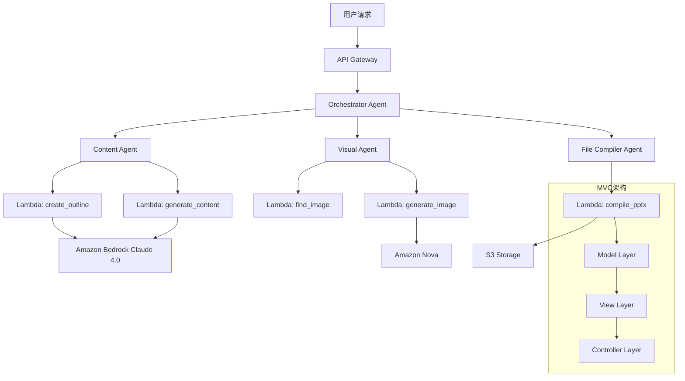

# Design Document

## Overview

AI PPT Assistant 是一个基于 Amazon Bedrock Agents 的多代理协作系统，采用 MVC 架构模式设计。系统通过编排多个专业化的 AI Agent 和 Lambda 函数（Python 3.13），实现从内容生成到文件创建的完整演示文稿制作流程。核心设计理念是将 AI 推理能力与实际执行能力分离，让 Agent 负责智能决策，Lambda 负责具体操作。

## Steering Document Alignment

### Technical Standards (tech.md)
- 采用 Serverless 架构，利用 AWS 托管服务
- 遵循 RESTful API 设计原则
- 实施 Infrastructure as Code (IaC) 使用 Terraform
- 应用 MVC 架构模式分离关注点

### Project Structure (structure.md)
```
/ai-ppt-assistant/
├── /agents/               # Bedrock Agent 配置
│   ├── orchestrator.json
│   ├── content.json
│   └── visual.json
├── /lambdas/              # Lambda 函数代码 (Python 3.13)
│   ├── /controllers/      # 控制器层
│   ├── /models/          # 数据模型层
│   ├── /views/           # 视图生成层
│   └── /utils/           # 工具函数
└── /infrastructure/       # Terraform 基础设施代码
    ├── main.tf
    ├── variables.tf
    └── outputs.tf
```

## Code Reuse Analysis

### Existing Components to Leverage
- **AWS SDK (Boto3)**: 用于所有 AWS 服务交互
- **python-pptx**: PowerPoint 文件生成库
- **Pillow**: 图像处理和优化
- **langchain**: Agent 协调和链式调用

### Integration Points
- **Amazon Bedrock**: Claude 4.0 用于文本生成
- **Amazon Nova**: AI 图像生成
- **S3**: 文件存储和检索
- **DynamoDB**: 会话状态和历史记录

## Architecture

系统采用简化的多层架构设计，去除了不必要的复杂性：

### Modular Design Principles
- **Single File Responsibility**: 每个 Lambda 函数负责单一业务功能
- **Component Isolation**: Agent 之间通过标准 JSON 接口通信
- **Service Layer Separation**: 严格的 MVC 分层
- **Utility Modularity**: 共享工具通过 Lambda Layers 管理



## Components and Interfaces

### Orchestrator Agent
- **Purpose:** 总体流程编排和任务分配
- **Interfaces:** 
  ```json
  {
    "input": {
      "request_type": "generate|convert",
      "topic": "string",
      "page_count": "number",
      "audience": "string"
    },
    "output": {
      "status": "success|failure",
      "presentation_url": "string"
    }
  }
  ```
- **Dependencies:** Content Agent, Visual Agent, File Compiler Agent
- **Reuses:** Bedrock Agent Framework

### Content Agent
- **Purpose:** 文本内容生成和优化
- **Interfaces:**
  ```json
  {
    "actions": [
      "create_presentation_outline",
      "generate_slide_content",
      "generate_speaker_notes"
    ]
  }
  ```
- **Dependencies:** Lambda functions, Claude 4.0
- **Reuses:** Bedrock LLM capabilities

### Visual Agent
- **Purpose:** 图像生成和选择
- **Interfaces:**
  ```json
  {
    "actions": [
      "find_relevant_image",
      "generate_custom_image"
    ]
  }
  ```
- **Dependencies:** Lambda functions, Amazon Nova
- **Reuses:** Bedrock image generation

### Lambda: create_outline (Python 3.13)
- **Purpose:** 生成演示文稿大纲
- **Interfaces:**
  ```python
  def handler(event, context):
      # Input: topic, page_count, audience
      # Output: {"slides": [{"title": "", "key_points": []}]}
  ```
- **Dependencies:** Bedrock Runtime
- **Reuses:** Claude 4.0 prompt templates

### Lambda: compile_pptx (MVC Implementation)
- **Purpose:** 组装最终 PowerPoint 文件
- **Runtime:** Python 3.13
- **MVC Structure:**
  - **Model**: 数据获取和处理
  - **View**: PPTX 文件生成
  - **Controller**: 业务逻辑协调
- **Interfaces:**
  ```python
  # Controller
  def handler(event, context):
      controller = PresentationController()
      return controller.create_presentation(event)
  
  # Model
  class PresentationModel:
      def get_template(template_id)
      def save_to_s3(file_data)
  
  # View  
  class PresentationView:
      def render_pptx(slides_data, template)
  ```

## Data Models

### Presentation Request Model
```python
{
    "request_id": "uuid",
    "user_id": "string",
    "request_type": "generate|convert",
    "parameters": {
        "topic": "string",
        "page_count": "integer(5-30)",
        "audience": "string",
        "template_id": "string(optional)"
    },
    "status": "pending|processing|completed|failed",
    "created_at": "timestamp",
    "updated_at": "timestamp"
}
```

### Slide Content Model
```python
{
    "slide_id": "integer",
    "title": "string",
    "content": {
        "key_points": ["string"],
        "detailed_text": "string(optional)"
    },
    "image": {
        "url": "string",
        "alt_text": "string",
        "source": "generated|library"
    },
    "speaker_notes": "string",
    "layout": "title|content|image_left|image_right"
}
```

### Session State Model (DynamoDB)
```python
{
    "session_id": "uuid",
    "user_id": "string", 
    "current_state": "object",
    "history": [{
        "action": "string",
        "timestamp": "iso8601",
        "result": "object"
    }],
    "ttl": "timestamp"  # 30 days
}
```

## Error Handling

### Error Scenarios

1. **LLM Generation Timeout**
   - **Handling:** Implement exponential backoff retry (max 3 attempts)
   - **User Impact:** "正在处理您的请求，请稍候..." 消息
   - **Fallback:** 使用简化的提示词重试

2. **Image Generation Failure**
   - **Handling:** 先尝试图库检索，失败后使用占位图
   - **User Impact:** 使用默认图片，允许用户后续替换
   - **Recovery:** 记录失败，提供手动上传选项

3. **File Compilation Error**
   - **Handling:** 保存中间状态，允许从断点恢复
   - **User Impact:** "文件生成遇到问题，正在重试..."
   - **Logging:** 详细错误日志到 CloudWatch

4. **S3 Upload Failure**
   - **Handling:** 重试 3 次，使用不同的 S3 区域
   - **User Impact:** 延迟通知，提供替代下载方式
   - **Backup:** 临时存储在 Lambda /tmp

5. **Request Validation Error**
   - **Handling:** 返回详细的验证错误信息
   - **User Impact:** 明确指出哪个参数有问题
   - **Prevention:** 前端预验证

## API Design

### REST Endpoints (Simplified - No Authentication)

```yaml
POST /presentations/generate
  Headers:
    - X-API-Key: string (简单的 API 密钥验证)
  Request:
    - topic: string
    - page_count: number
    - audience: string
    - template_id?: string
  Response:
    - presentation_id: string
    - status: string
    - estimated_time: number

GET /presentations/{id}/status
  Headers:
    - X-API-Key: string
  Response:
    - status: pending|processing|completed|failed
    - progress: number (0-100)
    - message: string

GET /presentations/{id}/download
  Headers:
    - X-API-Key: string
  Response:
    - download_url: string (S3 presigned URL)
    - expires_at: timestamp

PATCH /presentations/{id}/slides/{slideId}
  Headers:
    - X-API-Key: string
  Request:
    - content?: object
    - image?: object
  Response:
    - slide: object
    - status: string
```

## Security Considerations (Simplified)

### Authentication & Authorization
- API Gateway 使用简单的 API Key 验证
- IAM 角色最小权限原则
- Agent 执行角色限制在必要的 AWS 服务

### Data Protection
- S3 bucket 加密 (SSE-S3)
- DynamoDB 加密
- VPC endpoints 用于服务间通信
- 敏感数据不记录在日志中

### Input Validation
- 所有输入参数严格验证
- 防止提示词注入攻击
- 文件大小和类型限制

## Performance Optimization

### Caching Strategy
- Lambda 函数预热 (Reserved Concurrency)
- DynamoDB DAX 用于频繁访问的数据

### Parallel Processing
- 多页幻灯片内容并行生成
- 图片生成与内容生成并行
- 使用 Step Functions 编排复杂流程

### Resource Management
- Lambda 内存配置：1024MB (内容生成), 2048MB (文件编译)
- 超时设置：30秒 (API), 5分钟 (后台处理)
- S3 生命周期策略：30天后转 IA 存储
- Python Runtime: 3.13 (最新版本，性能优化)

## Infrastructure as Code

### Terraform Configuration
```hcl
# main.tf 示例
provider "aws" {
  region = "us-east-1"
}

module "bedrock_agents" {
  source = "./modules/bedrock"
  model_id = "anthropic.claude-4-0"
}

module "lambda_functions" {
  source = "./modules/lambda"
  runtime = "python3.13"
  architecture = "arm64"  # Graviton2 for cost optimization
}

module "api_gateway" {
  source = "./modules/api"
  auth_type = "API_KEY"
}
```

## Testing Strategy

### Unit Testing
- **Approach:** 每个 Lambda 函数 100% 测试覆盖
- **Key Components:** 
  - Prompt 模板验证
  - 数据模型序列化/反序列化
  - MVC 各层独立测试
- **Tools:** pytest, moto (AWS service mocking)

### Integration Testing
- **Approach:** Agent 间通信测试
- **Key Flows:**
  - 完整的演示文稿生成流程
  - 错误恢复机制
  - 并发请求处理
- **Tools:** Bedrock Agent Testing Framework

### End-to-End Testing
- **Approach:** 模拟真实用户场景
- **User Scenarios:**
  - 生成 10 页技术演示文稿
  - 转换 20 页 PDF 报告
  - 修改特定幻灯片内容
  - 并发 10 个用户请求
- **Metrics:** 响应时间 <60秒, 成功率 >95%