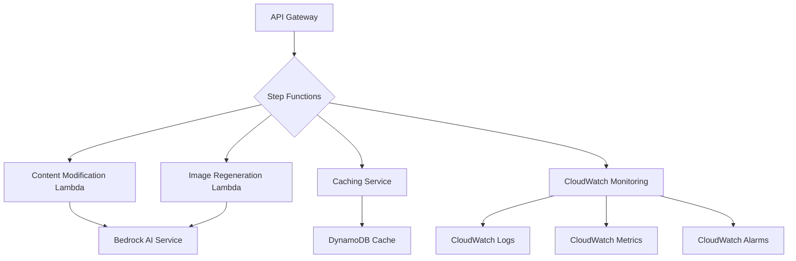

# AI PPT Assistant Phase 3 设计文档

## 总体概述
本设计文档为AI PPT Assistant的Phase 3实现提供了详细的技术架构和系统设计蓝图，重点关注内容修改API、性能优化和监控系统。

## 技术标准对齐

### 代码架构原则
- 遵循微服务和无服务器架构设计
- 高度模块化，单一职责
- 事件驱动和异步处理
- 支持水平扩展

## 代码重用分析

### 现有组件复用
- **PresentationFactory**: 重用现有的PPT生成核心逻辑
- **BedrockAgentService**: 复用Bedrock Agent交互模块
- **S3StorageService**: 继续使用现有的存储管理组件

### 集成点
- AWS Step Functions：编排复杂的PPT生成和修改工作流
- Amazon SQS：消息缓冲和异步任务处理
- Amazon CloudWatch：性能监控和日志记录

## 架构设计

### 系统架构图


### 架构组件详解

#### 1. API Gateway
- 提供RESTful接口
- 处理身份验证和请求路由
- 限流和访问控制

#### 2. Step Functions工作流
- 编排内容修改的多步骤流程
- 支持并行处理
- 提供工作流状态追踪

#### 3. Lambda函数
- 内容修改Lambda：处理文本和布局更新
- 图像重生成Lambda：AI驱动的图像创建
- 轻量级、无状态设计

#### 4. 缓存服务
- 使用DynamoDB作为缓存存储
- 实现细粒度缓存策略
- TTL和自动过期机制

#### 5. 监控系统
- CloudWatch日志收集
- 性能指标追踪
- 异常告警机制

## 组件和接口

### 内容修改组件
- **目的**：提供PPT单页内容精确修改能力
- **接口**：
  - `modifySlideContent(slideId, content)`
  - `regenerateSlideImage(slideId, context)`
- **依赖**：Bedrock AI服务、S3存储

### 缓存管理组件
- **目的**：优化系统性能，减少重复计算
- **接口**：
  - `getCachedContent(key)`
  - `setCachedContent(key, value, ttl)`
- **依赖**：DynamoDB

## 数据模型

### 幂等请求模型
```python
class ModificationRequest:
    request_id: str  # 唯一请求标识
    slide_id: str
    content: dict
    timestamp: datetime
    status: str  # 'pending', 'processing', 'completed'
```

### 缓存条目模型
```python
class CacheEntry:
    key: str
    value: dict
    created_at: datetime
    expires_at: datetime
    usage_count: int
```

## 错误处理策略

### 错误场景
1. **AI生成失败**
   - 处理：自动重试，最多3次
   - 用户影响：提供友好的错误消息

2. **缓存不一致**
   - 处理：缓存失效，重新生成内容
   - 用户影响：略微延长响应时间

## 测试策略

### 单元测试
- 每个Lambda函数的独立测试
- 缓存服务逻辑验证
- AI内容生成模块测试

### 集成测试
- Step Functions工作流完整性测试
- API端到端流程测试
- 缓存与主服务集成测试

### 性能测试
- 并发请求处理能力
- 缓存命中率
- 响应时间性能基准测试

### 可观测性测试
- 日志完整性
- 监控指标准确性
- 告警触发机制验证