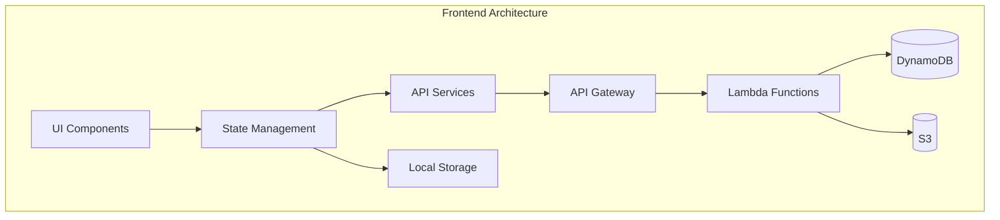

# Design Document: PPT Assistant Frontend

## Overview

PPT Assistant Frontend 是一个单页应用（SPA），为AI PPT Assistant API提供直观的Web界面。系统采用React框架构建，使用现代化的组件架构和状态管理方案，确保用户体验流畅且响应迅速。应用将以本地开发模式运行，无需复杂的认证流程，专注于PPT创建的核心功能。

## Steering Document Alignment

### Technical Standards (tech.md)
由于项目暂无steering文档，本设计遵循React和现代Web开发的最佳实践：
- 使用函数组件和Hooks进行状态管理
- 采用TypeScript提供类型安全
- 遵循组件化和模块化原则
- 实施响应式设计模式

### Project Structure (structure.md)
前端代码将组织为独立的frontend目录，与后端Lambda函数分离：
```
frontend/
├── src/
│   ├── components/     # UI组件
│   ├── services/       # API服务层
│   ├── hooks/          # 自定义Hooks
│   ├── utils/          # 工具函数
│   ├── styles/         # 全局样式
│   └── types/          # TypeScript类型定义
├── public/             # 静态资源
└── package.json        # 依赖配置
```

## Code Reuse Analysis

### Existing Components to Leverage
- **API Gateway配置**: 复用现有的API端点定义，无需修改后端
- **Lambda函数**: 直接调用现有的所有Lambda函数（session_manager, content_enhancer等）
- **类型定义**: 基于现有API响应格式创建TypeScript接口

### Integration Points
- **API Gateway**: 通过HTTPS调用现有REST API端点
- **DynamoDB**: 通过API间接访问，前端不直接连接数据库
- **S3存储**: PPT文件通过预签名URL下载，无需直接S3访问
- **本地存储**: 使用localStorage和IndexedDB存储项目数据

## Architecture

采用分层架构设计，确保关注点分离和高可维护性：

### Modular Design Principles
- **Single File Responsibility**: 每个组件文件处理单一UI功能
- **Component Isolation**: 组件通过props和回调通信，避免直接依赖
- **Service Layer Separation**: API调用逻辑与UI组件完全分离
- **Utility Modularity**: 工具函数按功能域组织（storage、format、validation等）



## Components and Interfaces

### Component 1: AppLayout
- **Purpose:** 应用主布局框架，包含导航栏、侧边栏和主内容区
- **Interfaces:** 
  - Props: `currentProject`, `onProjectChange`
  - Events: `onNewProject`, `onSettings`
- **Dependencies:** React Router, Navigation, Sidebar
- **Reuses:** 无

### Component 2: ProjectManager
- **Purpose:** 管理项目列表，支持创建、加载、删除项目
- **Interfaces:**
  - Props: `projects[]`, `currentProjectId`
  - Methods: `createProject()`, `loadProject()`, `deleteProject()`
- **Dependencies:** LocalStorageService, ProjectCard
- **Reuses:** 无

### Component 3: OutlineEditor
- **Purpose:** PPT大纲的树形编辑器，支持拖拽排序
- **Interfaces:**
  - Props: `outline`, `onOutlineChange`
  - Methods: `addNode()`, `removeNode()`, `reorderNodes()`
- **Dependencies:** TreeView, DragDropContext
- **Reuses:** 无

### Component 4: ContentEditor
- **Purpose:** 富文本编辑器，用于编辑幻灯片内容
- **Interfaces:**
  - Props: `content`, `onContentChange`
  - Methods: `formatText()`, `insertElement()`
- **Dependencies:** Quill或TinyMCE编辑器
- **Reuses:** 无

### Component 5: SlidePreview
- **Purpose:** 实时预览当前幻灯片的外观
- **Interfaces:**
  - Props: `slideData`, `template`
  - Methods: `renderSlide()`, `updatePreview()`
- **Dependencies:** Canvas或SVG渲染器
- **Reuses:** 无

### Component 6: ImageGallery
- **Purpose:** 显示和管理图片搜索结果
- **Interfaces:**
  - Props: `images[]`, `onImageSelect`
  - Methods: `searchImages()`, `selectImage()`
- **Dependencies:** ImageGrid, LazyLoad
- **Reuses:** 无

### Component 7: ApiConfigPanel
- **Purpose:** 配置API端点和连接设置
- **Interfaces:**
  - Props: `config`, `onConfigChange`
  - Methods: `testConnection()`, `saveConfig()`
- **Dependencies:** ConfigService
- **Reuses:** 无

## Data Models

### Model 1: Project
```typescript
interface Project {
  id: string;                    // UUID
  title: string;                 // 项目标题
  description?: string;          // 项目描述
  sessionId?: string;            // API会话ID
  outline: OutlineNode[];        // 大纲结构
  slides: Slide[];              // 幻灯片数组
  settings: ProjectSettings;     // 项目设置
  createdAt: Date;              // 创建时间
  updatedAt: Date;              // 更新时间
}
```

### Model 2: OutlineNode
```typescript
interface OutlineNode {
  id: string;                    // 节点ID
  title: string;                 // 节点标题
  content?: string;              // 节点内容
  level: number;                 // 层级（0-3）
  children: OutlineNode[];       // 子节点
  slideId?: string;              // 关联的幻灯片ID
}
```

### Model 3: Slide
```typescript
interface Slide {
  id: string;                    // 幻灯片ID
  title: string;                 // 标题
  content: string;               // 主要内容（富文本）
  images: SlideImage[];          // 图片数组
  layout: LayoutType;            // 布局类型
  notes?: string;                // 演讲者备注
  order: number;                 // 排序
}
```

### Model 4: ApiConfig
```typescript
interface ApiConfig {
  baseUrl: string;               // API基础URL
  timeout: number;               // 超时时间（毫秒）
  headers?: Record<string, string>; // 自定义请求头
  apiKey?: string;               // API密钥（如需要）
}
```

## Error Handling

### Error Scenarios

1. **API连接失败**
   - **Handling:** 显示连接错误提示，提供重试按钮和配置检查建议
   - **User Impact:** 看到友好的错误消息，可以检查配置或重试

2. **内容生成超时**
   - **Handling:** 30秒后超时，提供取消和重试选项
   - **User Impact:** 看到进度条和超时提示，可选择重试或修改输入

3. **本地存储空间不足**
   - **Handling:** 检测存储限制，提示用户清理旧项目
   - **User Impact:** 收到存储空间警告，可选择删除旧项目

4. **PPT生成失败**
   - **Handling:** 记录详细错误，提供部分内容下载选项
   - **User Impact:** 看到具体错误原因，可下载已生成的部分

5. **数据格式错误**
   - **Handling:** 验证所有输入，提供格式提示
   - **User Impact:** 实时看到输入验证反馈

## Testing Strategy

### Unit Testing
- **工具**: Jest + React Testing Library
- **覆盖率目标**: 80%以上
- **关键测试点**:
  - 组件渲染和交互
  - API服务方法
  - 数据转换工具
  - 本地存储操作

### Integration Testing
- **工具**: Cypress或Playwright
- **测试流程**:
  - 创建项目完整流程
  - 大纲编辑和内容生成
  - PPT生成和下载
  - 项目管理操作

### End-to-End Testing
- **测试场景**:
  - 新用户首次使用流程
  - 完整的PPT创建流程
  - 错误恢复和边界情况
  - 不同浏览器兼容性

## Technology Stack

### 核心技术
- **框架**: React 18.x with TypeScript
- **状态管理**: Zustand或Context API
- **路由**: React Router v6
- **样式**: Tailwind CSS或Styled Components
- **构建工具**: Vite
- **包管理**: npm或yarn

### 主要依赖
- **编辑器**: Quill或TinyMCE（富文本编辑）
- **UI组件**: Ant Design或Material-UI
- **HTTP客户端**: Axios
- **本地存储**: LocalForage
- **拖拽**: react-beautiful-dnd
- **图表预览**: react-chartjs-2（如需要）

## Performance Considerations

### 优化策略
- **代码分割**: 使用React.lazy()按路由分割
- **懒加载**: 图片和组件的延迟加载
- **缓存**: API响应和静态资源缓存
- **虚拟化**: 长列表使用react-window
- **防抖节流**: 输入和滚动事件优化
- **预渲染**: 关键路径的SSG或SSR（如需要）