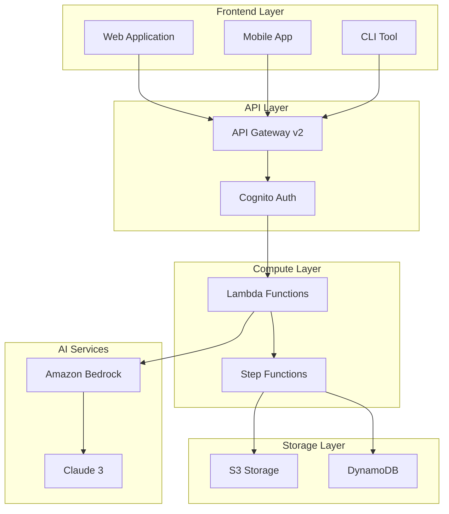

# AI PPT Assistant - Intelligent Presentation Generation System

<div align="center">


**Cloud-native presentation generation system powered by Amazon Bedrock**

English | [简体中文](./README_CN.md) 

</div>

## 📋 Overview

AI PPT Assistant is a cloud-native intelligent presentation generation system that leverages Amazon Bedrock's generative AI capabilities to automatically create high-quality PowerPoint presentations. Built with a serverless architecture, it ensures high availability, elastic scaling, and cost optimization.

### ✨ Key Features

- **🤖 Intelligent Content Generation** - Automatically generate structured presentation content based on topics
- **🎨 Automatic Layout Design** - Smart template and layout selection for professional appearance
- **🖼️ AI Image Generation** - Auto-generate illustrations, charts, and data visualizations
- **🌍 Multi-language Support** - Support for 10+ languages including English and Chinese
- **👥 Real-time Collaboration** - Multi-user collaborative editing and commenting
- **📊 Version Control** - Complete version history and rollback capabilities
- **⚡ Quick Deployment** - One-click deployment to AWS cloud environment
- **🔒 Enterprise Security** - Data encryption, access control, and compliance certifications

## 🏗️ Architecture



## 🚀 Quick Start

### Prerequisites

- AWS account with configured credentials
- Python 3.12+
- Node.js 18+ (for frontend development)
- Terraform 1.0+ (for infrastructure deployment)
- Amazon Bedrock model access permissions

### 1. Clone Repository

```bash
git clone https://github.com/your-org/ai-ppt-assistant.git
cd ai-ppt-assistant
```

### 2. Configure Environment

```bash
# Install Python dependencies
pip install -r requirements.txt

# Configure AWS credentials
aws configure

# Set environment variables
cp .env.example .env
# Edit .env file with necessary configurations
```

### 3. Deploy to AWS

```bash
# Deploy infrastructure using Terraform
cd terraform
terraform init
terraform plan
terraform apply

# Or use deployment script
./scripts/deploy.sh production
```

### 4. Access Application

After deployment, you'll receive:
- API Endpoint: `https://api.your-domain.com`
- Web Application: `https://app.your-domain.com`
- Admin Console: `https://admin.your-domain.com`

## 📖 Documentation

### Core Documentation

- [📐 Architecture](./docs/ARCHITECTURE.md) - Detailed architecture design and technical decisions
- [🚀 Deployment Guide](./docs/DEPLOYMENT_GUIDE.md) - Complete deployment process and configuration
- [🔧 Operations Manual](./docs/OPERATIONS_MANUAL.md) - Daily operations, monitoring, and troubleshooting
- [🔒 Security Best Practices](./docs/SECURITY.md) - Security configuration and compliance guide
- [🐛 Troubleshooting](./docs/TROUBLESHOOTING.md) - Common issues and solutions
- [👥 Contributing Guide](./docs/CONTRIBUTING.md) - How to contribute to the project

### API Documentation

- [API Reference](./docs/api/API_REFERENCE.md) - Complete API endpoint documentation
- [Error Codes](./docs/api/ERROR_CODES.md) - Error handling and debugging
- [Examples](./docs/api/EXAMPLES.md) - Integration examples in various languages
- [OpenAPI Spec](./docs/api/openapi-v1.yaml) - Machine-readable API definition

### Tutorial Guides

- [Quick Start](./docs/tutorials/QUICK_START.md) - 5-minute quick experience
- [User Guide](./docs/tutorials/USER_GUIDE.md) - Complete feature introduction
- [Best Practices](./docs/tutorials/BEST_PRACTICES.md) - Usage tips and optimization
- [Use Cases](./docs/tutorials/USE_CASES.md) - Real-world application examples

## 💻 Development

### Project Structure

```
ai-ppt-assistant/
├── src/                    # Core source code
│   ├── bedrock_adapter.py # Bedrock service adapter
│   ├── content_generator.py# Content generation logic
│   ├── ppt_compiler.py    # PPT compiler
│   └── ...
├── lambda_functions/       # Lambda function code
│   ├── generate_ppt/      # PPT generation function
│   ├── update_slide/      # Slide update
│   └── ...
├── frontend/              # Frontend application
│   ├── index.html        # Main page
│   ├── js/               # JavaScript code
│   └── css/              # Stylesheets
├── terraform/            # Infrastructure as Code
│   ├── main.tf          # Main configuration
│   ├── variables.tf     # Variable definitions
│   └── ...
├── docs/                # Project documentation
├── tests/               # Test code
└── scripts/             # Deployment and utility scripts
```

### Local Development

```bash
# Install development dependencies
pip install -r requirements-dev.txt

# Run tests
pytest tests/

# Start local development server
python scripts/dev_server.py

# Frontend development
cd frontend
npm install
npm run dev
```

### Code Standards

- Python: Follow PEP 8, formatted with Black
- JavaScript: ESLint + Prettier
- Commit Messages: Follow Conventional Commits
- Branching Strategy: Git Flow

## 🧪 Testing

```bash
# Run unit tests
pytest tests/unit

# Run integration tests
pytest tests/integration

# Run end-to-end tests
pytest tests/e2e

# Generate test coverage report
pytest --cov=src tests/
```

## 📊 Monitoring & Operations

### Key Metrics

- **Availability Target**: 99.95%
- **Response Time**: P50 < 200ms, P99 < 2s
- **Error Rate**: < 0.1%
- **Recovery Time Objective (RTO)**: < 1 hour
- **Recovery Point Objective (RPO)**: < 5 minutes

### Monitoring Tools

- **CloudWatch**: System metrics and logs
- **X-Ray**: Distributed tracing
- **CloudWatch Synthetics**: End-to-end monitoring
- **GuardDuty**: Security threat detection

## 🔒 Security

- **Data Encryption**: In-transit and at-rest encryption
- **Authentication**: AWS Cognito with MFA
- **Access Control**: Fine-grained IAM permissions
- **Audit Logs**: Complete CloudTrail auditing
- **Compliance**: SOC2, GDPR, HIPAA Ready

## 🤝 Contributing

We welcome all forms of contributions! Please check the [Contributing Guide](./docs/CONTRIBUTING.md) for details.

### Ways to Contribute

1. 🐛 Submit bug reports
2. 💡 Suggest new features
3. 📝 Improve documentation
4. 🔧 Submit code improvements
5. 🌐 Add internationalization support

## 📈 Roadmap

- [ ] v1.1 - Support more AI models (GPT-4, Gemini)
- [ ] v1.2 - Real-time collaborative editing
- [ ] v1.3 - Mobile applications
- [ ] v1.4 - Video presentation generation
- [ ] v2.0 - Enterprise feature suite

## 📄 License

This project is licensed under the MIT License - see the [LICENSE](LICENSE) file for details

## 🆘 Support

- **Documentation**: [docs.ai-ppt-assistant.com](https://docs.ai-ppt-assistant.com)
- **Email**: support@ai-ppt-assistant.com
- **Issues**: [GitHub Issues](https://github.com/your-org/ai-ppt-assistant/issues)
- **Discussions**: [GitHub Discussions](https://github.com/your-org/ai-ppt-assistant/discussions)

## 🙏 Acknowledgments

- Amazon Web Services team for cloud service support
- Anthropic team for Claude models
- All contributors and community members

---

<div align="center">

**[Website](https://ai-ppt-assistant.com)** | **[Blog](https://blog.ai-ppt-assistant.com)** | **[Twitter](https://twitter.com/aipptassistant)**

Made with ❤️ by AI PPT Assistant Team

</div>