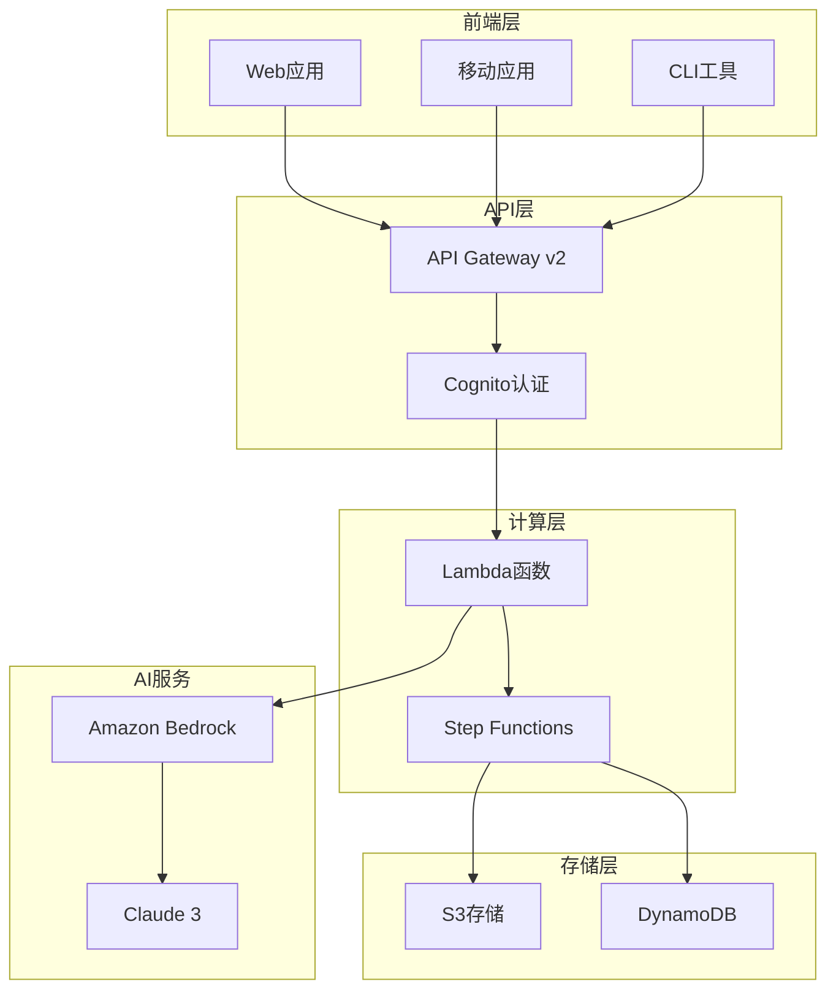

# AI PPT Assistant - 智能演示文稿生成系统

<div align="center">


**基于 Amazon Bedrock 的智能演示文稿生成系统**

[English](./README.md) | 简体中文 

</div>

## 📋 项目概述

AI PPT Assistant 是一个云原生的智能演示文稿生成系统，利用 Amazon Bedrock 的生成式 AI 能力，自动创建高质量的 PPT 演示文稿。系统采用无服务器架构，确保高可用性、弹性扩展和成本优化。

### ✨ 核心特性

- **🤖 智能内容生成** - 基于主题自动生成结构化演示内容
- **🎨 自动排版设计** - 智能选择模板和布局，专业美观
- **🖼️ AI 图像生成** - 自动生成配图、图表和数据可视化
- **🌍 多语言支持** - 支持中英文等10+种语言
- **👥 实时协作** - 支持多用户协作编辑和评论
- **📊 版本管理** - 完整的版本历史和回滚能力
- **⚡ 快速部署** - 一键部署到AWS云环境
- **🔒 企业级安全** - 数据加密、访问控制、合规认证

## 🏗️ 系统架构



## 🚀 快速开始

### 前置条件

- AWS 账户并配置好凭证
- Python 3.12+
- Node.js 18+ (前端开发)
- Terraform 1.0+ (基础设施部署)
- Amazon Bedrock 模型访问权限

### 1. 克隆项目

```bash
git clone https://github.com/your-org/ai-ppt-assistant.git
cd ai-ppt-assistant
```

### 2. 配置环境

```bash
# 安装Python依赖
pip install -r requirements.txt

# 配置AWS凭证
aws configure

# 设置环境变量
cp .env.example .env
# 编辑 .env 文件，填入必要配置
```

### 3. 部署到AWS

```bash
# 使用Terraform部署基础设施
cd terraform
terraform init
terraform plan
terraform apply

# 或使用部署脚本
./scripts/deploy.sh production
```

### 4. 访问应用

部署完成后，您将获得：
- API端点: `https://api.your-domain.com`
- Web应用: `https://app.your-domain.com`
- 管理控制台: `https://admin.your-domain.com`

## 📖 文档

### 核心文档

- [📐 系统架构](./docs/ARCHITECTURE.md) - 详细的架构设计和技术决策
- [🚀 部署指南](./docs/DEPLOYMENT_GUIDE.md) - 完整的部署流程和配置说明
- [🔧 运维手册](./docs/OPERATIONS_MANUAL.md) - 日常运维、监控和故障处理
- [🔒 安全最佳实践](./docs/SECURITY.md) - 安全配置和合规指南
- [🐛 故障排除](./docs/TROUBLESHOOTING.md) - 常见问题和解决方案
- [👥 贡献指南](./docs/CONTRIBUTING.md) - 如何参与项目开发

### API文档

- [API参考](./docs/api/API_REFERENCE.md) - 完整的API端点文档
- [错误码](./docs/api/ERROR_CODES.md) - 错误处理和故障排查
- [示例代码](./docs/api/EXAMPLES.md) - 各种语言的集成示例
- [OpenAPI规范](./docs/api/openapi-v1.yaml) - 机器可读的API定义

### 教程指南

- [快速入门](./docs/tutorials/QUICK_START.md) - 5分钟快速体验
- [用户指南](./docs/tutorials/USER_GUIDE.md) - 完整功能介绍
- [最佳实践](./docs/tutorials/BEST_PRACTICES.md) - 使用技巧和优化建议
- [使用场景](./docs/tutorials/USE_CASES.md) - 实际应用案例

## 💻 开发

### 项目结构

```
ai-ppt-assistant/
├── src/                    # 核心源代码
│   ├── bedrock_adapter.py # Bedrock服务适配器
│   ├── content_generator.py# 内容生成逻辑
│   ├── ppt_compiler.py    # PPT编译器
│   └── ...
├── lambda_functions/       # Lambda函数代码
│   ├── generate_ppt/      # PPT生成函数
│   ├── update_slide/      # 幻灯片更新
│   └── ...
├── frontend/              # 前端应用
│   ├── index.html        # 主页面
│   ├── js/               # JavaScript代码
│   └── css/              # 样式文件
├── terraform/            # 基础设施代码
│   ├── main.tf          # 主配置
│   ├── variables.tf     # 变量定义
│   └── ...
├── docs/                # 项目文档
├── tests/               # 测试代码
└── scripts/             # 部署和工具脚本
```

### 本地开发

```bash
# 安装开发依赖
pip install -r requirements-dev.txt

# 运行测试
pytest tests/

# 启动本地开发服务器
python scripts/dev_server.py

# 前端开发
cd frontend
npm install
npm run dev
```

### 代码规范

- Python: 遵循 PEP 8 规范，使用 Black 格式化
- JavaScript: 使用 ESLint + Prettier
- 提交信息: 遵循 Conventional Commits 规范
- 分支策略: Git Flow

## 🧪 测试

```bash
# 运行单元测试
pytest tests/unit

# 运行集成测试
pytest tests/integration

# 运行端到端测试
pytest tests/e2e

# 生成测试覆盖率报告
pytest --cov=src tests/
```

## 📊 监控与运维

### 关键指标

- **可用性目标**: 99.95%
- **响应时间**: P50 < 200ms, P99 < 2s
- **错误率**: < 0.1%
- **恢复时间目标 (RTO)**: < 1小时
- **恢复点目标 (RPO)**: < 5分钟

### 监控工具

- **CloudWatch**: 系统指标和日志
- **X-Ray**: 分布式追踪
- **CloudWatch Synthetics**: 端到端监控
- **GuardDuty**: 安全威胁检测

## 🔒 安全性

- **数据加密**: 传输中和静态数据均加密
- **身份认证**: AWS Cognito 多因素认证
- **访问控制**: 细粒度的 IAM 权限管理
- **审计日志**: CloudTrail 完整审计
- **合规认证**: SOC2, GDPR, HIPAA Ready

## 🤝 贡献

我们欢迎所有形式的贡献！请查看[贡献指南](./docs/CONTRIBUTING.md)了解详情。

### 贡献方式

1. 🐛 提交Bug报告
2. 💡 提出新功能建议
3. 📝 改进文档
4. 🔧 提交代码改进
5. 🌐 添加国际化支持

## 📈 路线图

- [ ] v1.1 - 支持更多AI模型 (GPT-4, Gemini)
- [ ] v1.2 - 实时协作编辑功能
- [ ] v1.3 - 移动端应用
- [ ] v1.4 - 视频演示生成
- [ ] v2.0 - 企业版功能套件

## 📄 许可证

本项目采用 MIT 许可证 - 查看 [LICENSE](LICENSE) 文件了解详情

## 🆘 支持

- **文档**: [docs.ai-ppt-assistant.com](https://docs.ai-ppt-assistant.com)
- **邮件**: support@ai-ppt-assistant.com
- **Issues**: [GitHub Issues](https://github.com/your-org/ai-ppt-assistant/issues)
- **讨论**: [GitHub Discussions](https://github.com/your-org/ai-ppt-assistant/discussions)

## 🙏 致谢

- Amazon Web Services 团队提供的云服务支持
- Anthropic 团队的 Claude 模型
- 所有贡献者和社区成员

---

<div align="center">

**[官网](https://ai-ppt-assistant.com)** | **[博客](https://blog.ai-ppt-assistant.com)** | **[Twitter](https://twitter.com/aipptassistant)**

Made with ❤️ by AI PPT Assistant Team

</div>