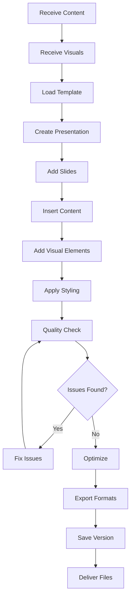

# PPT Compiler Agent

## Overview

The PPT Compiler Agent is responsible for assembling all content and visual elements into final presentation files. It handles file generation, format conversion, quality assurance, and version management, ensuring professional output across multiple formats.

## Core Capabilities

### 1. Presentation Assembly
- Combine text content and visual elements
- Apply templates and themes
- Organize slides in logical sequence
- Manage slide transitions and animations

### 2. Template Management
- Apply pre-designed templates
- Customize template settings
- Create and modify master slides
- Ensure brand consistency

### 3. Format Conversion
- Export to PowerPoint (.pptx)
- Generate PDF versions
- Create HTML presentations
- Export individual slides as images
- Produce video presentations

### 4. Quality Control
- Validate presentation integrity
- Check formatting consistency
- Optimize file sizes
- Fix detected issues automatically

### 5. Version Control
- Save presentation versions
- Compare different versions
- Restore previous versions
- Track changes and history

## Architecture Components

### Agent Configuration
- **Model**: Claude 3.5 Sonnet (latest version)
- **Temperature**: 0.3 for precision and consistency
- **Max Length**: 2048 tokens
- **Session Memory**: Enabled for maintaining context

### Action Groups

#### 1. PresentationAssembly
Core assembly functions:
- `createPresentation`: Initialize new presentation
- `addSlide`: Add slides with content
- `addVisualElement`: Insert images and charts
- `compilePresentation`: Generate final output

#### 2. TemplateManagement
Template operations:
- `applyTemplate`: Apply design templates
- `customizeTemplate`: Modify template settings
- `createMasterSlide`: Define master layouts

#### 3. FormatConversion
Export to various formats:
- `exportToPDF`: Create PDF versions
- `exportToHTML`: Generate web presentations
- `exportToImages`: Export slide images
- `exportToVideo`: Create video presentations

#### 4. QualityControl
Quality assurance functions:
- `validatePresentation`: Check integrity
- `checkConsistency`: Verify formatting
- `optimizeFileSize`: Reduce file size
- `fixIssues`: Auto-fix problems

#### 5. VersionControl
Version management:
- `saveVersion`: Create version snapshots
- `compareVersions`: Diff between versions
- `restoreVersion`: Rollback to previous

## Knowledge Base Structure

### 1. File Formats
Specifications for supported formats:
- **PPTX**: Office Open XML structure
- **PDF**: Various PDF standards (1.4, 1.7, PDF/A)
- **HTML**: HTML5 presentation frameworks
- **Images**: PNG, JPEG, SVG specifications
- **Video**: MP4, WebM export settings

### 2. Templates
Template structures and components:
- **Business Templates**: Professional layouts
- **Creative Templates**: Artistic designs
- **Academic Templates**: Research presentations
- **Master Slides**: Reusable components
- **Layout Grids**: Composition guidelines

### 3. Compilation Rules
Best practices for assembly:
- **Content Ordering**: Logical flow
- **Formatting Consistency**: Uniform styling
- **Media Handling**: Embedding vs. linking
- **Performance Optimization**: File size management

### 4. Quality Checks
Validation procedures:
- **Content Validation**: Completeness and accuracy
- **Visual Validation**: Resolution and compatibility
- **Technical Validation**: File integrity
- **Export Validation**: Format-specific checks

### 5. Output Formats
Format-specific settings:
- **Print Formats**: Handouts, notes, outlines
- **Digital Formats**: Screen shows, web, video
- **Resolution Settings**: Various quality levels
- **Compression Options**: Size optimization

## Compilation Process



## Best Practices

### File Assembly

1. **Content Organization**
   - Logical slide sequence
   - Consistent section breaks
   - Clear navigation structure

2. **Template Application**
   - Match template to content type
   - Maintain design consistency
   - Preserve brand guidelines

3. **Format Selection**
   - Choose appropriate format for use case
   - Consider audience and platform
   - Balance quality and file size

### Quality Standards

| Aspect | Requirement | Validation |
|--------|-------------|------------|
| Resolution | 1920x1080 minimum | Automatic check |
| File Size | <50MB for email | Compression available |
| Compatibility | Office 2016+ | Version testing |
| Accessibility | WCAG 2.1 AA | Alt text verification |

### Optimization Strategies

1. **Image Optimization**
   - Resize to display resolution
   - Compress without visible loss
   - Use appropriate formats

2. **Font Management**
   - Embed essential fonts
   - Define fallback fonts
   - Subset for smaller size

3. **Content Cleanup**
   - Remove hidden slides
   - Clean metadata
   - Delete revision history

## Usage Examples

### Creating a Business Presentation
```
Request: "Compile 20-slide business presentation with corporate template"

Compiler Agent Actions:
1. Loads corporate template
2. Creates presentation structure
3. Adds slides with content from Content Agent
4. Inserts images from Visual Agent
5. Applies consistent formatting
6. Validates completeness
7. Optimizes file size
8. Exports to PPTX and PDF
```

### Format Conversion
```
Request: "Convert presentation to web format with navigation"

Compiler Agent Actions:
1. Loads existing presentation
2. Converts to HTML5 structure
3. Implements navigation controls
4. Optimizes media for web
5. Creates responsive layout
6. Packages with assets
```

## Integration with Other Agents

### Coordination Flow
1. **Receives from Content Agent**: Text, bullet points, speaker notes
2. **Receives from Visual Agent**: Images, charts, diagrams
3. **Receives from Orchestrator**: Template selection, output requirements
4. **Returns to Orchestrator**: Final presentation files

### Data Exchange Format
```json
{
  "compilation_request": {
    "content_data": {...},
    "visual_assets": [...],
    "template": "corporate_blue",
    "output_formats": ["pptx", "pdf"],
    "quality_settings": "high"
  },
  "compilation_result": {
    "files": [
      {
        "format": "pptx",
        "path": "output/presentation.pptx",
        "size": "12.5MB"
      },
      {
        "format": "pdf",
        "path": "output/presentation.pdf",
        "size": "8.2MB"
      }
    ],
    "metadata": {
      "slides": 20,
      "duration": "15 minutes",
      "version": "1.0"
    }
  }
}
```

## Performance Metrics

### Quality Indicators
- Assembly accuracy: 100%
- Format compliance: 100%
- Optimization efficiency: >40% size reduction
- Cross-platform compatibility: >95%

### Processing Speed
- Presentation creation: 5-10 seconds
- Slide addition: 1-2 seconds per slide
- Format conversion: 10-20 seconds
- Total compilation: <60 seconds

## Troubleshooting

### Common Issues

1. **Template Conflicts**
   - Reset to default template
   - Manually adjust layouts
   - Create custom template

2. **Large File Sizes**
   - Increase compression
   - Reduce image quality
   - Link instead of embed

3. **Format Compatibility**
   - Use older format version
   - Provide fallback options
   - Test on target platform

4. **Missing Elements**
   - Verify all inputs received
   - Check file paths
   - Regenerate missing content

## Future Enhancements

- [ ] Real-time collaboration support
- [ ] Cloud storage integration
- [ ] Advanced animation effects
- [ ] AI-powered layout suggestions
- [ ] Automated accessibility improvements
- [ ] Multi-language presentation generation
- [ ] Presentation analytics
- [ ] Interactive elements support