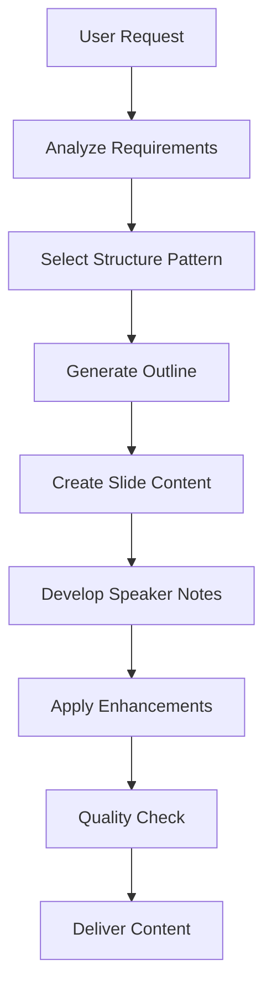

# PPT Content Agent

## Overview

The PPT Content Agent is a specialized AI agent focused on generating high-quality presentation content. It handles all text-based aspects of presentations including outlines, slide content, and speaker notes.

## Core Capabilities

### 1. Outline Generation
- Creates logical presentation structures
- Balances content across available time
- Adapts complexity to audience needs
- Supports multiple structural patterns

### 2. Slide Content Creation
- Follows the 6x6 rule for readability
- Generates impactful headlines
- Creates clear, concise bullet points
- Maintains consistent tone and style

### 3. Speaker Notes Development
- Provides detailed talking points
- Includes timing allocations
- Adds transitions between slides
- Prepares for Q&A scenarios

### 4. Multi-language Support
- Generates content in 8 languages
- Maintains cultural sensitivity
- Adapts examples to regional contexts
- Preserves meaning across translations

## Architecture Components

### Agent Configuration
- **Model**: Claude 3.5 Sonnet (latest version)
- **Temperature**: 0.8 for creative content generation
- **Max Length**: 4096 tokens for detailed content
- **Session Memory**: Enabled for context retention

### Action Groups

#### 1. OutlineGeneration
Manages presentation structure creation:
- `createOutline`: Generates initial presentation structure
- `refineOutline`: Modifies based on feedback
- `validateOutline`: Checks completeness and coherence

#### 2. SlideContentGeneration
Handles slide text creation:
- `generateSlideContent`: Creates content for all slides
- `generateBulletPoints`: Converts paragraphs to bullets
- `generateSlideTitle`: Creates impactful headlines
- `simplifyContent`: Reduces complexity for clarity

#### 3. SpeakerNotesGeneration
Develops presentation scripts:
- `generateSpeakerNotes`: Creates detailed notes
- `generateTransitions`: Smooth slide connections
- `calculateTimingAllocation`: Time distribution

#### 4. ContentEnhancement
Improves existing content:
- `addExamples`: Includes relevant examples
- `addDataVisualization`: Suggests charts
- `createCallToAction`: Compelling conclusions
- `generateQuestions`: Thought-provoking queries

#### 5. ContentTranslation
Handles multi-language needs:
- `translateContent`: Language conversion
- `adaptCulturalContext`: Cultural adaptation

## Knowledge Base Structure

### 1. Writing Guidelines
- Slide writing rules and best practices
- Headline formulas and structures
- Bullet point optimization techniques
- Content hierarchy principles

### 2. Presentation Structures
- McKinsey Pyramid Principle
- Situation-Complication-Resolution
- What-Why-How framework
- Past-Present-Future narrative
- Features-Benefits-Proof pattern

### 3. Audience Adaptation
Profiles for different audience types:
- **C-Suite Executives**: ROI-focused, strategic
- **Technical Teams**: Detail-oriented, precise
- **Sales Teams**: Customer-centric, motivational
- **General Audience**: Accessible, engaging

### 4. Content Formulas
- Opening attention grabbers
- Transition phrases
- Closing calls-to-action
- Storytelling techniques

### 5. Domain Expertise
Specialized knowledge for:
- Technology (Cloud, AI/ML, DevOps)
- Finance (Investment, Analysis)
- Healthcare (Clinical, Patient Care)
- Education (Curriculum, Pedagogy)

## Content Generation Process



## Best Practices

### Content Quality Standards

1. **Clarity**
   - Simple, direct language
   - Avoid unnecessary jargon
   - Define technical terms

2. **Conciseness**
   - 6 words per bullet point
   - 6 bullet points per slide
   - One idea per slide

3. **Engagement**
   - Start with a hook
   - Use stories and examples
   - Include interactive elements

4. **Consistency**
   - Maintain tone throughout
   - Use parallel structure
   - Apply uniform formatting

### Audience Adaptation Guidelines

| Audience | Focus | Style | Avoid |
|----------|-------|-------|-------|
| Executives | Strategy, ROI | Direct, Visual | Technical details |
| Technical | Implementation | Precise, Data-driven | Marketing speak |
| Sales | Benefits, Competition | Energetic, Story-driven | Complexity |
| General | Understanding | Accessible, Engaging | Assumptions |

### Time Allocation Formula

For a standard presentation:
- **Opening**: 10-15% of total time
- **Body**: 70-75% of total time
- **Conclusion**: 10-15% of total time

Slide-specific timing:
- **Title slide**: 30-45 seconds
- **Content slide**: 1-2 minutes
- **Complex slide**: 2-3 minutes
- **Conclusion**: 1-2 minutes

## Usage Examples

### Creating an Executive Presentation
```
Request: "Create a 15-minute presentation on digital transformation for C-suite"

Content Agent Actions:
1. Generates executive-focused outline (5 main points)
2. Creates ROI-driven slide content
3. Develops strategic talking points
4. Includes competitive analysis
5. Adds clear call-to-action
```

### Technical Deep Dive
```
Request: "Develop 30-minute technical presentation on microservices architecture"

Content Agent Actions:
1. Creates detailed technical outline
2. Includes architecture diagrams descriptions
3. Adds implementation best practices
4. Develops comprehensive speaker notes
5. Prepares technical Q&A content
```

## Integration with Other Agents

### Coordination Flow
1. **Receives from Orchestrator**: Topic, audience, duration, style
2. **Sends to Visual Agent**: Content structure for image generation
3. **Sends to Compiler**: Complete text content for assembly

### Data Exchange Format
```json
{
  "outline": {
    "sections": [...],
    "slide_count": 20,
    "time_allocation": {...}
  },
  "slides": [
    {
      "number": 1,
      "title": "...",
      "content": "...",
      "speaker_notes": "...",
      "timing_seconds": 120
    }
  ],
  "metadata": {
    "language": "EN",
    "style": "professional",
    "audience": "executives"
  }
}
```

## Performance Metrics

### Quality Indicators
- Content relevance score: >90%
- Readability score: 60-70 (Flesch)
- Time accuracy: ±10% of target
- Audience appropriateness: >85%

### Generation Speed
- Outline: 5-10 seconds
- Slide content: 15-30 seconds
- Speaker notes: 10-20 seconds
- Total processing: <60 seconds

## Troubleshooting

### Common Issues

1. **Content Too Dense**
   - Apply simplification function
   - Increase slide count
   - Use visual alternatives

2. **Timing Mismatch**
   - Recalculate time allocation
   - Adjust content detail level
   - Mark optional content

3. **Language Issues**
   - Verify language code
   - Check cultural adaptation
   - Review translation quality

4. **Audience Mismatch**
   - Reprocess with correct profile
   - Adjust technical level
   - Modify examples

## Future Enhancements

- [ ] Industry-specific templates
- [ ] Real-time collaboration editing
- [ ] Version control for content
- [ ] A/B testing for effectiveness
- [ ] Sentiment analysis integration
- [ ] Automated fact-checking
- [ ] Dynamic content personalization
- [ ] Speech pattern optimization