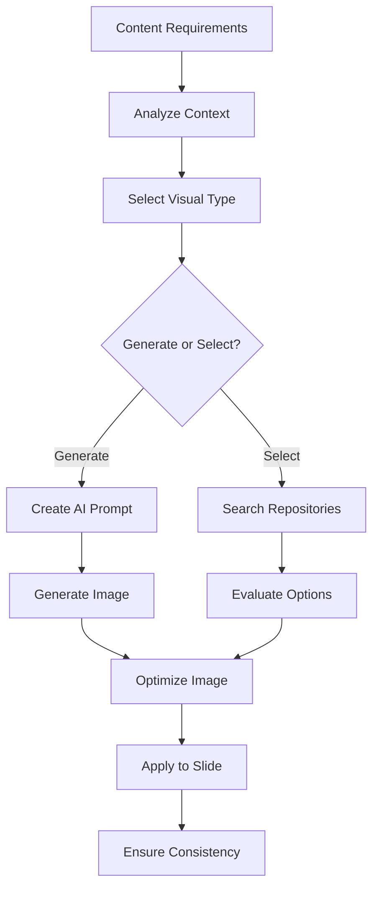

# PPT Visual Agent

## Overview

The PPT Visual Agent is a specialized AI agent responsible for generating and managing all visual elements in presentations. It uses AI models like Stable Diffusion XL and DALL-E 3 for image generation, combined with design principles for effective visual communication.

## Core Capabilities

### 1. Image Generation
- AI-powered image creation from text prompts
- Support for multiple styles (photorealistic, illustration, abstract)
- Diagram and flowchart generation
- Data visualization and chart creation

### 2. Image Selection & Curation
- Search existing image repositories
- Evaluate and select best-fit images
- Verify licensing and usage rights
- Match visuals to content context

### 3. Image Optimization
- Resolution adjustment for presentation display
- Format conversion (PNG, JPEG, WebP)
- Compression without quality loss
- Aspect ratio cropping

### 4. Layout Design
- Suggest optimal visual placement
- Balance text and visual elements
- Apply design principles (rule of thirds, golden ratio)
- Create visual hierarchy

### 5. Style Management
- Maintain consistent visual theme
- Apply brand guidelines
- Coordinate color palettes
- Ensure typography harmony

## Architecture Components

### Agent Configuration
- **Model**: Claude 3.5 Sonnet (latest version)
- **Temperature**: 0.9 for creative visual generation
- **Max Length**: 2048 tokens
- **Session Memory**: Enabled for style consistency

### Action Groups

#### 1. ImageGeneration
Handles AI-powered image creation:
- `generateImage`: Create images from text prompts
- `generateDiagram`: Create technical diagrams
- `generateChart`: Generate data visualizations

#### 2. ImageSelection
Manages image sourcing and selection:
- `searchImages`: Find existing images
- `selectBestImage`: Choose optimal image
- `validateImageRights`: Verify usage rights

#### 3. ImageOptimization
Optimizes images for presentations:
- `optimizeImage`: Adjust resolution and quality
- `cropImage`: Crop to aspect ratios
- `enhanceImage`: Improve image quality

#### 4. LayoutDesign
Designs effective slide layouts:
- `suggestLayout`: Recommend optimal arrangements
- `applyDesignPrinciples`: Apply design rules
- `createVisualHierarchy`: Establish visual priority

#### 5. StyleManagement
Maintains visual consistency:
- `applyTheme`: Apply presentation themes
- `ensureConsistency`: Check visual coherence
- `adaptToBrand`: Align with brand guidelines

## Knowledge Base Structure

### 1. Design Principles
- **Fundamental Concepts**: Balance, contrast, hierarchy, alignment
- **Color Theory**: Color schemes, psychology, accessibility
- **Typography**: Font pairing, readability, hierarchy
- **White Space**: Optimal usage for clarity

### 2. Visual Types
Categories and appropriate uses:
- **Photography**: Real-world imagery, emotional connection
- **Illustrations**: Concept visualization, custom graphics
- **Infographics**: Data presentation, statistics
- **Diagrams**: Process flows, systems, relationships
- **Icons**: Quick recognition, navigation

### 3. Image Generation Guidelines
- **Prompt Engineering**: Effective prompt structures
- **Style Descriptors**: Keywords for different visual styles
- **Negative Prompts**: What to avoid in generation
- **Quality Parameters**: Resolution, format, optimization

### 4. Layout Patterns
Common slide layouts:
- **Title Slides**: Center aligned, split screen
- **Content Slides**: Text with image, image focus, columns
- **Data Slides**: Single chart, dashboard layout
- **Comparison**: Side-by-side, overlapping

### 5. Accessibility Standards
- **Color Contrast**: WCAG AA/AAA compliance
- **Alternative Text**: Descriptive text for images
- **Motion Sensitivity**: Reduced animation options
- **Color Blindness**: Consideration and testing

## Image Generation Process



## Best Practices

### Image Generation Quality

1. **Prompt Engineering**
   - Be specific and descriptive
   - Include style, mood, and composition
   - Specify technical requirements

2. **Style Consistency**
   - Maintain uniform visual style
   - Use consistent color palette
   - Apply same artistic treatment

3. **Resolution Standards**
   - Full-screen: 1920x1080 minimum
   - Half-slide: 960x540 minimum
   - Icons: 128x128 minimum

4. **File Optimization**
   - JPEG for photos (80-90% quality)
   - PNG for graphics with transparency
   - SVG for scalable icons and logos

### Visual Communication

| Visual Type | Best For | Avoid When |
|-------------|----------|------------|
| Photography | Emotional connection, realism | Abstract concepts |
| Illustrations | Explaining concepts | Need for realism |
| Infographics | Data presentation | Simple information |
| Diagrams | Process flows | Emotional appeal |
| Icons | Quick recognition | Complex information |

### Color Usage Guidelines

1. **Professional Presentations**
   - Limit to 3-4 colors
   - Use company brand colors
   - Ensure high contrast

2. **Creative Presentations**
   - Can use broader palette
   - Consider color psychology
   - Maintain harmony

3. **Accessibility**
   - Test for color blindness
   - Maintain WCAG contrast ratios
   - Provide alternatives to color coding

## Usage Examples

### Creating a Business Presentation Visual
```
Request: "Generate professional image for digital transformation slide"

Visual Agent Actions:
1. Analyzes content context (business, technology)
2. Generates prompt: "Modern office with digital overlay, professional photography style, blue tech theme"
3. Creates image using Stable Diffusion XL
4. Optimizes to 1920x1080, JPEG 85% quality
5. Applies to slide with proper positioning
```

### Data Visualization
```
Request: "Create chart showing quarterly revenue growth"

Visual Agent Actions:
1. Analyzes data structure
2. Selects appropriate chart type (column chart)
3. Applies color scheme from theme
4. Generates chart with proper labels
5. Ensures accessibility compliance
```

## Integration with Other Agents

### Coordination Flow
1. **Receives from Content Agent**: Slide content and context
2. **Receives from Orchestrator**: Style preferences and brand guidelines
3. **Sends to Compiler**: Optimized visual assets

### Data Exchange Format
```json
{
  "visual_request": {
    "slide_number": 5,
    "content_type": "concept_explanation",
    "visual_style": "professional",
    "required_elements": ["diagram", "supporting_image"]
  },
  "generated_assets": [
    {
      "type": "diagram",
      "path": "assets/slide5_diagram.png",
      "resolution": "1920x1080",
      "format": "PNG"
    }
  ]
}
```

## Performance Metrics

### Quality Indicators
- Visual relevance score: >85%
- Resolution compliance: 100%
- Style consistency: >90%
- Accessibility compliance: 100%

### Generation Speed
- AI image generation: 5-15 seconds
- Image selection: 2-5 seconds
- Optimization: 1-3 seconds
- Total processing: <30 seconds per slide

## Troubleshooting

### Common Issues

1. **Image Generation Failures**
   - Refine prompt for clarity
   - Try alternative AI model
   - Fallback to stock images

2. **Style Inconsistency**
   - Review theme settings
   - Apply style transfer
   - Regenerate with consistent prompt

3. **Performance Issues**
   - Reduce image resolution
   - Increase compression
   - Use cached results

4. **Licensing Concerns**
   - Verify AI model terms
   - Check stock image licenses
   - Document usage rights

## Future Enhancements

- [ ] Real-time style transfer
- [ ] Advanced prompt templates
- [ ] Custom training on brand visuals
- [ ] 3D visualization support
- [ ] Animated graphics generation
- [ ] AR/VR presentation support
- [ ] Video clip generation
- [ ] Interactive visual elements