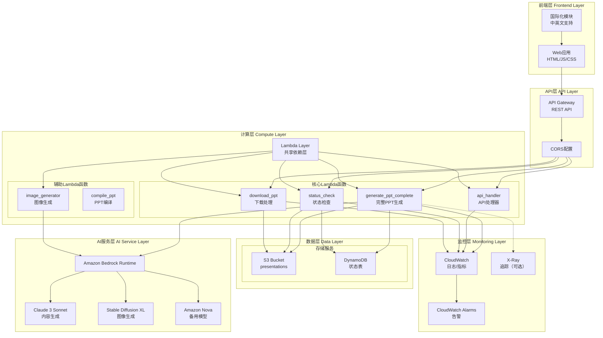
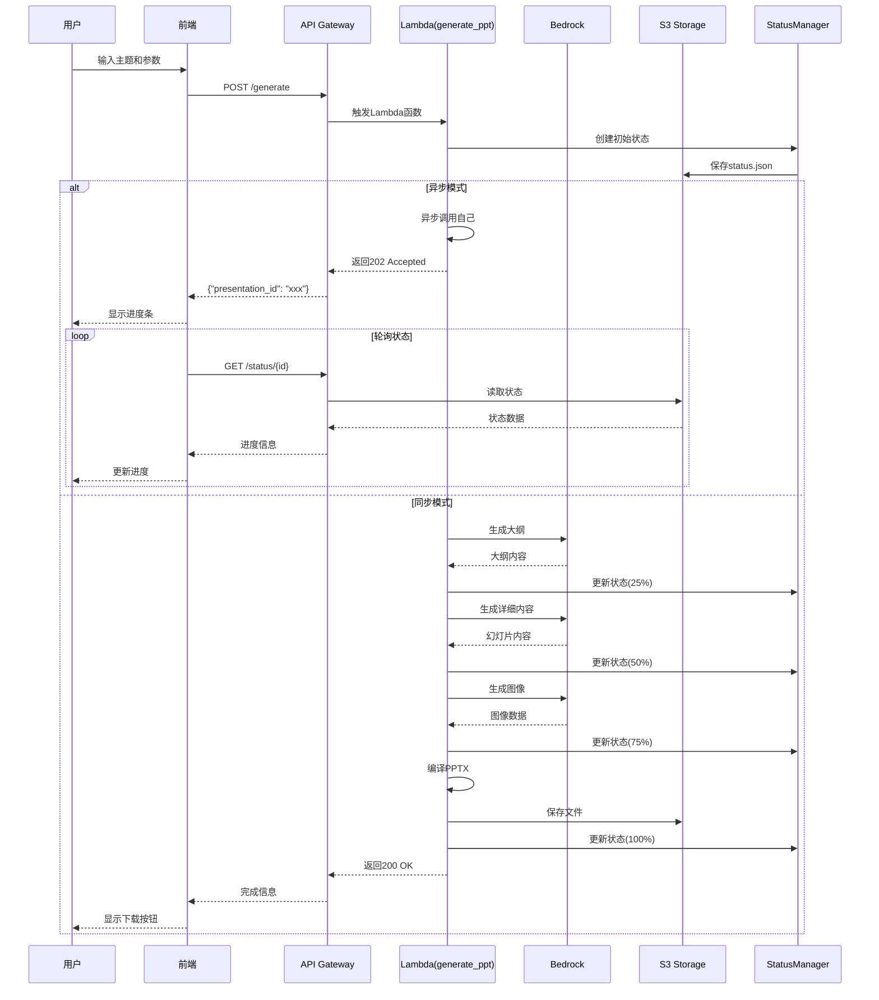
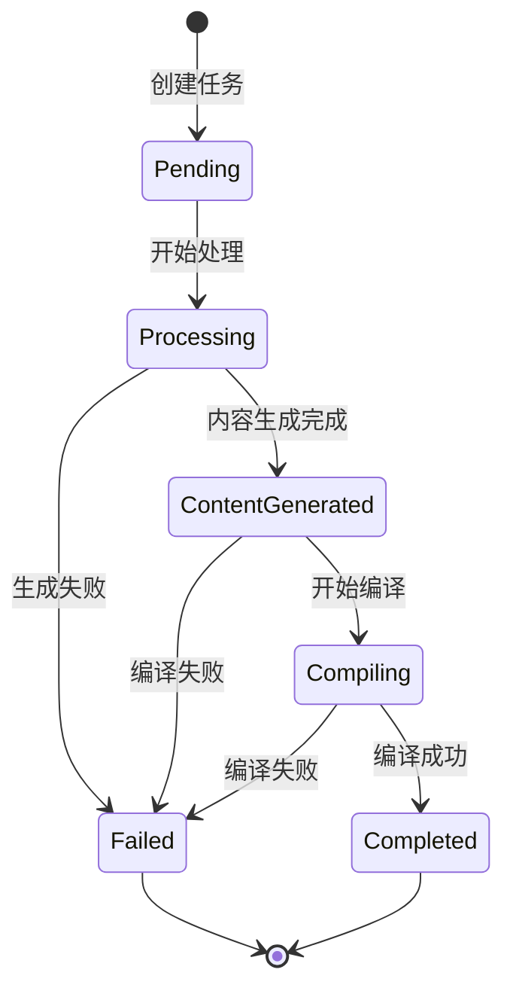

# AI PPT Assistant - 系统架构文档

## 目录

1. [系统概述](#系统概述)
2. [架构原则](#架构原则)
3. [系统架构](#系统架构)
4. [核心组件](#核心组件)
5. [数据流设计](#数据流设计)
6. [技术栈](#技术栈)
7. [API设计](#api设计)
8. [部署架构](#部署架构)
9. [安全架构](#安全架构)
10. [性能优化](#性能优化)
11. [监控和日志](#监控和日志)
12. [容错和灾备](#容错和灾备)

## 系统概述

AI PPT Assistant是一个基于AWS云服务的智能演示文稿生成系统，利用Amazon Bedrock的生成式AI能力（Claude 3和Stable Diffusion），自动创建高质量的PPT演示文稿。系统采用无服务器架构，确保高可用性、弹性扩展和成本优化。

### 核心功能

- **智能内容生成**: 基于主题使用Claude 3 Sonnet自动生成演示文稿大纲和内容
- **AI图像生成**: 使用Stable Diffusion为每个幻灯片生成配图
- **自动排版编译**: 使用python-pptx库自动生成PPTX文件
- **异步处理模式**: 支持长时间运行的PPT生成任务
- **状态追踪**: 实时跟踪PPT生成进度
- **多语言支持**: 前端支持中英文切换

### 项目结构

```
.
├── src/                        # 核心业务逻辑模块
│   ├── bedrock_adapter.py     # Bedrock模型适配器
│   ├── content_generator.py   # 内容生成器
│   ├── ppt_compiler.py        # PPT编译器
│   ├── status_manager.py      # 状态管理器
│   ├── validators.py          # 请求验证器
│   ├── prompts.py            # AI提示词模板
│   └── common/               # 公共服务
│       ├── s3_service.py     # S3操作服务
│       └── response_builder.py # 响应构建器
├── lambdas/                   # Lambda函数实现
│   ├── generate_ppt_complete.py # 完整PPT生成函数
│   ├── api_handler.py        # API处理器
│   ├── status_check.py       # 状态检查函数
│   ├── download_ppt.py       # 下载处理函数
│   └── image_generator.py    # 图像生成函数
├── infrastructure/            # Terraform基础设施配置
│   ├── main.tf               # 主配置文件
│   ├── cloudwatch_monitoring.tf # 监控配置
│   └── lambda_image_processing.tf # 图像处理Lambda配置
├── frontend/                  # 前端应用
│   ├── index.html            # 主页面
│   ├── js/
│   │   ├── app.js           # 主应用逻辑
│   │   ├── config.js        # 配置管理
│   │   ├── status.js        # 状态轮询
│   │   ├── download.js      # 下载管理
│   │   └── i18n.js          # 国际化支持
│   └── css/
└── scripts/                   # 部署和构建脚本
```

## 架构原则

### 设计原则

1. **无服务器优先（Serverless First）**
   - 使用AWS Lambda处理所有计算任务
   - 自动扩展，无需管理服务器
   - 按需付费，降低成本

2. **模块化设计（Modular Design）**
   - 清晰的模块边界和职责分离
   - 独立的Lambda函数处理不同任务
   - 共享层（Lambda Layer）管理依赖

3. **异步处理（Asynchronous Processing）**
   - 长时间运行的任务使用异步模式
   - 状态管理和进度追踪
   - 客户端轮询获取状态

4. **安全设计（Security by Design）**
   - IAM最小权限原则
   - S3存储桶私有访问
   - API Gateway请求验证

5. **容错性（Fault Tolerance）**
   - 重试机制和指数退避
   - 优雅的错误处理
   - 降级策略

## 系统架构

### 整体架构图



### 分层架构

```
┌─────────────────────────────────────────────────────────────┐
│                     表现层 (Presentation Layer)              │
│                   Web UI (HTML/JS/CSS) | i18n               │
├─────────────────────────────────────────────────────────────┤
│                      接入层 (Access Layer)                   │
│                   API Gateway | CORS | 请求验证              │
├─────────────────────────────────────────────────────────────┤
│                     业务逻辑层 (Business Logic)              │
│              Lambda Functions | 内容生成 | PPT编译           │
├─────────────────────────────────────────────────────────────┤
│                      服务层 (Service Layer)                  │
│              Bedrock Runtime | S3 Service | 状态管理         │
├─────────────────────────────────────────────────────────────┤
│                      数据访问层 (Data Access)                │
│                    S3 | DynamoDB | 文件系统                  │
├─────────────────────────────────────────────────────────────┤
│                    基础设施层 (Infrastructure)               │
│                  IAM | CloudWatch | Lambda Layer             │
└─────────────────────────────────────────────────────────────┘
```

## 核心组件

### 1. Lambda函数

#### generate_ppt_complete (lambdas/generate_ppt_complete.py)
**职责**: 端到端处理PPT生成流程
- 验证请求参数
- 调用Bedrock生成大纲和内容
- 协调图像生成
- 编译生成PPTX文件
- 管理异步处理模式

**配置**:
- Runtime: Python 3.11
- Memory: 3008 MB (获得2个vCPU)
- Timeout: 300秒
- 临时存储: 2048 MB

**关键实现**:
```python
# 异步模式处理
if enable_async and not is_async_invocation:
    lambda_client.invoke(
        FunctionName=context.function_name,
        InvocationType='Event',  # 异步调用
        Payload=json.dumps(async_payload)
    )
    return {"statusCode": 202, "body": {...}}
```

#### api_handler (lambdas/api_handler.py)
**职责**: 统一处理API Gateway请求
- 路由请求到相应处理逻辑
- 请求验证和错误处理
- 构建标准化响应

**配置**:
- Memory: 1024 MB
- Timeout: 30秒

#### status_check (lambdas/status_check.py)
**职责**: 查询PPT生成状态
- 从S3读取状态文件
- 返回进度信息
- 提供下载链接（如果完成）

**配置**:
- Memory: 512 MB
- Timeout: 10秒

#### image_generator (lambdas/image_generator.py)
**职责**: 生成幻灯片配图
- 生成图像提示词
- 调用Stable Diffusion生成图像
- 图像后处理和优化
- 上传到S3

### 2. 核心模块 (src/)

#### BedrockAdapter (src/bedrock_adapter.py)
**功能**: 统一处理不同Bedrock模型的API格式差异
- 支持Claude 3、Nova等多种模型
- 自动适配请求和响应格式
- 错误处理和重试逻辑

```python
@staticmethod
def prepare_request(model_id: str, prompt: str, max_tokens: int = 4096):
    if 'nova' in model_id.lower():
        # Nova模型格式
    elif 'claude' in model_id.lower():
        # Claude模型格式
    else:
        # 默认格式
```

#### ContentGenerator (src/content_generator.py)
**功能**: 使用AI生成PPT内容
- 生成PPT大纲
- 生成详细幻灯片内容
- 支持演讲者备注
- 内容验证和清理

#### PPTCompiler (src/ppt_compiler.py)
**功能**: 编译生成PPTX文件
- 使用python-pptx库
- 应用样式和布局
- 插入图片和文本
- 生成下载链接

#### StatusManager (src/status_manager.py)
**功能**: 管理PPT生成状态
- 创建和更新状态
- 进度追踪
- 错误记录
- S3持久化

### 3. 基础设施组件

#### API Gateway
- **类型**: REST API
- **认证**: 无（可扩展为API Key或Cognito）
- **CORS**: 完全配置支持跨域
- **端点**:
  - POST /generate - 生成PPT
  - GET /status/{id} - 查询状态
  - GET /download/{id} - 下载PPT

#### S3 Bucket
- **名称**: ai-ppt-presentations-{environment}
- **结构**:
  ```
  presentations/
  ├── {presentation_id}/
  │   ├── content/
  │   │   └── content.json
  │   ├── images/
  │   │   ├── slide_1.png
  │   │   └── ...
  │   ├── output/
  │   │   └── presentation.pptx
  │   └── status/
  │       └── status.json
  ```
- **安全**: 私有访问，服务端加密

#### DynamoDB
- **表名**: ai-ppt-presentations
- **主键**: presentation_id (分区键), created_at (排序键)
- **GSI**: user-index (user_id为分区键)
- **用途**: 存储演示文稿元数据和状态

#### Lambda Layer
- **名称**: ai-ppt-dependencies-{environment}
- **内容**: 共享Python依赖
  - boto3
  - python-pptx
  - pillow
  - 其他通用库

## 数据流设计

### PPT生成流程



### 状态管理流程



## 技术栈

### 后端技术

| 组件 | 技术选型 | 版本 | 说明 |
|------|----------|------|------|
| **运行时** | Python | 3.11 | Lambda运行时 |
| **AI模型** | Claude 3 Sonnet | Latest | 文本生成 |
| **图像生成** | Stable Diffusion XL | 1.0 | 图像生成 |
| **备用模型** | Amazon Nova | Latest | 备用文本生成 |
| **PPT库** | python-pptx | 0.6.21 | PPT操作 |
| **图像处理** | Pillow | 10.0+ | 图像优化 |
| **AWS SDK** | boto3 | 1.28+ | AWS服务调用 |
| **验证库** | pydantic | 2.0+ | 数据验证 |

### 前端技术

| 组件 | 技术选型 | 版本 | 说明 |
|------|----------|------|------|
| **框架** | 原生JavaScript | ES6+ | 无框架依赖 |
| **样式** | CSS3 | - | 响应式设计 |
| **国际化** | 自定义i18n | - | 中英文支持 |
| **HTTP客户端** | Fetch API | - | 原生API调用 |
| **状态管理** | LocalStorage | - | 本地状态持久化 |

### 基础设施

| 组件 | 服务 | 配置 | 用途 |
|------|------|------|------|
| **计算** | Lambda | 512MB-3GB RAM | 函数计算 |
| **API** | API Gateway | REST API | API管理 |
| **存储** | S3 | Standard | 文件存储 |
| **数据库** | DynamoDB | On-Demand | 元数据存储 |
| **AI平台** | Bedrock Runtime | - | AI模型调用 |
| **监控** | CloudWatch | Custom Metrics | 监控告警 |
| **IaC** | Terraform | 1.0+ | 基础设施即代码 |

## API设计

### API端点

#### 1. POST /generate
**描述**: 生成新的PPT演示文稿

**请求体**:
```json
{
  "topic": "人工智能的未来发展",
  "page_count": 10,
  "style": "professional"
}
```

**响应** (202 Accepted - 异步模式):
```json
{
  "presentation_id": "uuid-v4",
  "status": "processing",
  "message": "PPT生成已开始，请通过状态接口查询进度",
  "status_url": "/status/{presentation_id}"
}
```

**响应** (200 OK - 同步模式):
```json
{
  "presentation_id": "uuid-v4",
  "status": "completed",
  "topic": "人工智能的未来发展",
  "page_count": 10,
  "slides_generated": 10,
  "download_url": "https://...",
  "expires_in": 3600
}
```

#### 2. GET /status/{presentation_id}
**描述**: 查询PPT生成状态

**响应**:
```json
{
  "presentation_id": "uuid-v4",
  "status": "processing",
  "progress": 50,
  "current_step": "content_generation",
  "steps": {
    "outline_generation": true,
    "content_generation": false,
    "ppt_compilation": false,
    "upload_complete": false
  },
  "estimated_completion_time": "2024-01-14T10:30:00Z"
}
```

#### 3. GET /download/{presentation_id}
**描述**: 获取PPT下载链接

**响应**:
```json
{
  "presentation_id": "uuid-v4",
  "download_url": "https://...",
  "expires_in": 3600,
  "file_name": "presentation.pptx",
  "file_size": 2048576
}
```

### 错误响应格式

```json
{
  "error": {
    "code": "VALIDATION_ERROR",
    "message": "请求参数无效",
    "details": {
      "field": "page_count",
      "reason": "必须在1-50之间"
    }
  },
  "request_id": "xxx"
}
```

## 部署架构

### 环境配置

#### 开发环境 (dev)
- **Region**: us-east-1
- **Lambda并发**: 10
- **S3生命周期**: 7天
- **日志保留**: 7天

#### 生产环境 (prod)
- **Region**: us-east-1 (主), us-west-2 (备)
- **Lambda并发**: 100
- **S3生命周期**: 30天
- **日志保留**: 30天
- **预留并发**: 启用

### 部署流程

```bash
# 1. 构建Lambda包
cd scripts
./build_lambda.sh

# 2. 部署基础设施
cd infrastructure
terraform init
terraform plan -var-file=terraform.tfvars
terraform apply -auto-approve

# 3. 验证部署
./test_api.sh
```

### CI/CD配置

```yaml
# GitHub Actions示例
name: Deploy
on:
  push:
    branches: [main]

jobs:
  deploy:
    runs-on: ubuntu-latest
    steps:
      - uses: actions/checkout@v2
      - name: Build Lambda
        run: ./scripts/build_lambda.sh
      - name: Deploy Infrastructure
        run: |
          cd infrastructure
          terraform apply -auto-approve
```

## 安全架构

### IAM权限策略

#### Lambda执行角色
```json
{
  "Version": "2012-10-17",
  "Statement": [
    {
      "Sid": "S3Access",
      "Effect": "Allow",
      "Action": [
        "s3:GetObject",
        "s3:PutObject",
        "s3:DeleteObject"
      ],
      "Resource": "arn:aws:s3:::ai-ppt-presentations-*/*"
    },
    {
      "Sid": "BedrockAccess",
      "Effect": "Allow",
      "Action": [
        "bedrock:InvokeModel"
      ],
      "Resource": [
        "arn:aws:bedrock:*::foundation-model/anthropic.claude-3-*",
        "arn:aws:bedrock:*::foundation-model/stability.stable-diffusion-*"
      ]
    },
    {
      "Sid": "DynamoDBAccess",
      "Effect": "Allow",
      "Action": [
        "dynamodb:PutItem",
        "dynamodb:GetItem",
        "dynamodb:UpdateItem",
        "dynamodb:Query"
      ],
      "Resource": "arn:aws:dynamodb:*:*:table/ai-ppt-presentations*"
    }
  ]
}
```

### 数据安全

1. **传输加密**
   - API Gateway使用HTTPS
   - S3传输使用TLS 1.2+

2. **存储加密**
   - S3: 服务端加密 (SSE-S3)
   - DynamoDB: 默认加密启用

3. **访问控制**
   - S3 Bucket: 阻止公共访问
   - API Gateway: 可配置API Key或Cognito认证
   - Lambda: VPC配置（可选）

### 敏感数据处理

- 不存储用户个人信息
- 生成的内容仅临时存储
- 定期清理过期文件

## 性能优化

### Lambda优化

1. **冷启动优化**
   - 使用Lambda Layer减少部署包大小
   - 预留并发配置（生产环境）
   - 使用3GB内存获得2个vCPU

2. **代码优化**
   ```python
   # 全局变量复用连接
   bedrock_client = boto3.client('bedrock-runtime')
   s3_client = boto3.client('s3')

   def handler(event, context):
       # 复用已初始化的客户端
   ```

3. **异步处理**
   - 长时间任务使用异步模式
   - 客户端立即获得响应
   - 后台处理不阻塞用户

### 缓存策略

1. **静态资源缓存**
   - 前端资源使用浏览器缓存
   - Cache-Control: max-age=86400

2. **S3预签名URL缓存**
   - 下载链接缓存1小时
   - 减少重复生成

### 并发控制

```python
# 限流管理器
class ThrottleManager:
    @staticmethod
    def add_initial_delay(max_delay=1.0):
        """添加随机延迟减少并发冲突"""
        delay = random.uniform(0, max_delay)
        time.sleep(delay)
```

## 监控和日志

### CloudWatch指标

#### 自定义指标
- PPT生成成功率
- 平均生成时间
- Bedrock API调用次数
- 错误率统计

#### Lambda指标
- 调用次数
- 错误次数
- 持续时间
- 并发执行数
- 冷启动次数

### 日志策略

```python
# 结构化日志
logger.info(json.dumps({
    "event": "ppt_generation_started",
    "presentation_id": presentation_id,
    "topic": topic,
    "page_count": page_count,
    "timestamp": datetime.utcnow().isoformat()
}))
```

### 告警配置

| 告警名称 | 条件 | 阈值 | 动作 |
|---------|------|------|------|
| 高错误率 | 错误率 > 5% | 5分钟 | SNS通知 |
| Lambda超时 | 超时次数 > 10 | 5分钟 | SNS通知 |
| 高并发 | 并发 > 80% | 1分钟 | 自动扩容 |
| S3存储 | 使用率 > 80% | 1小时 | 清理策略 |

## 容错和灾备

### 错误处理策略

1. **重试机制**
   ```python
   @retry_with_backoff(max_retries=5, initial_delay=2, backoff_factor=3)
   def invoke_bedrock(prompt):
       # Bedrock调用，自动重试
   ```

2. **降级策略**
   - Bedrock主模型失败时切换到备用模型
   - 图像生成失败时使用默认图片

3. **错误恢复**
   - 保存中间状态，支持断点续传
   - 失败任务可重新触发

### 备份策略

1. **S3版本控制**
   - 启用版本控制
   - 保留30天历史版本

2. **DynamoDB备份**
   - 启用点时间恢复
   - 每日自动备份

3. **代码备份**
   - Git版本控制
   - Lambda版本管理

### 灾难恢复

- **RTO (恢复时间目标)**: < 1小时
- **RPO (恢复点目标)**: < 1小时

恢复流程:
1. 切换到备用区域
2. 恢复S3数据
3. 重新部署Lambda函数
4. 更新DNS记录

## 未来优化方向

### 短期计划 (1-3个月)

1. **性能优化**
   - 实现Redis缓存层
   - Lambda SnapStart支持
   - 并行处理优化

2. **功能增强**
   - 支持更多PPT模板
   - 批量生成功能
   - WebSocket实时通知

3. **监控改进**
   - 完整的X-Ray追踪
   - 自定义Dashboard
   - 成本监控

### 长期计划 (6-12个月)

1. **架构演进**
   - 迁移到容器化部署(ECS/EKS)
   - GraphQL API支持
   - 事件驱动架构(EventBridge)

2. **AI能力扩展**
   - 自定义模型微调
   - 多模态内容支持
   - 智能模板推荐

3. **企业功能**
   - 多租户支持
   - SSO集成
   - 审计日志

---

*最后更新: 2024-12-15*
*版本: 2.0.0*
*基于实际代码实现更新*