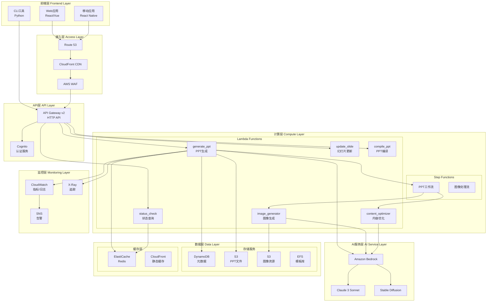
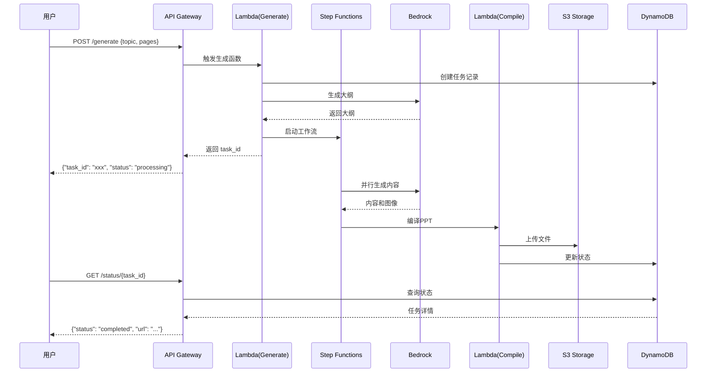
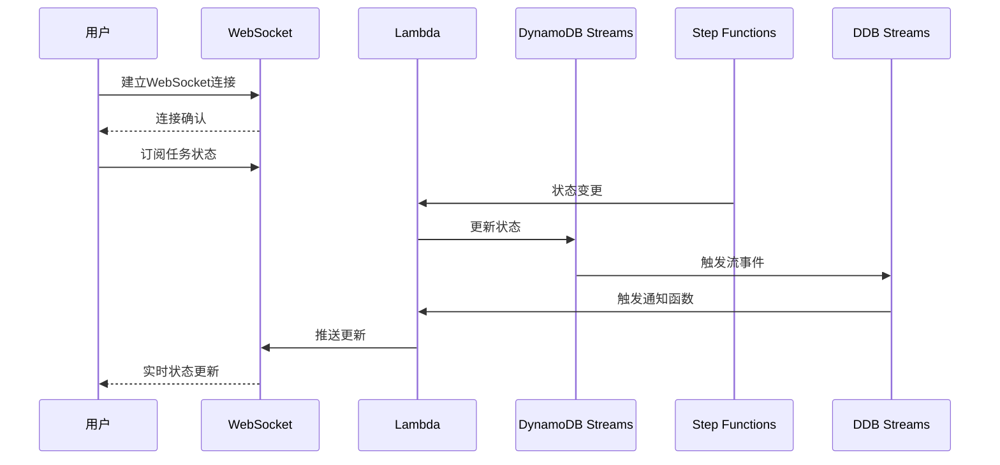
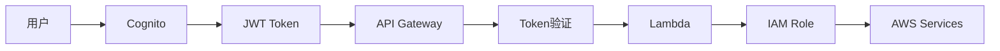

# AI PPT Assistant - 系统架构文档

## 目录

1. [系统概述](#系统概述)
2. [架构原则](#架构原则)
3. [系统架构](#系统架构)
4. [核心组件](#核心组件)
5. [数据流设计](#数据流设计)
6. [技术栈](#技术栈)
7. [扩展性设计](#扩展性设计)
8. [可靠性设计](#可靠性设计)
9. [安全架构](#安全架构)
10. [性能优化](#性能优化)

## 系统概述

AI PPT Assistant是一个云原生的智能演示文稿生成系统，利用Amazon Bedrock的生成式AI能力，自动创建高质量的PPT演示文稿。系统采用无服务器架构，确保高可用性、弹性扩展和成本优化。

### 核心能力

- **智能内容生成**: 基于主题自动生成演示文稿内容
- **自动排版设计**: 智能选择模板和布局
- **图像生成与优化**: AI生成配图和图表
- **多语言支持**: 支持中英文等多语言内容
- **实时协作**: 支持多用户协作编辑
- **版本管理**: 完整的版本历史和回滚能力

## 架构原则

### 设计原则

1. **无服务器优先（Serverless First）**
   - 减少运维负担
   - 自动扩展
   - 按需付费

2. **微服务架构（Microservices）**
   - 服务解耦
   - 独立部署
   - 技术多样性

3. **事件驱动（Event-Driven）**
   - 异步处理
   - 松耦合
   - 高吞吐量

4. **云原生（Cloud Native）**
   - 容器化部署
   - 声明式配置
   - 自动化运维

5. **安全设计（Security by Design）**
   - 零信任架构
   - 最小权限原则
   - 数据加密

## 系统架构

### 整体架构图



### 分层架构

```
┌─────────────────────────────────────────────────────────────┐
│                     表现层 (Presentation Layer)              │
│                   Web UI | Mobile App | CLI                  │
├─────────────────────────────────────────────────────────────┤
│                      接入层 (Access Layer)                   │
│              CloudFront | WAF | Route 53 | API Gateway       │
├─────────────────────────────────────────────────────────────┤
│                     业务逻辑层 (Business Logic)              │
│            Lambda Functions | Step Functions | ECS Tasks     │
├─────────────────────────────────────────────────────────────┤
│                      服务层 (Service Layer)                  │
│         Bedrock | Cognito | SES | SNS | EventBridge         │
├─────────────────────────────────────────────────────────────┤
│                      数据访问层 (Data Access)                │
│              DynamoDB | S3 | ElastiCache | RDS              │
├─────────────────────────────────────────────────────────────┤
│                    基础设施层 (Infrastructure)               │
│                  VPC | IAM | KMS | CloudTrail               │
└─────────────────────────────────────────────────────────────┘
```

## 核心组件

### 1. API Gateway

**职责**：
- RESTful API端点管理
- 请求路由和转换
- 限流和配额管理
- API版本控制

**配置**：
```yaml
Type: HTTP API
Protocol: HTTP/2
Throttle:
  RateLimit: 10000 req/s
  BurstLimit: 20000
Integration: Lambda Proxy
Authorization: JWT (Cognito)
```

### 2. Lambda函数集群

#### generate_ppt函数
```python
# 核心功能：PPT生成协调器
def handler(event, context):
    """
    1. 解析用户请求
    2. 调用Bedrock生成大纲
    3. 触发Step Functions工作流
    4. 返回任务ID
    """
    request = parse_request(event)
    outline = generate_outline(request.topic)
    task_id = start_workflow(outline)
    return {"task_id": task_id, "status": "processing"}
```

#### image_generator函数
```python
# 核心功能：AI图像生成
def handler(event, context):
    """
    1. 接收图像描述
    2. 调用Bedrock SDXL模型
    3. 优化和压缩图像
    4. 上传到S3
    """
    prompt = event['prompt']
    image = generate_image(prompt)
    optimized = optimize_image(image)
    url = upload_to_s3(optimized)
    return {"image_url": url}
```

### 3. DynamoDB数据模型

#### 主表：presentations
```json
{
  "presentation_id": "uuid-v4",          // 分区键
  "created_at": "2024-01-14T10:00:00Z", // 排序键
  "user_id": "user-123",
  "title": "AI技术趋势",
  "status": "completed",
  "metadata": {
    "pages": 15,
    "template": "modern",
    "language": "zh-CN"
  },
  "s3_location": "s3://bucket/path/file.pptx",
  "version": 1,
  "updated_at": "2024-01-14T11:00:00Z"
}
```

#### GSI：user-index
```json
{
  "user_id": "user-123",    // 分区键
  "created_at": "timestamp", // 排序键
  "presentation_id": "uuid"
}
```

### 4. Step Functions工作流

```json
{
  "Comment": "PPT生成工作流",
  "StartAt": "GenerateOutline",
  "States": {
    "GenerateOutline": {
      "Type": "Task",
      "Resource": "arn:aws:lambda:generate-outline",
      "Next": "ParallelContent"
    },
    "ParallelContent": {
      "Type": "Parallel",
      "Branches": [
        {
          "StartAt": "GenerateText",
          "States": {
            "GenerateText": {
              "Type": "Task",
              "Resource": "arn:aws:lambda:generate-content",
              "End": true
            }
          }
        },
        {
          "StartAt": "GenerateImages",
          "States": {
            "GenerateImages": {
              "Type": "Map",
              "ItemsPath": "$.slides",
              "MaxConcurrency": 5,
              "Iterator": {
                "StartAt": "GenerateImage",
                "States": {
                  "GenerateImage": {
                    "Type": "Task",
                    "Resource": "arn:aws:lambda:image-generator",
                    "End": true
                  }
                }
              },
              "End": true
            }
          }
        }
      ],
      "Next": "CompilePPT"
    },
    "CompilePPT": {
      "Type": "Task",
      "Resource": "arn:aws:lambda:compile-ppt",
      "End": true
    }
  }
}
```

## 数据流设计

### PPT生成流程



### 实时更新流程



## 技术栈

### 后端技术

| 组件 | 技术选型 | 版本 | 说明 |
|------|----------|------|------|
| **运行时** | Python | 3.12 | Lambda运行时 |
| **框架** | FastAPI | 0.104 | API框架 |
| **AI模型** | Claude 3 Sonnet | Latest | 文本生成 |
| **图像生成** | Stable Diffusion XL | 1.0 | 图像生成 |
| **PPT库** | python-pptx | 0.6.21 | PPT操作 |
| **异步任务** | Celery | 5.3 | 任务队列 |
| **缓存** | Redis | 7.0 | 数据缓存 |

### 前端技术

| 组件 | 技术选型 | 版本 | 说明 |
|------|----------|------|------|
| **框架** | React | 18.2 | UI框架 |
| **状态管理** | Redux Toolkit | 1.9 | 状态管理 |
| **UI组件** | Ant Design | 5.0 | 组件库 |
| **打包工具** | Vite | 5.0 | 构建工具 |
| **类型检查** | TypeScript | 5.0 | 类型系统 |

### 基础设施

| 组件 | 服务 | 配置 | 用途 |
|------|------|------|------|
| **计算** | Lambda | 3GB RAM, 5min timeout | 函数计算 |
| **API** | API Gateway | HTTP API | API管理 |
| **存储** | S3 | Standard | 文件存储 |
| **数据库** | DynamoDB | On-Demand | 元数据 |
| **缓存** | ElastiCache | Redis 7.0 | 缓存层 |
| **CDN** | CloudFront | Global | 内容分发 |
| **监控** | CloudWatch | Custom Metrics | 监控告警 |

## 扩展性设计

### 水平扩展策略

1. **Lambda并发控制**
```yaml
Reserved Concurrency: 1000
Provisioned Concurrency: 10
Auto-scaling:
  Target: 70% utilization
  Min: 10
  Max: 1000
```

2. **DynamoDB自动扩展**
```yaml
Auto Scaling:
  Read:
    Target: 70%
    Min: 5 RCU
    Max: 40000 RCU
  Write:
    Target: 70%
    Min: 5 WCU
    Max: 40000 WCU
```

3. **API Gateway限流**
```yaml
Throttling:
  RateLimit: 10000 req/s
  BurstLimit: 20000
  Per-Client:
    RateLimit: 100 req/s
    BurstLimit: 200
```

### 分片策略

```python
# DynamoDB分片键设计
def get_partition_key(user_id, timestamp):
    """
    分片策略：user_id + 时间戳
    确保数据均匀分布
    """
    shard = hashlib.md5(user_id.encode()).hexdigest()[:4]
    return f"{shard}#{timestamp}"
```

## 可靠性设计

### 高可用架构

1. **多可用区部署**
   - Lambda自动多AZ
   - S3跨区域复制
   - DynamoDB全球表

2. **故障转移**
   - Route 53健康检查
   - 自动故障转移
   - 备用区域激活

3. **数据持久性**
   - S3: 99.999999999% (11个9)
   - DynamoDB: 99.999%
   - 定期备份到Glacier

### 错误处理

```python
# 重试策略
@retry(
    stop=stop_after_attempt(3),
    wait=wait_exponential(multiplier=1, min=4, max=10),
    retry=retry_if_exception_type(TransientError)
)
def call_bedrock_api(prompt):
    """带指数退避的重试机制"""
    try:
        return bedrock.invoke(prompt)
    except ThrottlingException:
        raise TransientError("API throttled")
```

### 熔断器模式

```python
from pybreaker import CircuitBreaker

bedrock_breaker = CircuitBreaker(
    fail_max=5,
    reset_timeout=60,
    expected_exception=ServiceException
)

@bedrock_breaker
def generate_content(prompt):
    """熔断器保护的API调用"""
    return bedrock_service.generate(prompt)
```

## 安全架构

### 身份认证与授权



### 数据加密

1. **传输加密**
   - TLS 1.3全程加密
   - 证书固定（Certificate Pinning）

2. **存储加密**
   - S3: SSE-S3/SSE-KMS
   - DynamoDB: 默认加密
   - ElastiCache: 传输和存储加密

3. **密钥管理**
```yaml
KMS:
  MasterKey: aws/kms
  DataKeys:
    Rotation: 90 days
    Algorithm: AES-256
  Secrets:
    Storage: Secrets Manager
    Rotation: Automatic
```

### 安全最佳实践

```python
# 输入验证
from pydantic import BaseModel, validator

class PPTRequest(BaseModel):
    topic: str
    pages: int

    @validator('topic')
    def validate_topic(cls, v):
        if len(v) > 200:
            raise ValueError('Topic too long')
        # 防止注入攻击
        if any(c in v for c in ['<', '>', 'script']):
            raise ValueError('Invalid characters')
        return v

    @validator('pages')
    def validate_pages(cls, v):
        if v < 1 or v > 50:
            raise ValueError('Pages must be between 1 and 50')
        return v
```

## 性能优化

### 缓存策略

1. **多级缓存**
```
CloudFront (边缘) → ElastiCache (应用) → Lambda内存 (进程)
```

2. **缓存键设计**
```python
def get_cache_key(user_id, topic, template):
    """生成缓存键"""
    return f"ppt:{user_id}:{hashlib.md5(topic.encode()).hexdigest()}:{template}"
```

3. **缓存预热**
```python
async def warm_cache():
    """预热常用模板和内容"""
    popular_topics = await get_popular_topics()
    for topic in popular_topics:
        await generate_and_cache(topic)
```

### Lambda优化

1. **冷启动优化**
```python
# 全局变量复用连接
import boto3

# 在处理器外初始化
bedrock_client = boto3.client('bedrock-runtime')
dynamodb = boto3.resource('dynamodb')

def handler(event, context):
    # 复用已初始化的客户端
    response = bedrock_client.invoke_model(...)
```

2. **层优化**
```dockerfile
# 使用Lambda层减少部署包大小
FROM public.ecr.aws/lambda/python:3.12

# 只安装生产依赖
COPY requirements.txt .
RUN pip install --no-cache-dir -r requirements.txt -t /opt/python

# 压缩层
RUN find /opt/python -type d -name "__pycache__" -exec rm -r {} +
RUN find /opt/python -type f -name "*.pyc" -delete
```

### 数据库优化

1. **批量操作**
```python
def batch_write_items(items):
    """批量写入优化"""
    with dynamodb.batch_writer() as batch:
        for item in items:
            batch.put_item(Item=item)
```

2. **投影索引**
```python
# 只查询需要的属性
response = table.query(
    IndexName='user-index',
    ProjectionExpression='presentation_id, title, created_at',
    KeyConditionExpression=Key('user_id').eq(user_id)
)
```

### 监控指标

```yaml
Key Metrics:
  API:
    - Latency: p50 < 100ms, p99 < 1s
    - Error Rate: < 0.1%
    - Throughput: > 1000 req/s

  Lambda:
    - Cold Start: < 1s
    - Duration: p50 < 3s, p99 < 10s
    - Concurrent: < 80% reserved

  DynamoDB:
    - Consumed RCU/WCU: < 80%
    - Throttled Requests: 0
    - Latency: < 10ms

  Bedrock:
    - Token Usage: Monitor daily
    - Response Time: < 5s
    - Error Rate: < 1%
```

## 灾难恢复

### RTO和RPO目标

- **RTO (Recovery Time Objective)**: < 1小时
- **RPO (Recovery Point Objective)**: < 5分钟

### 备份策略

```yaml
Backup Strategy:
  DynamoDB:
    - Continuous Backup: Enabled
    - Point-in-time Recovery: 35 days
    - Cross-region Backup: Daily

  S3:
    - Versioning: Enabled
    - Cross-region Replication: Real-time
    - Lifecycle: Archive after 90 days

  Code:
    - Git Repository: Multi-region
    - Lambda Versions: Keep last 10
    - Infrastructure: Terraform state in S3
```

### 恢复流程

```bash
#!/bin/bash
# 灾难恢复脚本

# 1. 切换DNS到备用区域
aws route53 change-resource-record-sets \
  --hosted-zone-id $ZONE_ID \
  --change-batch file://failover.json

# 2. 恢复DynamoDB
aws dynamodb restore-table-from-backup \
  --target-table-name presentations \
  --backup-arn $BACKUP_ARN

# 3. 同步S3数据
aws s3 sync s3://backup-bucket s3://primary-bucket

# 4. 部署Lambda函数
terraform apply -var="region=us-west-2" -auto-approve

# 5. 验证服务
./scripts/health-check.sh
```

## 成本优化

### 资源优化建议

1. **Lambda优化**
   - 使用ARM架构（Graviton2）节省20%成本
   - 根据实际使用调整内存配置
   - 使用预留实例获得折扣

2. **存储优化**
   - S3智能分层
   - DynamoDB按需模式
   - 生命周期策略

3. **网络优化**
   - 使用CloudFront减少源站请求
   - VPC端点避免数据传输费用

### 成本监控

```python
# 成本告警配置
def create_cost_alarm():
    cloudwatch.put_metric_alarm(
        AlarmName='monthly-cost-exceeded',
        ComparisonOperator='GreaterThanThreshold',
        EvaluationPeriods=1,
        MetricName='EstimatedCharges',
        Namespace='AWS/Billing',
        Period=86400,
        Statistic='Maximum',
        Threshold=1000.0,
        ActionsEnabled=True,
        AlarmActions=[sns_topic_arn]
    )
```

## 未来展望

### 路线图

- **Q1 2024**: 多模态支持（视频、音频）
- **Q2 2024**: 实时协作功能
- **Q3 2024**: 移动端原生应用
- **Q4 2024**: AI驱动的演讲辅助

### 技术演进

1. **容器化部署**: 迁移到ECS/Fargate
2. **GraphQL API**: 提供更灵活的查询接口
3. **机器学习优化**: 自定义模型训练
4. **边缘计算**: Lambda@Edge优化

---

*最后更新: 2024-01-14*
*版本: 1.0.0*
*作者: AI PPT Assistant架构团队*