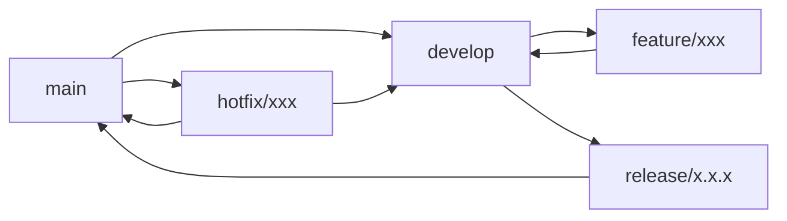
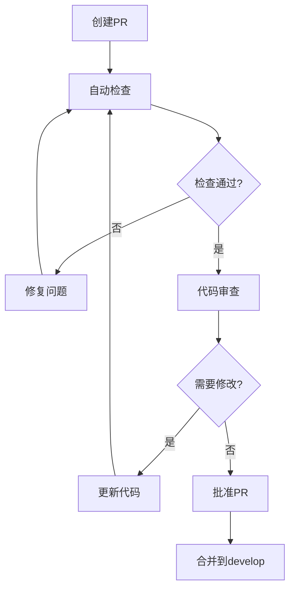

# AI PPT Assistant - 开发者贡献指南

## 目录

1. [欢迎贡献](#欢迎贡献)
2. [开发环境设置](#开发环境设置)
3. [代码规范](#代码规范)
4. [开发流程](#开发流程)
5. [测试要求](#测试要求)
6. [提交规范](#提交规范)
7. [PR流程](#pr流程)
8. [代码审查](#代码审查)
9. [文档要求](#文档要求)
10. [社区指南](#社区指南)

## 欢迎贡献

感谢您对AI PPT Assistant项目的关注！我们欢迎所有形式的贡献：

- 🐛 Bug修复
- ✨ 新功能开发
- 📝 文档改进
- 🎨 UI/UX优化
- ⚡ 性能优化
- 🌐 国际化支持
- 🧪 测试覆盖
- 💡 创意建议

### 贡献者行为准则

我们承诺为所有人提供友好、安全和欢迎的环境。请遵守以下准则：

1. **尊重他人**：使用友好和包容的语言
2. **建设性批评**：提供有价值的反馈
3. **接受不同观点**：尊重不同的经验和想法
4. **专注于目标**：以项目最佳利益为重
5. **保持专业**：在公共空间代表项目时保持专业

## 开发环境设置

### 系统要求

```yaml
最低要求:
  操作系统: macOS 12+ / Ubuntu 20.04+ / Windows 10 WSL2
  Python: 3.12+
  Node.js: 18+
  内存: 8GB RAM
  存储: 10GB可用空间

推荐配置:
  操作系统: macOS 14 / Ubuntu 22.04
  Python: 3.12.1
  Node.js: 20 LTS
  内存: 16GB RAM
  存储: 20GB SSD
```

### 环境准备

#### 1. 克隆仓库

```bash
# 克隆主仓库
git clone https://github.com/your-org/ai-ppt-assistant.git
cd ai-ppt-assistant

# 添加上游仓库
git remote add upstream https://github.com/your-org/ai-ppt-assistant.git

# 验证远程仓库
git remote -v
```

#### 2. Python环境设置

```bash
# 使用pyenv管理Python版本
pyenv install 3.12.1
pyenv local 3.12.1

# 创建虚拟环境
python -m venv venv
source venv/bin/activate  # macOS/Linux
# 或
.\venv\Scripts\activate  # Windows

# 安装依赖
pip install --upgrade pip
pip install -r requirements.txt
pip install -r requirements-dev.txt

# 安装预提交钩子
pre-commit install
```

#### 3. Node.js环境设置

```bash
# 使用nvm管理Node版本
nvm install 20
nvm use 20

# 安装前端依赖
cd frontend
npm install

# 安装全局工具
npm install -g typescript eslint prettier
```

#### 4. AWS本地开发环境

```bash
# 安装AWS CLI
pip install awscli

# 配置AWS凭证（使用开发账号）
aws configure --profile dev
# AWS Access Key ID: [开发环境密钥]
# AWS Secret Access Key: [开发环境密钥]
# Default region name: us-east-1
# Default output format: json

# 安装LocalStack（本地AWS模拟）
pip install localstack
localstack start

# 安装SAM CLI（本地Lambda测试）
pip install aws-sam-cli
```

#### 5. 开发工具配置

```bash
# 安装Terraform
brew install terraform  # macOS
# 或
wget -O- https://apt.releases.hashicorp.com/gpg | gpg --dearmor | sudo tee /usr/share/keyrings/hashicorp-archive-keyring.gpg
echo "deb [signed-by=/usr/share/keyrings/hashicorp-archive-keyring.gpg] https://apt.releases.hashicorp.com $(lsb_release -cs) main" | sudo tee /etc/apt/sources.list.d/hashicorp.list
sudo apt update && sudo apt install terraform  # Ubuntu

# 安装Docker（用于Lambda层构建）
# 访问 https://docs.docker.com/get-docker/

# 验证所有工具
python --version
node --version
aws --version
terraform --version
docker --version
```

### IDE配置

#### VS Code推荐配置

`.vscode/settings.json`:

```json
{
  "python.defaultInterpreter": "${workspaceFolder}/venv/bin/python",
  "python.linting.enabled": true,
  "python.linting.pylintEnabled": true,
  "python.linting.flake8Enabled": true,
  "python.formatting.provider": "black",
  "python.formatting.blackArgs": ["--line-length", "100"],
  "editor.formatOnSave": true,
  "editor.rulers": [100],
  "files.trimTrailingWhitespace": true,
  "files.insertFinalNewline": true,
  "[python]": {
    "editor.codeActionsOnSave": {
      "source.organizeImports": true
    }
  },
  "[javascript]": {
    "editor.defaultFormatter": "esbenp.prettier-vscode"
  },
  "[typescript]": {
    "editor.defaultFormatter": "esbenp.prettier-vscode"
  }
}
```

推荐扩展：

```json
{
  "recommendations": [
    "ms-python.python",
    "ms-python.vscode-pylance",
    "ms-azuretools.vscode-docker",
    "hashicorp.terraform",
    "amazonwebservices.aws-toolkit-vscode",
    "dbaeumer.vscode-eslint",
    "esbenp.prettier-vscode",
    "streetsidesoftware.code-spell-checker"
  ]
}
```

## 代码规范

### Python代码规范

遵循PEP 8和项目特定规范：

```python
"""
模块文档字符串

描述模块功能、用途和主要组件。
"""

import os
import sys
from typing import Dict, List, Optional, Union

import boto3
from pydantic import BaseModel, Field

# 常量定义（大写下划线）
MAX_RETRY_ATTEMPTS = 3
DEFAULT_TIMEOUT = 30

# 类定义（PascalCase）
class PresentationGenerator:
    """
    演示文稿生成器类

    Attributes:
        config: 配置对象
        client: AWS客户端

    Methods:
        generate: 生成演示文稿
        validate: 验证输入
    """

    def __init__(self, config: Dict[str, Any]) -> None:
        """
        初始化生成器

        Args:
            config: 配置字典，包含必要的设置

        Raises:
            ValueError: 配置无效时
        """
        self.config = config
        self.client = self._create_client()

    def generate(
        self,
        topic: str,
        pages: int = 10,
        template: Optional[str] = None
    ) -> Dict[str, Any]:
        """
        生成演示文稿

        Args:
            topic: 演示主题
            pages: 页数，默认10
            template: 模板名称，可选

        Returns:
            包含生成结果的字典

        Raises:
            GenerationError: 生成失败时
        """
        # 输入验证
        self._validate_input(topic, pages)

        # 业务逻辑
        try:
            result = self._process_generation(topic, pages, template)
        except Exception as e:
            logger.error(f"Generation failed: {e}")
            raise GenerationError(f"Failed to generate: {e}") from e

        return result

    def _validate_input(self, topic: str, pages: int) -> None:
        """私有方法使用单下划线前缀"""
        if not topic or len(topic) > 200:
            raise ValueError("Invalid topic")

        if pages < 1 or pages > 50:
            raise ValueError("Pages must be between 1 and 50")

# 函数定义（snake_case）
def process_request(
    event: Dict[str, Any],
    context: Any
) -> Dict[str, Any]:
    """
    处理Lambda请求

    使用Google风格的文档字符串
    """
    # 使用早返回减少嵌套
    if not event:
        return {"statusCode": 400, "body": "Empty event"}

    # 使用上下文管理器
    with PresentationGenerator(config) as generator:
        result = generator.generate(event["topic"])

    # 明确的返回
    return {
        "statusCode": 200,
        "body": json.dumps(result)
    }

# 异常类
class GenerationError(Exception):
    """自定义异常类"""
    pass

# 类型注解示例
ResponseType = Dict[str, Union[str, int, List[str]]]

def format_response(
    data: Any,
    status: int = 200
) -> ResponseType:
    """使用类型注解提高代码可读性"""
    return {
        "statusCode": status,
        "headers": {"Content-Type": "application/json"},
        "body": json.dumps(data)
    }
```

### JavaScript/TypeScript代码规范

```typescript
/**
 * PPT生成服务
 *
 * @module services/PptService
 */

import { AxiosInstance } from 'axios';
import { PPTRequest, PPTResponse } from '@/types';

// 接口定义
interface PptServiceConfig {
  apiUrl: string;
  timeout?: number;
  retryAttempts?: number;
}

// 枚举定义
enum PptStatus {
  PENDING = 'pending',
  PROCESSING = 'processing',
  COMPLETED = 'completed',
  FAILED = 'failed'
}

/**
 * PPT生成服务类
 */
export class PptService {
  private readonly client: AxiosInstance;
  private readonly config: PptServiceConfig;

  /**
   * 构造函数
   * @param config - 服务配置
   */
  constructor(config: PptServiceConfig) {
    this.config = {
      timeout: 30000,
      retryAttempts: 3,
      ...config
    };

    this.client = this.createClient();
  }

  /**
   * 生成PPT
   * @param request - PPT生成请求
   * @returns Promise<PPTResponse>
   */
  async generate(request: PPTRequest): Promise<PPTResponse> {
    // 参数验证
    this.validateRequest(request);

    try {
      // 使用async/await而非.then()
      const response = await this.client.post<PPTResponse>(
        '/generate',
        request
      );

      // 解构赋值
      const { data } = response;

      // 日志记录
      console.log(`PPT generation started: ${data.taskId}`);

      return data;
    } catch (error) {
      // 错误处理
      this.handleError(error);
      throw error;
    }
  }

  /**
   * 验证请求
   * @private
   */
  private validateRequest(request: PPTRequest): void {
    const { topic, pages } = request;

    // 使用可选链
    if (!topic?.trim()) {
      throw new Error('Topic is required');
    }

    // 使用空值合并
    const pageCount = pages ?? 10;
    if (pageCount < 1 || pageCount > 50) {
      throw new Error('Pages must be between 1 and 50');
    }
  }

  /**
   * 错误处理
   * @private
   */
  private handleError(error: unknown): void {
    // 类型守卫
    if (error instanceof Error) {
      console.error(`Error: ${error.message}`);
    } else {
      console.error('Unknown error occurred');
    }
  }
}

// 导出单例
export default new PptService({
  apiUrl: process.env.VITE_API_URL || 'http://localhost:3000'
});

// React组件示例
import React, { useState, useEffect, useCallback } from 'react';

interface PptGeneratorProps {
  userId: string;
  onComplete?: (pptId: string) => void;
}

/**
 * PPT生成器组件
 */
export const PptGenerator: React.FC<PptGeneratorProps> = ({
  userId,
  onComplete
}) => {
  // 使用具名状态
  const [isLoading, setIsLoading] = useState(false);
  const [error, setError] = useState<string | null>(null);

  // 使用useCallback避免不必要的重渲染
  const handleGenerate = useCallback(async (topic: string) => {
    setIsLoading(true);
    setError(null);

    try {
      const response = await PptService.generate({ topic, userId });
      onComplete?.(response.taskId);
    } catch (err) {
      setError(err instanceof Error ? err.message : 'Generation failed');
    } finally {
      setIsLoading(false);
    }
  }, [userId, onComplete]);

  // 组件逻辑...

  return (
    <div className="ppt-generator">
      {/* JSX内容 */}
    </div>
  );
};
```

### Terraform代码规范

```hcl
# infrastructure/modules/lambda/main.tf

/**
 * Lambda函数模块
 *
 * 创建和配置Lambda函数及相关资源
 */

# 使用有意义的资源名称
resource "aws_lambda_function" "ppt_generator" {
  # 必需参数放在前面
  function_name = "${var.project_name}-${var.environment}-generate-ppt"
  role         = aws_iam_role.lambda_execution.arn
  handler      = "index.handler"
  runtime      = "python3.12"

  # 可选参数分组
  memory_size = var.lambda_memory_size
  timeout     = var.lambda_timeout

  # 环境变量使用map
  environment {
    variables = {
      ENVIRONMENT    = var.environment
      DYNAMODB_TABLE = var.dynamodb_table_name
      S3_BUCKET     = var.s3_bucket_name
      LOG_LEVEL     = var.log_level
    }
  }

  # 使用动态块减少重复
  dynamic "vpc_config" {
    for_each = var.vpc_config != null ? [var.vpc_config] : []
    content {
      subnet_ids         = vpc_config.value.subnet_ids
      security_group_ids = vpc_config.value.security_group_ids
    }
  }

  # 标签规范
  tags = merge(
    var.common_tags,
    {
      Name        = "${var.project_name}-generate-ppt"
      Environment = var.environment
      ManagedBy   = "Terraform"
    }
  )

  # 依赖关系明确
  depends_on = [
    aws_iam_role_policy_attachment.lambda_logs,
    aws_cloudwatch_log_group.lambda
  ]
}

# 使用locals简化重复引用
locals {
  function_name = aws_lambda_function.ppt_generator.function_name
  function_arn  = aws_lambda_function.ppt_generator.arn
}

# 输出值描述清晰
output "function_name" {
  description = "Lambda函数名称"
  value       = local.function_name
}

output "function_arn" {
  description = "Lambda函数ARN"
  value       = local.function_arn
}
```

## 开发流程

### Git工作流

我们使用Git Flow工作流：



#### 分支命名规范

- `main` - 生产分支
- `develop` - 开发分支
- `feature/功能名` - 功能分支
- `bugfix/问题描述` - Bug修复分支
- `hotfix/紧急修复` - 紧急修复分支
- `release/版本号` - 发布分支

### 开发步骤

#### 1. 创建功能分支

```bash
# 从develop分支创建
git checkout develop
git pull upstream develop
git checkout -b feature/add-ppt-templates

# 或使用git flow
git flow feature start add-ppt-templates
```

#### 2. 开发和提交

```bash
# 开发功能
vim lambdas/template_manager.py

# 运行测试
pytest tests/unit/test_template_manager.py

# 添加和提交
git add lambdas/template_manager.py
git add tests/unit/test_template_manager.py

# 使用规范的提交信息
git commit -m "feat: add PPT template management system

- Add template CRUD operations
- Support custom templates
- Add template validation

Closes #123"
```

#### 3. 保持分支更新

```bash
# 定期从develop合并最新代码
git fetch upstream
git checkout develop
git merge upstream/develop
git checkout feature/add-ppt-templates
git rebase develop
```

#### 4. 推送分支

```bash
# 推送到个人fork
git push origin feature/add-ppt-templates

# 如果rebase后需要强制推送
git push origin feature/add-ppt-templates --force-with-lease
```

## 测试要求

### 测试金字塔

```
         /\
        /  \    E2E测试 (10%)
       /    \   - Playwright/Selenium
      /------\
     /        \  集成测试 (30%)
    /          \ - API测试
   /            \- 数据库测试
  /--------------\
 /                \ 单元测试 (60%)
/                  \- 业务逻辑
                    - 工具函数
```

### 单元测试

```python
# tests/unit/test_ppt_generator.py

import pytest
from unittest.mock import Mock, patch, MagicMock
from lambdas.generate_ppt import PptGenerator, ValidationError

class TestPptGenerator:
    """PPT生成器测试类"""

    @pytest.fixture
    def generator(self):
        """创建生成器实例"""
        config = {
            "bedrock_model": "claude-3",
            "max_pages": 50
        }
        return PptGenerator(config)

    @pytest.fixture
    def mock_bedrock(self):
        """模拟Bedrock客户端"""
        with patch('boto3.client') as mock_client:
            mock_bedrock = MagicMock()
            mock_client.return_value = mock_bedrock
            yield mock_bedrock

    def test_validate_topic_valid(self, generator):
        """测试有效主题验证"""
        # Arrange
        topic = "AI Technology Trends"

        # Act
        result = generator.validate_topic(topic)

        # Assert
        assert result is True

    def test_validate_topic_empty(self, generator):
        """测试空主题验证"""
        # Arrange
        topic = ""

        # Act & Assert
        with pytest.raises(ValidationError) as exc_info:
            generator.validate_topic(topic)

        assert "Topic cannot be empty" in str(exc_info.value)

    @pytest.mark.parametrize("pages,expected", [
        (1, True),
        (25, True),
        (50, True),
        (0, False),
        (51, False),
        (-1, False)
    ])
    def test_validate_pages(self, generator, pages, expected):
        """参数化测试页数验证"""
        if expected:
            assert generator.validate_pages(pages) is True
        else:
            with pytest.raises(ValidationError):
                generator.validate_pages(pages)

    @patch('lambdas.generate_ppt.PptGenerator._call_bedrock')
    def test_generate_outline(self, mock_call, generator):
        """测试大纲生成"""
        # Arrange
        mock_call.return_value = {
            "slides": [
                {"title": "Introduction", "content": "..."},
                {"title": "Main Points", "content": "..."}
            ]
        }

        # Act
        result = generator.generate_outline("AI Trends", 2)

        # Assert
        assert len(result["slides"]) == 2
        assert result["slides"][0]["title"] == "Introduction"
        mock_call.assert_called_once()

    @pytest.mark.asyncio
    async def test_async_generation(self, generator, mock_bedrock):
        """测试异步生成"""
        # Arrange
        mock_bedrock.invoke_model.return_value = {
            "body": b'{"content": "generated"}'
        }

        # Act
        result = await generator.generate_async("topic")

        # Assert
        assert result is not None
        mock_bedrock.invoke_model.assert_called()
```

### 集成测试

```python
# tests/integration/test_api_integration.py

import pytest
import boto3
from moto import mock_dynamodb, mock_s3
import requests

@pytest.fixture(scope="module")
def api_client():
    """创建API测试客户端"""
    return requests.Session()

@pytest.fixture
def test_data():
    """测试数据"""
    return {
        "topic": "Integration Test Topic",
        "pages": 5,
        "template": "modern"
    }

@mock_dynamodb
@mock_s3
class TestAPIIntegration:
    """API集成测试"""

    def setup_method(self):
        """设置测试环境"""
        # 创建模拟DynamoDB表
        dynamodb = boto3.resource('dynamodb', region_name='us-east-1')
        self.table = dynamodb.create_table(
            TableName='test-presentations',
            KeySchema=[
                {'AttributeName': 'presentation_id', 'KeyType': 'HASH'}
            ],
            AttributeDefinitions=[
                {'AttributeName': 'presentation_id', 'AttributeType': 'S'}
            ],
            BillingMode='PAY_PER_REQUEST'
        )

        # 创建模拟S3桶
        s3 = boto3.client('s3', region_name='us-east-1')
        s3.create_bucket(Bucket='test-ppt-bucket')

    def test_generate_ppt_flow(self, api_client, test_data):
        """测试完整的PPT生成流程"""
        # 1. 发起生成请求
        response = api_client.post(
            "http://localhost:3000/generate",
            json=test_data
        )
        assert response.status_code == 202
        task_id = response.json()["task_id"]

        # 2. 检查状态
        status_response = api_client.get(
            f"http://localhost:3000/status/{task_id}"
        )
        assert status_response.status_code == 200
        assert status_response.json()["status"] in ["processing", "completed"]

        # 3. 获取下载链接
        download_response = api_client.get(
            f"http://localhost:3000/download/{task_id}"
        )
        assert download_response.status_code == 200
        assert "download_url" in download_response.json()

    @pytest.mark.slow
    def test_concurrent_requests(self, api_client, test_data):
        """测试并发请求处理"""
        import concurrent.futures

        def make_request():
            return api_client.post(
                "http://localhost:3000/generate",
                json=test_data
            )

        # 并发10个请求
        with concurrent.futures.ThreadPoolExecutor(max_workers=10) as executor:
            futures = [executor.submit(make_request) for _ in range(10)]
            results = [f.result() for f in futures]

        # 验证所有请求成功
        assert all(r.status_code == 202 for r in results)
        task_ids = [r.json()["task_id"] for r in results]
        assert len(set(task_ids)) == 10  # 确保ID唯一
```

### E2E测试

```typescript
// tests/e2e/ppt-generation.spec.ts

import { test, expect } from '@playwright/test';

test.describe('PPT Generation Flow', () => {
  test.beforeEach(async ({ page }) => {
    // 登录
    await page.goto('http://localhost:3000/login');
    await page.fill('#email', 'test@example.com');
    await page.fill('#password', 'password123');
    await page.click('button[type="submit"]');
    await expect(page).toHaveURL('http://localhost:3000/dashboard');
  });

  test('should generate PPT successfully', async ({ page }) => {
    // 导航到生成页面
    await page.goto('http://localhost:3000/generate');

    // 填写表单
    await page.fill('#topic', 'E2E Test Presentation');
    await page.selectOption('#pages', '10');
    await page.selectOption('#template', 'modern');

    // 提交生成请求
    await page.click('#generate-btn');

    // 等待处理
    await expect(page.locator('.status')).toContainText('Processing', {
      timeout: 5000
    });

    // 等待完成
    await expect(page.locator('.status')).toContainText('Completed', {
      timeout: 60000
    });

    // 验证下载按钮
    const downloadBtn = page.locator('#download-btn');
    await expect(downloadBtn).toBeVisible();
    await expect(downloadBtn).toBeEnabled();

    // 下载文件
    const [download] = await Promise.all([
      page.waitForEvent('download'),
      downloadBtn.click()
    ]);

    // 验证下载
    expect(download.suggestedFilename()).toContain('.pptx');
  });

  test('should handle errors gracefully', async ({ page }) => {
    // 提交无效数据
    await page.goto('http://localhost:3000/generate');
    await page.fill('#topic', '');  // 空主题
    await page.click('#generate-btn');

    // 验证错误提示
    await expect(page.locator('.error-message')).toContainText(
      'Topic is required'
    );
  });
});
```

### 测试覆盖率要求

```yaml
coverage:
  minimum:
    overall: 80%
    statements: 80%
    branches: 75%
    functions: 80%
    lines: 80%

  critical_paths:  # 关键路径要求更高覆盖率
    - path: lambdas/generate_ppt.py
      minimum: 95%
    - path: lambdas/compile_ppt.py
      minimum: 90%
```

运行测试和覆盖率：

```bash
# 运行所有测试
pytest

# 运行特定测试
pytest tests/unit/test_ppt_generator.py

# 生成覆盖率报告
pytest --cov=lambdas --cov-report=html

# 运行性能测试
pytest tests/performance --benchmark-only

# 运行E2E测试
npx playwright test
```

## 提交规范

### Commit Message格式

遵循[Conventional Commits](https://www.conventionalcommits.org/)规范：

```
<type>(<scope>): <subject>

<body>

<footer>
```

#### Type类型

- `feat`: 新功能
- `fix`: Bug修复
- `docs`: 文档更新
- `style`: 代码格式（不影响功能）
- `refactor`: 重构
- `perf`: 性能优化
- `test`: 测试相关
- `build`: 构建系统或依赖
- `ci`: CI/CD配置
- `chore`: 其他杂项

#### 示例

```bash
# 功能添加
git commit -m "feat(lambda): add template management API

- Implement CRUD operations for templates
- Add template validation logic
- Support custom user templates

Closes #234"

# Bug修复
git commit -m "fix(api): resolve timeout issue in PPT generation

The Lambda function was timing out for large presentations.
Increased timeout to 5 minutes and added async processing.

Fixes #456"

# 文档更新
git commit -m "docs: update deployment guide with new environment variables"

# 性能优化
git commit -m "perf(dynamodb): optimize query performance with GSI

Add global secondary index for user queries.
Reduces query time from 2s to 200ms.

Performance improvement: 90%"
```

### 提交前检查

```bash
# 运行pre-commit钩子
pre-commit run --all-files

# 手动检查列表
checklist:
  - [ ] 代码通过linting
  - [ ] 单元测试通过
  - [ ] 文档已更新
  - [ ] commit message规范
  - [ ] 无敏感信息泄露
```

## PR流程

### 创建PR前

1. **确保代码质量**
   ```bash
   # 运行完整测试套件
   make test-all

   # 检查代码质量
   make lint
   make format

   # 更新文档
   make docs
   ```

2. **rebase最新代码**
   ```bash
   git fetch upstream
   git rebase upstream/develop
   ```

### PR模板

```markdown
## 描述
简要描述这个PR的目的和所做的更改

## 变更类型
- [ ] 🐛 Bug修复
- [ ] ✨ 新功能
- [ ] 🔧 配置更改
- [ ] 📝 文档更新
- [ ] ♻️ 代码重构
- [ ] ⚡ 性能优化

## 相关Issue
Closes #(issue_number)

## 改动说明
- 改动点1
- 改动点2
- 改动点3

## 测试
- [ ] 单元测试通过
- [ ] 集成测试通过
- [ ] 手动测试完成

## 截图（如适用）
如果有UI更改，请提供截图

## 检查清单
- [ ] 代码遵循项目规范
- [ ] 自测通过
- [ ] 文档已更新
- [ ] 无破坏性更改
- [ ] 依赖已更新

## 部署注意事项
描述部署时需要注意的事项（如环境变量、数据库迁移等）
```

### PR审查流程



## 代码审查

### 审查重点

#### 1. 功能性
- [ ] 代码实现了预期功能
- [ ] 边界条件处理正确
- [ ] 错误处理完善

#### 2. 可维护性
- [ ] 代码易读易理解
- [ ] 命名清晰有意义
- [ ] 适当的注释和文档

#### 3. 性能
- [ ] 无明显性能问题
- [ ] 适当的缓存策略
- [ ] 数据库查询优化

#### 4. 安全性
- [ ] 输入验证充分
- [ ] 无SQL注入风险
- [ ] 敏感信息处理得当

#### 5. 测试
- [ ] 测试覆盖充分
- [ ] 测试用例有意义
- [ ] 边界条件测试

### 审查评论规范

```markdown
# 建设性评论示例

## 👍 好的评论
"建议将这个复杂的函数拆分成几个小函数，这样更容易测试和维护。例如：
```python
def process_data(data):
    validated_data = validate(data)
    transformed_data = transform(validated_data)
    return save(transformed_data)
```"

## 👎 不好的评论
"这代码写得太差了，重写！"

## 建议格式
[级别] 问题描述
建议的解决方案
相关文档或示例链接

级别：
- 🚨 必须修复（阻塞合并）
- ⚠️ 强烈建议（应该修复）
- 💡 建议（可以考虑）
- ❓ 疑问（需要解释）
- 👏 赞赏（好的实践）
```

## 文档要求

### 代码文档

每个模块、类和公共函数都需要文档字符串：

```python
def calculate_metrics(data: List[Dict], window: int = 30) -> Dict[str, float]:
    """
    计算性能指标

    根据提供的数据计算各种性能指标，包括平均值、中位数、
    P95和P99百分位数。

    Args:
        data: 包含性能数据的字典列表，每个字典必须包含
              'timestamp'和'value'键
        window: 计算窗口大小（天），默认30天

    Returns:
        包含计算结果的字典，键为指标名称，值为计算结果

    Raises:
        ValueError: 当数据为空或window小于1时
        KeyError: 当数据缺少必需键时

    Example:
        >>> data = [
        ...     {"timestamp": "2024-01-01", "value": 100},
        ...     {"timestamp": "2024-01-02", "value": 150}
        ... ]
        >>> metrics = calculate_metrics(data, window=7)
        >>> print(metrics["average"])
        125.0

    Note:
        这个函数假设数据已按时间戳排序。如果数据未排序，
        结果可能不准确。

    See Also:
        - aggregate_metrics: 聚合多个来源的指标
        - export_metrics: 导出指标到外部系统
    """
    # 实现细节...
```

### API文档

使用OpenAPI/Swagger规范：

```yaml
# openapi.yaml

openapi: 3.0.0
info:
  title: AI PPT Assistant API
  version: 1.0.0
  description: API for generating AI-powered presentations

paths:
  /generate:
    post:
      summary: Generate a new presentation
      operationId: generatePresentation
      tags:
        - Presentations
      requestBody:
        required: true
        content:
          application/json:
            schema:
              $ref: '#/components/schemas/GenerateRequest'
            examples:
              basic:
                summary: Basic generation request
                value:
                  topic: "AI Technology Trends"
                  pages: 10
                  template: "modern"
      responses:
        '202':
          description: Generation started successfully
          content:
            application/json:
              schema:
                $ref: '#/components/schemas/GenerateResponse'
        '400':
          description: Invalid request
          content:
            application/json:
              schema:
                $ref: '#/components/schemas/ErrorResponse'

components:
  schemas:
    GenerateRequest:
      type: object
      required:
        - topic
      properties:
        topic:
          type: string
          description: The main topic of the presentation
          minLength: 1
          maxLength: 200
        pages:
          type: integer
          description: Number of slides to generate
          minimum: 1
          maximum: 50
          default: 10
        template:
          type: string
          description: Template to use
          enum: [modern, classic, minimal]
          default: modern
```

### README文档

每个模块需要README：

```markdown
# Module Name

## 概述
简要描述模块的功能和用途

## 安装
```bash
pip install -r requirements.txt
```

## 快速开始
```python
from module import MainClass

instance = MainClass()
result = instance.process(data)
```

## API参考
详细的API文档链接

## 配置
描述所需的环境变量和配置文件

## 示例
提供使用示例

## 测试
```bash
pytest tests/
```

## 贡献
参考主项目的贡献指南

## 许可证
MIT License
```

## 社区指南

### 沟通渠道

- **GitHub Discussions**: 技术讨论和问题
- **Slack**: 实时交流（#ai-ppt-assistant频道）
- **邮件列表**: dev@ai-ppt-assistant.com
- **每周会议**: 周三下午3点（UTC+8）

### 行为准则

1. **友善和尊重**
   - 使用欢迎和包容的语言
   - 尊重不同的观点和经验
   - 优雅地接受建设性批评

2. **协作精神**
   - 主动帮助新贡献者
   - 分享知识和经验
   - 认可他人的贡献

3. **专业态度**
   - 保持专业的交流方式
   - 避免人身攻击
   - 专注于技术讨论

### 获得帮助

如果您需要帮助：

1. 查看[文档](https://docs.ai-ppt-assistant.com)
2. 搜索[已有Issues](https://github.com/org/repo/issues)
3. 在[Discussions](https://github.com/org/repo/discussions)提问
4. 加入[Slack频道](https://ai-ppt-assistant.slack.com)

### 贡献者认可

我们重视每一位贡献者：

- 所有贡献者都会被列入[CONTRIBUTORS.md](./CONTRIBUTORS.md)
- 重要贡献者会获得特殊徽章
- 年度贡献者评选和奖励

## 发布流程

### 版本命名

遵循[语义化版本](https://semver.org/):

- MAJOR.MINOR.PATCH (例如: 1.2.3)
- MAJOR: 不兼容的API更改
- MINOR: 向后兼容的功能添加
- PATCH: 向后兼容的Bug修复

### 发布检查清单

- [ ] 所有测试通过
- [ ] 文档已更新
- [ ] CHANGELOG已更新
- [ ] 版本号已更新
- [ ] 已创建git tag
- [ ] 已发布到PyPI/npm
- [ ] 已更新Docker镜像
- [ ] 已发布GitHub Release

---

*感谢您的贡献！让我们一起构建更好的AI PPT Assistant！*

*最后更新: 2024-01-14*
*版本: 1.0.0*