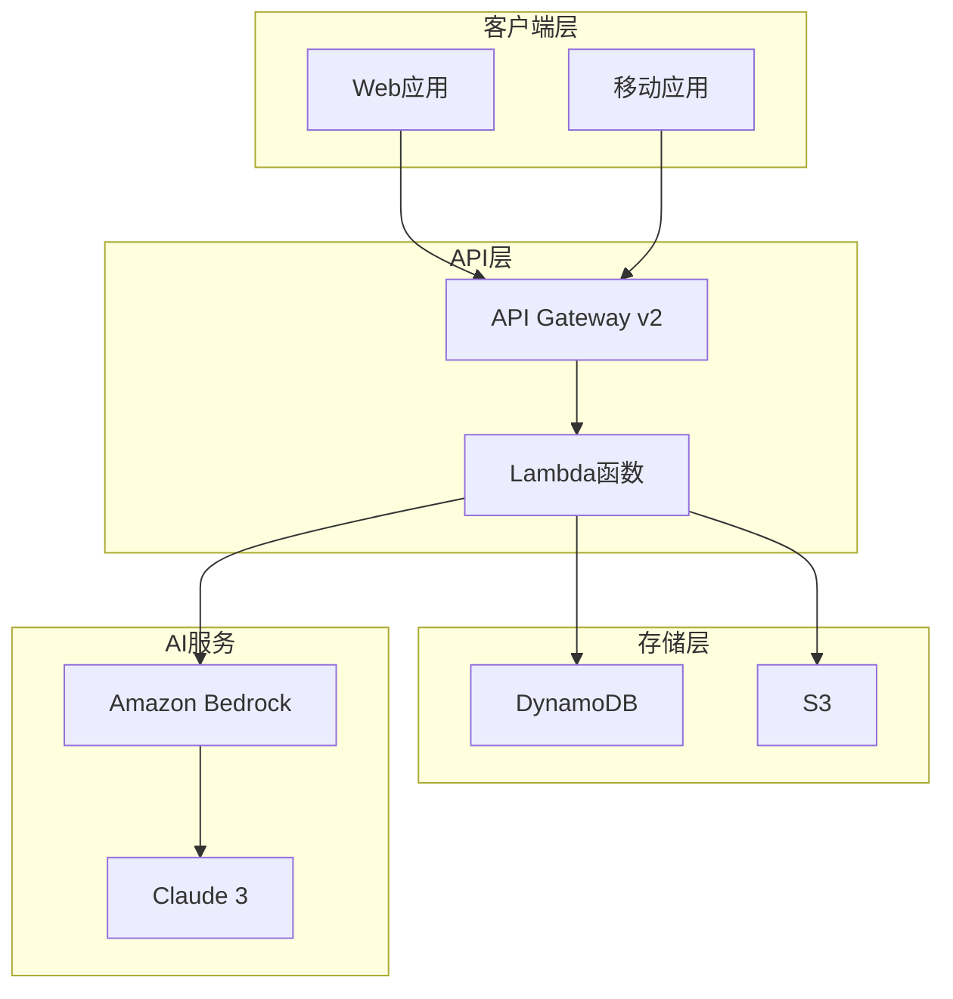

# AI PPT Assistant - 部署指南

## 目录

1. [概述](#概述)
2. [环境准备](#环境准备)
3. [多环境部署策略](#多环境部署策略)
4. [Terraform部署步骤](#terraform部署步骤)
5. [环境变量配置](#环境变量配置)
6. [部署验证](#部署验证)
7. [回滚策略](#回滚策略)
8. [CI/CD集成](#cicd集成)
9. [生产环境部署清单](#生产环境部署清单)
10. [环境清理](#环境清理)

## 概述

AI PPT Assistant是一个基于Amazon Bedrock的智能演示文稿生成系统。本指南提供了从开发到生产环境的完整部署流程。

### 系统架构概览



## 环境准备

### 先决条件

#### 1. AWS账户配置

```bash
# 安装AWS CLI
curl "https://awscli.amazonaws.com/awscli-exe-linux-x86_64.zip" -o "awscliv2.zip"
unzip awscliv2.zip
sudo ./aws/install

# 配置AWS凭证
aws configure
# AWS Access Key ID: [YOUR_ACCESS_KEY]
# AWS Secret Access Key: [YOUR_SECRET_KEY]
# Default region name: us-east-1
# Default output format: json
```

#### 2. 必需工具安装

```bash
# 安装Terraform (>= 1.0)
brew install terraform

# 安装Python 3.12
brew install python@3.12

# 安装Node.js (用于前端)
brew install node

# 安装jq (JSON处理)
brew install jq

# 验证安装
terraform --version
python3.12 --version
node --version
jq --version
```

#### 3. Bedrock Model访问权限

```bash
# 请求Bedrock模型访问权限
aws bedrock request-model-access \
    --model-id anthropic.claude-3-sonnet-20240229-v1:0 \
    --region us-east-1

# 验证模型访问
aws bedrock list-foundation-models \
    --region us-east-1 \
    --query "modelSummaries[?modelId=='anthropic.claude-3-sonnet-20240229-v1:0']"
```

### 项目结构准备

```bash
# 克隆项目仓库
git clone https://github.com/your-org/ai-ppt-assistant.git
cd ai-ppt-assistant

# 安装Python依赖
pip install -r requirements.txt

# 创建必要的目录
mkdir -p infrastructure/environments/{dev,staging,prod}
mkdir -p lambdas/layers
mkdir -p scripts/deployment
```

## 多环境部署策略

### 环境架构

| 环境 | 用途 | 配置特点 | 访问限制 |
|------|------|----------|----------|
| **Dev** | 开发测试 | 最小资源配置，快速迭代 | 内部开发团队 |
| **Staging** | 预发布测试 | 接近生产配置，完整功能 | 内部测试团队 |
| **Prod** | 生产环境 | 高可用、自动扩展、监控 | 公开访问 |

### 环境隔离策略

```hcl
# infrastructure/environments/dev/terraform.tfvars
environment         = "dev"
aws_region         = "us-east-1"
dynamodb_capacity  = "ON_DEMAND"
lambda_memory      = 512
lambda_timeout     = 30
api_throttle_rate  = 100
api_burst_limit    = 200
enable_monitoring  = false
enable_backup      = false

# infrastructure/environments/staging/terraform.tfvars
environment         = "staging"
aws_region         = "us-east-1"
dynamodb_capacity  = "ON_DEMAND"
lambda_memory      = 1024
lambda_timeout     = 60
api_throttle_rate  = 500
api_burst_limit    = 1000
enable_monitoring  = true
enable_backup      = true

# infrastructure/environments/prod/terraform.tfvars
environment         = "prod"
aws_region         = "us-east-1"
dynamodb_capacity  = "PROVISIONED"
dynamodb_read_cap  = 100
dynamodb_write_cap = 100
lambda_memory      = 3008
lambda_timeout     = 300
api_throttle_rate  = 2000
api_burst_limit    = 4000
enable_monitoring  = true
enable_backup      = true
enable_xray       = true
```

## Terraform部署步骤

### 1. 初始化Terraform

```bash
cd infrastructure

# 初始化Terraform和下载providers
terraform init

# 创建工作空间
terraform workspace new dev
terraform workspace new staging
terraform workspace new prod

# 选择部署环境
terraform workspace select dev
```

### 2. 准备Lambda层

```bash
# 构建依赖层
cd ../lambdas/layers
./build-layer.sh

# 返回infrastructure目录
cd ../../infrastructure
```

### 3. 验证配置

```bash
# 格式化Terraform代码
terraform fmt -recursive

# 验证配置语法
terraform validate

# 生成部署计划
terraform plan -var-file="environments/dev/terraform.tfvars" -out=tfplan

# 审查部署计划
terraform show tfplan
```

### 4. 执行部署

```bash
# 应用部署（开发环境）
terraform apply tfplan

# 或直接部署（会提示确认）
terraform apply -var-file="environments/dev/terraform.tfvars"

# 自动批准部署（CI/CD使用）
terraform apply -var-file="environments/dev/terraform.tfvars" -auto-approve
```

### 5. 部署输出

```bash
# 查看部署输出
terraform output -json > deployment-output.json

# 提取API端点
API_ENDPOINT=$(terraform output -raw api_gateway_url)
echo "API Endpoint: $API_ENDPOINT"

# 提取S3存储桶
S3_BUCKET=$(terraform output -raw s3_bucket_name)
echo "S3 Bucket: $S3_BUCKET"
```

## 环境变量配置

### Lambda环境变量

```python
# 通过Terraform自动配置的环境变量
ENVIRONMENT         = "dev|staging|prod"
AWS_REGION         = "us-east-1"
DYNAMODB_TABLE     = "ai-ppt-presentations"
S3_BUCKET          = "ai-ppt-presentations-{env}-{account_id}"
BEDROCK_MODEL_ID   = "anthropic.claude-3-sonnet-20240229-v1:0"
LOG_LEVEL          = "DEBUG|INFO|WARNING|ERROR"
ENABLE_XRAY        = "true|false"
API_KEY            = "encrypted_api_key"  # 使用AWS Secrets Manager
```

### Secrets管理

```bash
# 创建Secrets
aws secretsmanager create-secret \
    --name ai-ppt-assistant/prod/api-key \
    --secret-string '{"api_key":"your-secure-api-key"}'

# 在Lambda中使用
import boto3
import json

def get_secret(secret_name):
    session = boto3.session.Session()
    client = session.client('secretsmanager')
    response = client.get_secret_value(SecretId=secret_name)
    return json.loads(response['SecretString'])
```

## 部署验证

### 1. 基础设施验证

```bash
# 验证API Gateway
aws apigatewayv2 get-apis \
    --query "Items[?Name=='ai-ppt-assistant-api-dev']"

# 验证Lambda函数
aws lambda list-functions \
    --query "Functions[?starts_with(FunctionName, 'ai-ppt-assistant')].[FunctionName,Runtime,State]" \
    --output table

# 验证DynamoDB表
aws dynamodb describe-table \
    --table-name ai-ppt-presentations \
    --query "Table.TableStatus"

# 验证S3存储桶
aws s3api head-bucket --bucket $S3_BUCKET
```

### 2. 功能测试

```bash
# 测试PPT生成API
curl -X POST $API_ENDPOINT/generate \
    -H "Content-Type: application/json" \
    -d '{"topic":"AI技术趋势","pages":5}'

# 测试状态查询
PRESENTATION_ID="test-presentation-id"
curl -X GET $API_ENDPOINT/status/$PRESENTATION_ID

# 测试下载链接
curl -X GET $API_ENDPOINT/download/$PRESENTATION_ID
```

### 3. 性能验证

```python
# scripts/deployment/performance_test.py
import asyncio
import aiohttp
import time

async def test_endpoint(session, url, payload):
    start = time.time()
    async with session.post(url, json=payload) as response:
        await response.text()
        return time.time() - start

async def load_test(endpoint, concurrent=10, total=100):
    async with aiohttp.ClientSession() as session:
        tasks = []
        for i in range(total):
            task = test_endpoint(session, f"{endpoint}/generate",
                                {"topic": f"Test {i}", "pages": 5})
            tasks.append(task)
            if len(tasks) >= concurrent:
                results = await asyncio.gather(*tasks)
                print(f"Batch complete. Avg: {sum(results)/len(results):.2f}s")
                tasks = []

        if tasks:
            results = await asyncio.gather(*tasks)
            print(f"Final batch. Avg: {sum(results)/len(results):.2f}s")

# 运行测试
asyncio.run(load_test(API_ENDPOINT))
```

## 回滚策略

### 1. 快速回滚

```bash
# 保存当前状态
terraform state pull > terraform.state.backup

# 查看历史版本
terraform state list

# 回滚到上一个版本
terraform apply -var-file="environments/prod/terraform.tfvars" \
    -target=aws_lambda_function.generate_ppt \
    -replace=aws_lambda_function.generate_ppt

# 或使用之前的tfplan
terraform apply previous.tfplan
```

### 2. Lambda版本管理

```bash
# 创建Lambda别名
aws lambda create-alias \
    --function-name ai-ppt-assistant-generate \
    --name PROD \
    --function-version 1

# 更新别名指向
aws lambda update-alias \
    --function-name ai-ppt-assistant-generate \
    --name PROD \
    --function-version 2

# 回滚到之前版本
aws lambda update-alias \
    --function-name ai-ppt-assistant-generate \
    --name PROD \
    --function-version 1
```

### 3. 数据库回滚

```bash
# 启用DynamoDB时间点恢复
aws dynamodb update-continuous-backups \
    --table-name ai-ppt-presentations \
    --point-in-time-recovery-specification PointInTimeRecoveryEnabled=true

# 恢复到特定时间点
aws dynamodb restore-table-to-point-in-time \
    --source-table-name ai-ppt-presentations \
    --target-table-name ai-ppt-presentations-restored \
    --restore-date-time 2024-01-01T12:00:00Z
```

## CI/CD集成

### GitHub Actions工作流

```yaml
# .github/workflows/deploy.yml
name: Deploy AI PPT Assistant

on:
  push:
    branches:
      - main
      - staging
      - develop

env:
  AWS_REGION: us-east-1
  TF_VERSION: 1.5.0

jobs:
  deploy:
    runs-on: ubuntu-latest

    steps:
    - uses: actions/checkout@v3

    - name: Configure AWS credentials
      uses: aws-actions/configure-aws-credentials@v2
      with:
        aws-access-key-id: ${{ secrets.AWS_ACCESS_KEY_ID }}
        aws-secret-access-key: ${{ secrets.AWS_SECRET_ACCESS_KEY }}
        aws-region: ${{ env.AWS_REGION }}

    - name: Setup Terraform
      uses: hashicorp/setup-terraform@v2
      with:
        terraform_version: ${{ env.TF_VERSION }}

    - name: Determine Environment
      id: env
      run: |
        if [[ "${{ github.ref }}" == "refs/heads/main" ]]; then
          echo "environment=prod" >> $GITHUB_OUTPUT
        elif [[ "${{ github.ref }}" == "refs/heads/staging" ]]; then
          echo "environment=staging" >> $GITHUB_OUTPUT
        else
          echo "environment=dev" >> $GITHUB_OUTPUT
        fi

    - name: Build Lambda Layers
      run: |
        cd lambdas/layers
        ./build-layer.sh

    - name: Terraform Init
      run: |
        cd infrastructure
        terraform init
        terraform workspace select ${{ steps.env.outputs.environment }}

    - name: Terraform Plan
      run: |
        cd infrastructure
        terraform plan \
          -var-file="environments/${{ steps.env.outputs.environment }}/terraform.tfvars" \
          -out=tfplan

    - name: Terraform Apply
      if: github.event_name == 'push'
      run: |
        cd infrastructure
        terraform apply tfplan

    - name: Run Integration Tests
      run: |
        cd tests
        pytest integration/ --env=${{ steps.env.outputs.environment }}

    - name: Notify Deployment
      uses: 8398a7/action-slack@v3
      with:
        status: ${{ job.status }}
        text: 'Deployment to ${{ steps.env.outputs.environment }} completed'
        webhook_url: ${{ secrets.SLACK_WEBHOOK }}
```

## 生产环境部署清单

### 部署前检查

- [ ] **代码审查完成**
  - [ ] 所有PR已审查和批准
  - [ ] 安全扫描通过
  - [ ] 代码覆盖率达标（>80%）

- [ ] **测试完成**
  - [ ] 单元测试通过
  - [ ] 集成测试通过
  - [ ] 性能测试达标
  - [ ] 安全测试通过

- [ ] **文档更新**
  - [ ] API文档更新
  - [ ] 运维手册更新
  - [ ] 变更日志更新

- [ ] **基础设施准备**
  - [ ] 备份策略配置
  - [ ] 监控告警配置
  - [ ] 日志聚合配置
  - [ ] 灾难恢复计划

### 部署步骤

1. **备份当前状态**
   ```bash
   ./scripts/backup-production.sh
   ```

2. **部署到Staging**
   ```bash
   terraform workspace select staging
   terraform apply -var-file="environments/staging/terraform.tfvars"
   ```

3. **Staging验证**
   ```bash
   ./scripts/validate-staging.sh
   ```

4. **生产部署**
   ```bash
   terraform workspace select prod
   terraform apply -var-file="environments/prod/terraform.tfvars"
   ```

5. **生产验证**
   ```bash
   ./scripts/validate-production.sh
   ```

6. **监控确认**
   - 检查CloudWatch指标
   - 验证X-Ray追踪
   - 确认告警配置

### 部署后验证

- [ ] **功能验证**
  - [ ] API端点响应正常
  - [ ] PPT生成功能正常
  - [ ] 文件下载功能正常

- [ ] **性能验证**
  - [ ] 响应时间符合SLA
  - [ ] 并发处理能力达标
  - [ ] 资源使用率正常

- [ ] **安全验证**
  - [ ] SSL证书有效
  - [ ] API密钥正常
  - [ ] IAM权限最小化

- [ ] **监控验证**
  - [ ] CloudWatch指标正常
  - [ ] 日志收集正常
  - [ ] 告警触发正常

## 故障处理

### 常见问题

1. **Lambda冷启动慢**
   ```bash
   # 启用预留并发
   aws lambda put-provisioned-concurrency-config \
     --function-name ai-ppt-assistant-generate \
     --qualifier PROD \
     --provisioned-concurrent-executions 5
   ```

2. **DynamoDB限流**
   ```bash
   # 增加读写容量
   aws dynamodb update-table \
     --table-name ai-ppt-presentations \
     --provisioned-throughput ReadCapacityUnits=200,WriteCapacityUnits=200
   ```

3. **API Gateway超时**
   ```bash
   # 增加超时时间
   aws apigatewayv2 update-integration \
     --api-id $API_ID \
     --integration-id $INTEGRATION_ID \
     --timeout-in-millis 30000
   ```

## 环境清理

### 清理策略概述

环境清理是资源管理的重要环节，可以避免不必要的成本开销和资源浪费。以下提供了完整的清理流程。

### 1. 开发环境清理

开发环境应定期清理，保持资源的有效利用。

```bash
# 切换到开发环境
cd infrastructure
terraform workspace select dev

# 生成销毁计划
terraform plan -destroy -var-file="environments/dev/terraform.tfvars" -out=destroy-plan

# 查看将要删除的资源
terraform show destroy-plan

# 执行销毁（需要确认）
terraform destroy -var-file="environments/dev/terraform.tfvars"

# 自动确认销毁（谨慎使用）
terraform destroy -var-file="environments/dev/terraform.tfvars" -auto-approve
```

### 2. 分阶段清理

对于生产环境，建议分阶段清理以降低风险：

#### 第一阶段：清理计算资源

```bash
# 删除Lambda函数
aws lambda delete-function --function-name ai-ppt-generate-dev
aws lambda delete-function --function-name ai-ppt-api-handler-dev
aws lambda delete-function --function-name ai-ppt-status-dev
aws lambda delete-function --function-name ai-ppt-download-dev

# 删除Lambda层
aws lambda delete-layer-version \
  --layer-name ai-ppt-dependencies-layer-dev \
  --version-number 1

# 删除API Gateway
API_ID=$(aws apigatewayv2 get-apis \
  --query "Items[?Name=='ai-ppt-assistant-api-dev'].ApiId" \
  --output text)
aws apigatewayv2 delete-api --api-id $API_ID
```

#### 第二阶段：清理存储资源

```bash
# 清空并删除S3存储桶
BUCKET_NAME="ai-ppt-presentations-dev-$(aws sts get-caller-identity --query Account --output text)"

# 删除所有对象版本（如果启用了版本控制）
aws s3api delete-objects \
  --bucket $BUCKET_NAME \
  --delete "$(aws s3api list-object-versions \
    --bucket $BUCKET_NAME \
    --output json \
    --query '{Objects: Versions[].{Key:Key,VersionId:VersionId}}')"

# 删除所有对象
aws s3 rm s3://$BUCKET_NAME --recursive

# 删除存储桶
aws s3api delete-bucket --bucket $BUCKET_NAME

# 删除缓存桶
aws s3 rm s3://ai-ppt-image-cache-dev --recursive
aws s3api delete-bucket --bucket ai-ppt-image-cache-dev
```

#### 第三阶段：清理数据库

```bash
# 备份DynamoDB数据（如需要）
aws dynamodb create-backup \
  --table-name ai-ppt-presentations \
  --backup-name "ai-ppt-presentations-backup-$(date +%Y%m%d-%H%M%S)"

# 删除DynamoDB表
aws dynamodb delete-table --table-name ai-ppt-presentations

# 等待表删除完成
aws dynamodb wait table-not-exists --table-name ai-ppt-presentations
```

### 3. 清理IAM资源

```bash
# 分离角色策略
aws iam detach-role-policy \
  --role-name ai-ppt-lambda-role-dev \
  --policy-arn arn:aws:iam::aws:policy/AmazonBedrockFullAccess

aws iam detach-role-policy \
  --role-name ai-ppt-lambda-role-dev \
  --policy-arn arn:aws:iam::aws:policy/service-role/AWSLambdaBasicExecutionRole

# 删除自定义策略
POLICY_ARN=$(aws iam list-policies \
  --query "Policies[?PolicyName=='ai-ppt-lambda-policy-dev'].Arn" \
  --output text)
aws iam delete-policy --policy-arn $POLICY_ARN

# 删除IAM角色
aws iam delete-role --role-name ai-ppt-lambda-role-dev
```

### 4. 清理网络资源

```bash
# 如果使用了VPC配置
VPC_ID=$(aws ec2 describe-vpcs \
  --filters "Name=tag:Name,Values=ai-ppt-vpc-dev" \
  --query "Vpcs[0].VpcId" \
  --output text)

# 删除安全组
aws ec2 delete-security-group \
  --group-name ai-ppt-lambda-sg-dev

# 删除子网
aws ec2 describe-subnets \
  --filters "Name=vpc-id,Values=$VPC_ID" \
  --query "Subnets[].SubnetId" | \
  xargs -I {} aws ec2 delete-subnet --subnet-id {}

# 删除VPC（如果是独立创建的）
aws ec2 delete-vpc --vpc-id $VPC_ID
```

### 5. 清理CloudWatch资源

```bash
# 删除日志组
aws logs delete-log-group --log-group-name /aws/lambda/ai-ppt-generate-dev
aws logs delete-log-group --log-group-name /aws/lambda/ai-ppt-api-handler-dev
aws logs delete-log-group --log-group-name /aws/lambda/ai-ppt-status-dev
aws logs delete-log-group --log-group-name /aws/lambda/ai-ppt-download-dev

# 删除CloudWatch告警
aws cloudwatch delete-alarms \
  --alarm-names $(aws cloudwatch describe-alarms \
    --alarm-name-prefix "ai-ppt-" \
    --query "MetricAlarms[].AlarmName" \
    --output text)

# 删除自定义指标
aws cloudwatch delete-dashboards \
  --dashboard-names ai-ppt-assistant-dashboard-dev
```

### 6. 完整清理脚本

创建一个完整的清理脚本 `scripts/cleanup-environment.sh`：

```bash
#!/bin/bash
set -e

# 配置变量
ENVIRONMENT=${1:-dev}
ACCOUNT_ID=$(aws sts get-caller-identity --query Account --output text)
REGION=${AWS_REGION:-us-east-1}

echo "========================================="
echo "清理环境: $ENVIRONMENT"
echo "账户ID: $ACCOUNT_ID"
echo "区域: $REGION"
echo "========================================="

# 确认操作
read -p "确定要清理 $ENVIRONMENT 环境吗? (yes/no): " confirm
if [[ $confirm != "yes" ]]; then
    echo "操作已取消"
    exit 0
fi

# 使用Terraform清理
if [[ -f "infrastructure/terraform.tfstate" ]]; then
    echo "使用Terraform清理资源..."
    cd infrastructure
    terraform workspace select $ENVIRONMENT
    terraform destroy -var-file="environments/$ENVIRONMENT/terraform.tfvars" -auto-approve
    cd ..
else
    echo "未找到Terraform状态文件，使用AWS CLI清理..."

    # Lambda函数
    for func in generate api-handler status download; do
        echo "删除Lambda函数: ai-ppt-$func-$ENVIRONMENT"
        aws lambda delete-function \
            --function-name ai-ppt-$func-$ENVIRONMENT \
            2>/dev/null || true
    done

    # S3存储桶
    BUCKET="ai-ppt-presentations-$ENVIRONMENT-$ACCOUNT_ID"
    if aws s3api head-bucket --bucket $BUCKET 2>/dev/null; then
        echo "清理S3存储桶: $BUCKET"
        aws s3 rm s3://$BUCKET --recursive
        aws s3api delete-bucket --bucket $BUCKET
    fi

    # DynamoDB表
    TABLE="ai-ppt-presentations-$ENVIRONMENT"
    if aws dynamodb describe-table --table-name $TABLE 2>/dev/null; then
        echo "删除DynamoDB表: $TABLE"
        aws dynamodb delete-table --table-name $TABLE
    fi

    # CloudWatch日志组
    for func in generate api-handler status download; do
        LOG_GROUP="/aws/lambda/ai-ppt-$func-$ENVIRONMENT"
        echo "删除日志组: $LOG_GROUP"
        aws logs delete-log-group --log-group-name $LOG_GROUP 2>/dev/null || true
    done
fi

echo "========================================="
echo "环境清理完成: $ENVIRONMENT"
echo "========================================="
```

### 7. 清理验证

```bash
# 验证资源是否已清理
echo "=== 验证Lambda函数 ==="
aws lambda list-functions \
  --query "Functions[?contains(FunctionName, 'ai-ppt')].[FunctionName]" \
  --output table

echo "=== 验证S3存储桶 ==="
aws s3api list-buckets \
  --query "Buckets[?contains(Name, 'ai-ppt')].[Name]" \
  --output table

echo "=== 验证DynamoDB表 ==="
aws dynamodb list-tables \
  --query "TableNames[?contains(@, 'ai-ppt')]" \
  --output table

echo "=== 验证IAM角色 ==="
aws iam list-roles \
  --query "Roles[?contains(RoleName, 'ai-ppt')].[RoleName]" \
  --output table
```

### 8. 清理最佳实践

#### 定期清理策略

- **开发环境**: 每周五下班前清理未使用的资源
- **测试环境**: 每次测试完成后立即清理
- **预发布环境**: 发布完成后保留一周再清理
- **生产环境**: 仅在确认迁移或下线后清理

#### 自动化清理

```yaml
# .github/workflows/cleanup.yml
name: 自动清理开发环境

on:
  schedule:
    - cron: '0 22 * * 5'  # 每周五晚上10点
  workflow_dispatch:

jobs:
  cleanup:
    runs-on: ubuntu-latest
    steps:
    - uses: actions/checkout@v3

    - name: Configure AWS
      uses: aws-actions/configure-aws-credentials@v2
      with:
        aws-access-key-id: ${{ secrets.AWS_ACCESS_KEY_ID }}
        aws-secret-access-key: ${{ secrets.AWS_SECRET_ACCESS_KEY }}
        aws-region: us-east-1

    - name: 清理开发环境
      run: |
        ./scripts/cleanup-environment.sh dev
```

#### 成本优化建议

1. **使用标签管理资源**
   ```bash
   # 为所有资源添加标签
   aws lambda tag-resource \
     --resource arn:aws:lambda:us-east-1:$ACCOUNT_ID:function:ai-ppt-generate-dev \
     --tags Environment=dev,Project=ai-ppt,Owner=team-ai
   ```

2. **设置预算告警**
   ```bash
   aws budgets create-budget \
     --account-id $ACCOUNT_ID \
     --budget file://budget-config.json \
     --notifications-with-subscribers file://notifications.json
   ```

3. **使用AWS Cost Explorer分析成本**
   ```bash
   aws ce get-cost-and-usage \
     --time-period Start=2024-01-01,End=2024-01-31 \
     --granularity MONTHLY \
     --metrics "BlendedCost" \
     --group-by Type=TAG,Key=Project
   ```

### 注意事项

⚠️ **重要提醒**：
- 清理前务必备份重要数据
- 生产环境清理需要严格的审批流程
- 保留审计日志至少90天
- 确认没有其他服务依赖待清理的资源
- 使用 `--dry-run` 参数先预览清理操作

## 联系支持

- **技术支持**: tech-support@company.com
- **紧急热线**: +1-xxx-xxx-xxxx
- **Slack频道**: #ai-ppt-assistant-ops
- **文档Wiki**: https://wiki.company.com/ai-ppt-assistant

---

*最后更新: 2025-01-14*
*版本: 1.1.0*