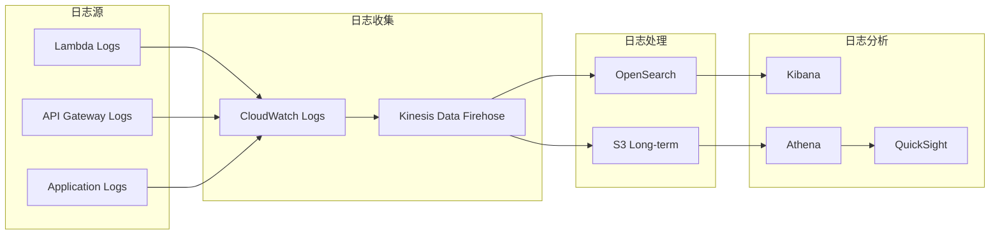
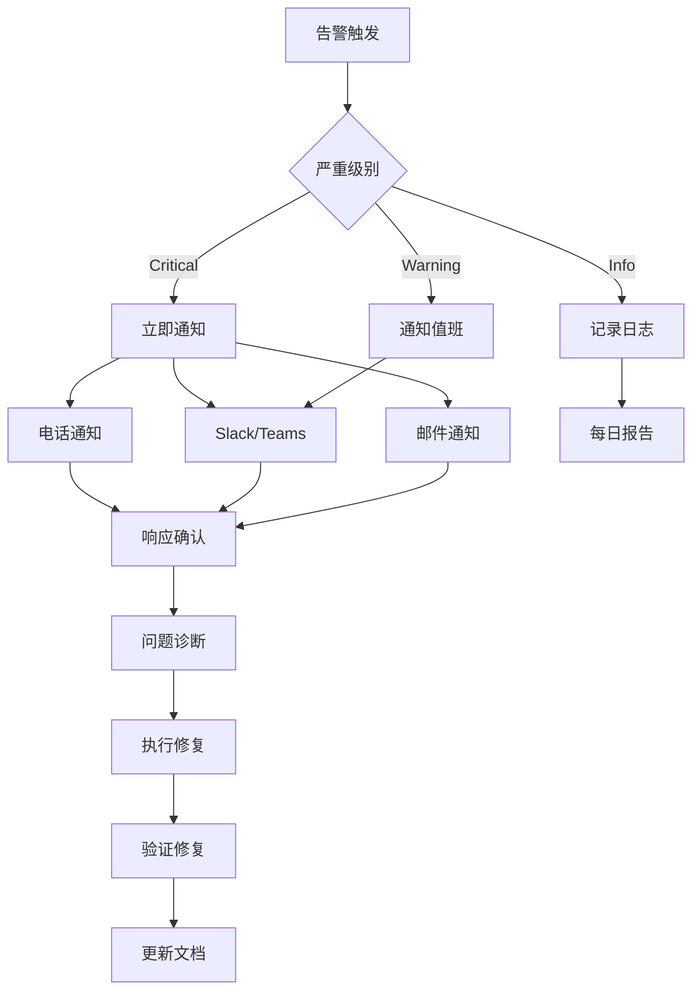
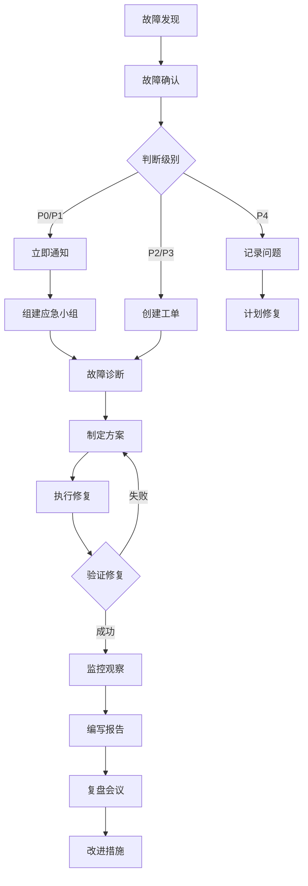

# AI PPT Assistant - 运维手册

## 目录

1. [运维概述](#运维概述)
2. [监控配置](#监控配置)
3. [日志管理](#日志管理)
4. [告警设置](#告警设置)
5. [备份恢复](#备份恢复)
6. [性能调优](#性能调优)
7. [容量规划](#容量规划)
8. [安全运维](#安全运维)
9. [故障响应](#故障响应)
10. [运维自动化](#运维自动化)

## 运维概述

### 运维目标

| 指标 | 目标值 | 监控方式 |
|------|--------|----------|
| **可用性** | 99.95% | CloudWatch Synthetics |
| **响应时间** | P50 < 200ms, P99 < 2s | X-Ray + CloudWatch |
| **错误率** | < 0.1% | CloudWatch Metrics |
| **恢复时间** | RTO < 1小时 | 自动化脚本 |
| **数据丢失** | RPO < 5分钟 | DynamoDB Streams |

### 运维团队职责

```yaml
团队结构:
  SRE团队:
    - 系统可靠性保障
    - 性能优化
    - 自动化工具开发

  DevOps团队:
    - CI/CD管道维护
    - 基础设施管理
    - 部署流程优化

  安全团队:
    - 安全监控
    - 合规审计
    - 事件响应
```

## 监控配置

### CloudWatch Dashboard配置

```json
{
  "name": "AI-PPT-Assistant-Operations",
  "widgets": [
    {
      "type": "metric",
      "title": "API Gateway Metrics",
      "metrics": [
        ["AWS/ApiGateway", "Count", {"stat": "Sum"}],
        [".", "Latency", {"stat": "Average"}],
        [".", "4XXError", {"stat": "Sum"}],
        [".", "5XXError", {"stat": "Sum"}]
      ]
    },
    {
      "type": "metric",
      "title": "Lambda Performance",
      "metrics": [
        ["AWS/Lambda", "Invocations", {"stat": "Sum"}],
        [".", "Duration", {"stat": "Average"}],
        [".", "Errors", {"stat": "Sum"}],
        [".", "ConcurrentExecutions", {"stat": "Maximum"}]
      ]
    },
    {
      "type": "metric",
      "title": "DynamoDB Usage",
      "metrics": [
        ["AWS/DynamoDB", "ConsumedReadCapacityUnits"],
        [".", "ConsumedWriteCapacityUnits"],
        [".", "ThrottledRequests"],
        [".", "UserErrors"]
      ]
    }
  ]
}
```

### 自定义指标

```python
import boto3
from datetime import datetime

cloudwatch = boto3.client('cloudwatch')

def publish_custom_metrics(metric_name, value, unit='Count'):
    """发布自定义CloudWatch指标"""
    cloudwatch.put_metric_data(
        Namespace='AI-PPT-Assistant',
        MetricData=[
            {
                'MetricName': metric_name,
                'Timestamp': datetime.utcnow(),
                'Value': value,
                'Unit': unit,
                'Dimensions': [
                    {
                        'Name': 'Environment',
                        'Value': os.environ['ENVIRONMENT']
                    },
                    {
                        'Name': 'Service',
                        'Value': 'PPT-Generator'
                    }
                ]
            }
        ]
    )

# 使用示例
publish_custom_metrics('PPT_Generation_Success', 1)
publish_custom_metrics('PPT_Generation_Duration', 5.2, 'Seconds')
publish_custom_metrics('Bedrock_Token_Usage', 1500, 'Count')
```

### X-Ray追踪配置

```python
from aws_xray_sdk.core import xray_recorder
from aws_xray_sdk.core import patch_all

# 自动追踪AWS服务调用
patch_all()

@xray_recorder.capture('generate_ppt')
def generate_ppt_handler(event, context):
    """带X-Ray追踪的Lambda处理器"""

    # 添加自定义段
    subsegment = xray_recorder.begin_subsegment('bedrock_generation')
    try:
        # 添加元数据
        subsegment.put_metadata('topic', event['topic'])
        subsegment.put_metadata('pages', event['pages'])

        # 业务逻辑
        result = generate_content(event['topic'])

        # 添加注释
        subsegment.put_annotation('status', 'success')
        subsegment.put_annotation('pages_generated', len(result))

        return result
    except Exception as e:
        subsegment.put_annotation('error', str(e))
        raise
    finally:
        xray_recorder.end_subsegment()
```

## 日志管理

### 日志架构



### 日志格式标准

```python
import json
import logging
from datetime import datetime

class StructuredLogger:
    """结构化日志记录器"""

    def __init__(self, service_name):
        self.logger = logging.getLogger(service_name)
        self.service_name = service_name

    def log(self, level, message, **kwargs):
        """记录结构化日志"""
        log_entry = {
            'timestamp': datetime.utcnow().isoformat(),
            'level': level,
            'service': self.service_name,
            'message': message,
            'correlation_id': kwargs.get('correlation_id'),
            'user_id': kwargs.get('user_id'),
            'request_id': kwargs.get('request_id'),
            'metadata': kwargs.get('metadata', {})
        }

        self.logger.log(
            getattr(logging, level.upper()),
            json.dumps(log_entry)
        )

# 使用示例
logger = StructuredLogger('ppt-generator')

logger.log('INFO', 'PPT generation started',
    correlation_id='abc-123',
    user_id='user-456',
    metadata={'topic': 'AI Trends', 'pages': 10}
)
```

### 日志查询示例

```bash
# CloudWatch Insights查询

# 查找错误日志
fields @timestamp, @message
| filter level = "ERROR"
| sort @timestamp desc
| limit 100

# 分析Lambda性能
fields @timestamp, @duration, @billedDuration, @memorySize, @maxMemoryUsed
| filter @type = "REPORT"
| stats avg(@duration), max(@duration), min(@duration) by bin(5m)

# 查找特定用户的操作
fields @timestamp, message, user_id, request_id
| filter user_id = "user-123"
| sort @timestamp desc

# 统计API调用量
fields @timestamp, @message
| filter @message like /API Gateway/
| stats count() by bin(1h)
```

## 告警设置

### 告警配置矩阵

| 告警名称 | 指标 | 阈值 | 严重级别 | 响应措施 |
|---------|------|------|---------|---------|
| **High Error Rate** | Lambda Errors | > 10/min | Critical | 立即调查，可能回滚 |
| **API Latency** | API Gateway Latency | > 3s | Warning | 检查性能瓶颈 |
| **DynamoDB Throttle** | ThrottledRequests | > 0 | Warning | 增加容量 |
| **Lambda Throttle** | Throttles | > 5/min | Critical | 增加并发限制 |
| **Low Success Rate** | Success Rate | < 95% | Warning | 检查错误日志 |
| **High Cost** | Estimated Charges | > $100/day | Info | 成本优化分析 |

### CloudWatch告警配置

```python
import boto3

cloudwatch = boto3.client('cloudwatch')
sns = boto3.client('sns')

def create_alarm(name, metric_name, namespace, threshold, comparison, description):
    """创建CloudWatch告警"""

    cloudwatch.put_metric_alarm(
        AlarmName=f'ai-ppt-assistant-{name}',
        ComparisonOperator=comparison,
        EvaluationPeriods=2,
        MetricName=metric_name,
        Namespace=namespace,
        Period=300,  # 5分钟
        Statistic='Average',
        Threshold=threshold,
        ActionsEnabled=True,
        AlarmActions=[
            'arn:aws:sns:us-east-1:123456789012:ops-alerts'
        ],
        AlarmDescription=description,
        TreatMissingData='breaching'
    )

# 创建告警示例
create_alarm(
    name='high-lambda-errors',
    metric_name='Errors',
    namespace='AWS/Lambda',
    threshold=10,
    comparison='GreaterThanThreshold',
    description='Lambda函数错误率过高'
)

create_alarm(
    name='api-high-latency',
    metric_name='Latency',
    namespace='AWS/ApiGateway',
    threshold=3000,  # 3秒
    comparison='GreaterThanThreshold',
    description='API响应时间过长'
)
```

### 告警响应流程



## 备份恢复

### 备份策略

```yaml
备份计划:
  DynamoDB:
    类型: 连续备份
    保留期: 35天
    频率: 实时
    跨区域: 每日

  S3:
    类型: 版本控制 + 复制
    保留期: 90天
    复制: 跨区域实时
    归档: 90天后转入Glacier

  Lambda:
    类型: 版本管理
    保留: 最近10个版本
    备份: 代码仓库

  配置:
    类型: Git版本控制
    备份: 多区域仓库
    加密: GPG签名
```

### 自动备份脚本

```bash
#!/bin/bash
# backup.sh - 自动备份脚本

set -e

# 配置
BACKUP_BUCKET="ai-ppt-assistant-backups"
TIMESTAMP=$(date +%Y%m%d_%H%M%S)
BACKUP_DIR="/tmp/backup_${TIMESTAMP}"

# 创建备份目录
mkdir -p ${BACKUP_DIR}

echo "开始备份流程..."

# 1. 备份DynamoDB表
echo "备份DynamoDB表..."
aws dynamodb create-backup \
    --table-name ai-ppt-presentations \
    --backup-name "presentations-backup-${TIMESTAMP}"

# 2. 导出DynamoDB数据到S3
aws dynamodb export-table-to-point-in-time \
    --table-arn arn:aws:dynamodb:region:account:table/ai-ppt-presentations \
    --s3-bucket ${BACKUP_BUCKET} \
    --s3-prefix "dynamodb-export/${TIMESTAMP}"

# 3. 备份Lambda函数代码
echo "备份Lambda函数..."
for func in $(aws lambda list-functions --query 'Functions[?starts_with(FunctionName, `ai-ppt`)].FunctionName' --output text); do
    echo "  备份函数: $func"
    aws lambda get-function --function-name $func \
        --query 'Code.Location' --output text | \
        xargs wget -O "${BACKUP_DIR}/${func}.zip"
done

# 4. 备份配置
echo "备份配置文件..."
aws s3 cp s3://ai-ppt-config/ ${BACKUP_DIR}/config/ --recursive

# 5. 打包并上传到S3
echo "上传备份到S3..."
tar -czf ${BACKUP_DIR}.tar.gz ${BACKUP_DIR}
aws s3 cp ${BACKUP_DIR}.tar.gz s3://${BACKUP_BUCKET}/full-backup/

# 6. 清理临时文件
rm -rf ${BACKUP_DIR} ${BACKUP_DIR}.tar.gz

echo "备份完成: ${TIMESTAMP}"

# 7. 验证备份
aws s3 ls s3://${BACKUP_BUCKET}/full-backup/${BACKUP_DIR}.tar.gz
```

### 恢复流程

```python
# restore.py - 恢复脚本

import boto3
import json
from datetime import datetime

class DisasterRecovery:
    """灾难恢复管理器"""

    def __init__(self):
        self.dynamodb = boto3.client('dynamodb')
        self.s3 = boto3.client('s3')
        self.lambda_client = boto3.client('lambda')

    def restore_dynamodb(self, backup_arn, target_table_name):
        """恢复DynamoDB表"""
        print(f"恢复DynamoDB表: {target_table_name}")

        response = self.dynamodb.restore_table_from_backup(
            TargetTableName=target_table_name,
            BackupArn=backup_arn
        )

        # 等待表恢复完成
        waiter = self.dynamodb.get_waiter('table_exists')
        waiter.wait(TableName=target_table_name)

        print(f"表恢复完成: {target_table_name}")
        return response

    def restore_s3_objects(self, source_bucket, target_bucket, prefix):
        """恢复S3对象"""
        print(f"恢复S3对象: {source_bucket} -> {target_bucket}")

        # 列出所有对象
        paginator = self.s3.get_paginator('list_objects_v2')
        pages = paginator.paginate(Bucket=source_bucket, Prefix=prefix)

        for page in pages:
            if 'Contents' in page:
                for obj in page['Contents']:
                    # 复制对象
                    copy_source = {'Bucket': source_bucket, 'Key': obj['Key']}
                    self.s3.copy_object(
                        CopySource=copy_source,
                        Bucket=target_bucket,
                        Key=obj['Key']
                    )
                    print(f"  恢复对象: {obj['Key']}")

    def restore_lambda_function(self, function_name, s3_bucket, s3_key):
        """恢复Lambda函数"""
        print(f"恢复Lambda函数: {function_name}")

        try:
            # 更新函数代码
            self.lambda_client.update_function_code(
                FunctionName=function_name,
                S3Bucket=s3_bucket,
                S3Key=s3_key
            )
            print(f"函数恢复完成: {function_name}")
        except Exception as e:
            print(f"恢复失败: {e}")

    def verify_restoration(self):
        """验证恢复结果"""
        print("验证恢复结果...")

        checks = {
            'DynamoDB Tables': self.check_dynamodb_tables(),
            'S3 Buckets': self.check_s3_buckets(),
            'Lambda Functions': self.check_lambda_functions()
        }

        for service, status in checks.items():
            print(f"  {service}: {'✓' if status else '✗'}")

        return all(checks.values())

# 使用示例
if __name__ == "__main__":
    dr = DisasterRecovery()

    # 恢复DynamoDB
    dr.restore_dynamodb(
        backup_arn='arn:aws:dynamodb:...:backup/...',
        target_table_name='ai-ppt-presentations-restored'
    )

    # 恢复S3
    dr.restore_s3_objects(
        source_bucket='ai-ppt-backups',
        target_bucket='ai-ppt-presentations',
        prefix='2024-01-14/'
    )

    # 验证
    if dr.verify_restoration():
        print("恢复成功完成！")
    else:
        print("恢复过程有错误，请检查")
```

## 性能调优

### Lambda性能优化

```python
# lambda_optimizer.py

import os
import json
from functools import lru_cache

# 1. 连接池复用
class ConnectionPool:
    """数据库连接池"""
    _instance = None

    def __new__(cls):
        if cls._instance is None:
            cls._instance = super().__new__(cls)
            cls._instance.connections = {}
        return cls._instance

    def get_connection(self, service):
        if service not in self.connections:
            self.connections[service] = create_connection(service)
        return self.connections[service]

# 2. 缓存优化
@lru_cache(maxsize=128)
def get_cached_template(template_id):
    """缓存模板数据"""
    return fetch_template_from_s3(template_id)

# 3. 批处理优化
def batch_process_slides(slides, batch_size=5):
    """批量处理幻灯片"""
    results = []
    for i in range(0, len(slides), batch_size):
        batch = slides[i:i+batch_size]
        # 并行处理批次
        batch_results = process_slides_parallel(batch)
        results.extend(batch_results)
    return results

# 4. 内存管理
def optimize_memory():
    """优化内存使用"""
    import gc

    # 强制垃圾回收
    gc.collect()

    # 清理缓存
    if hasattr(get_cached_template, 'cache_clear'):
        get_cached_template.cache_clear()
```

### DynamoDB性能优化

```python
# dynamodb_optimizer.py

from boto3.dynamodb.conditions import Key
from concurrent.futures import ThreadPoolExecutor

class DynamoDBOptimizer:
    """DynamoDB性能优化器"""

    def __init__(self, table_name):
        self.table = boto3.resource('dynamodb').Table(table_name)

    def batch_write_optimized(self, items):
        """优化的批量写入"""
        with self.table.batch_writer() as batch:
            for item in items:
                batch.put_item(Item=item)

    def parallel_scan(self, filter_expression=None):
        """并行扫描表"""

        def scan_segment(segment):
            """扫描单个段"""
            kwargs = {
                'Segment': segment,
                'TotalSegments': 4
            }
            if filter_expression:
                kwargs['FilterExpression'] = filter_expression

            response = self.table.scan(**kwargs)
            items = response['Items']

            while 'LastEvaluatedKey' in response:
                kwargs['ExclusiveStartKey'] = response['LastEvaluatedKey']
                response = self.table.scan(**kwargs)
                items.extend(response['Items'])

            return items

        # 并行扫描4个段
        with ThreadPoolExecutor(max_workers=4) as executor:
            futures = [executor.submit(scan_segment, i) for i in range(4)]
            results = []
            for future in futures:
                results.extend(future.result())

        return results

    def query_with_projection(self, user_id, attributes):
        """投影查询优化"""
        response = self.table.query(
            KeyConditionExpression=Key('user_id').eq(user_id),
            ProjectionExpression=','.join(attributes),
            ScanIndexForward=False,  # 降序
            Limit=100  # 限制返回数量
        )
        return response['Items']
```

### API Gateway优化

```yaml
# API Gateway配置优化

# 1. 启用缓存
CacheConfiguration:
  CachingEnabled: true
  CacheTtlInSeconds: 300
  CacheKeyParameters:
    - method.request.path.id
    - method.request.querystring.version

# 2. 请求/响应压缩
CompressionEnabled: true
MinimumCompressionSize: 1024

# 3. 限流配置
ThrottleSettings:
  RateLimit: 10000
  BurstLimit: 20000

# 4. 使用HTTP/2
ProtocolType: HTTP2

# 5. 连接池配置
IntegrationSettings:
  ConnectionType: KEEP_ALIVE
  ConnectionTimeout: 30000
  RequestTimeout: 30000
```

## 容量规划

### 容量计算模型

```python
# capacity_planning.py

class CapacityPlanner:
    """容量规划计算器"""

    def __init__(self):
        self.metrics = {
            'daily_requests': 0,
            'avg_request_size': 0,
            'avg_response_size': 0,
            'peak_concurrent': 0,
            'growth_rate': 0.1  # 10%月增长
        }

    def calculate_lambda_capacity(self, daily_requests, avg_duration_ms):
        """计算Lambda容量需求"""

        # 计算并发需求
        peak_rps = daily_requests / 86400 * 3  # 峰值是平均的3倍
        concurrent_executions = peak_rps * (avg_duration_ms / 1000)

        # 添加20%缓冲
        recommended_concurrent = int(concurrent_executions * 1.2)

        # 计算成本
        monthly_requests = daily_requests * 30
        monthly_gb_seconds = (monthly_requests * avg_duration_ms * 3008) / 1000 / 1024

        cost = {
            'request_cost': monthly_requests * 0.0000002,
            'compute_cost': monthly_gb_seconds * 0.0000166667,
            'total_monthly': 0
        }
        cost['total_monthly'] = cost['request_cost'] + cost['compute_cost']

        return {
            'recommended_concurrent': recommended_concurrent,
            'estimated_monthly_cost': cost
        }

    def calculate_dynamodb_capacity(self, daily_reads, daily_writes, avg_item_size_kb):
        """计算DynamoDB容量需求"""

        # 计算RCU (1 RCU = 1 strongly consistent read/sec for items up to 4KB)
        read_capacity_units = (daily_reads / 86400) * (avg_item_size_kb / 4)

        # 计算WCU (1 WCU = 1 write/sec for items up to 1KB)
        write_capacity_units = (daily_writes / 86400) * avg_item_size_kb

        # 峰值容量（3倍平均值）
        peak_rcu = int(read_capacity_units * 3)
        peak_wcu = int(write_capacity_units * 3)

        # On-Demand模式成本计算
        monthly_cost = {
            'read_cost': daily_reads * 30 * 0.00000025,
            'write_cost': daily_writes * 30 * 0.00000125,
            'storage_cost': 0  # 根据实际存储计算
        }

        return {
            'recommended_rcu': peak_rcu,
            'recommended_wcu': peak_wcu,
            'on_demand_monthly_cost': monthly_cost
        }

    def calculate_s3_capacity(self, monthly_uploads_gb, monthly_downloads_gb, total_storage_gb):
        """计算S3容量和成本"""

        costs = {
            'storage': total_storage_gb * 0.023,  # Standard存储
            'requests': {
                'put': monthly_uploads_gb * 1000 * 0.000005,  # PUT请求
                'get': monthly_downloads_gb * 1000 * 0.0000004  # GET请求
            },
            'transfer': monthly_downloads_gb * 0.09  # 数据传输
        }

        # 智能分层可节省成本
        intelligent_tiering_savings = total_storage_gb * 0.005

        return {
            'monthly_cost': sum(costs.values()),
            'potential_savings': intelligent_tiering_savings,
            'recommendations': [
                '启用S3智能分层',
                '使用CloudFront减少传输成本',
                '实施生命周期策略'
            ]
        }

# 使用示例
planner = CapacityPlanner()

# Lambda容量规划
lambda_capacity = planner.calculate_lambda_capacity(
    daily_requests=100000,
    avg_duration_ms=3000
)
print(f"Lambda并发需求: {lambda_capacity['recommended_concurrent']}")
print(f"预估月成本: ${lambda_capacity['estimated_monthly_cost']['total_monthly']:.2f}")

# DynamoDB容量规划
dynamodb_capacity = planner.calculate_dynamodb_capacity(
    daily_reads=500000,
    daily_writes=100000,
    avg_item_size_kb=2
)
print(f"DynamoDB RCU: {dynamodb_capacity['recommended_rcu']}")
print(f"DynamoDB WCU: {dynamodb_capacity['recommended_wcu']}")
```

### 自动扩展配置

```python
# auto_scaling.py

import boto3

autoscaling = boto3.client('application-autoscaling')

def setup_dynamodb_autoscaling(table_name):
    """配置DynamoDB自动扩展"""

    # 注册可扩展目标
    autoscaling.register_scalable_target(
        ServiceNamespace='dynamodb',
        ResourceId=f'table/{table_name}',
        ScalableDimension='dynamodb:table:ReadCapacityUnits',
        MinCapacity=5,
        MaxCapacity=40000
    )

    # 创建扩展策略
    autoscaling.put_scaling_policy(
        PolicyName=f'{table_name}-read-scaling-policy',
        ServiceNamespace='dynamodb',
        ResourceId=f'table/{table_name}',
        ScalableDimension='dynamodb:table:ReadCapacityUnits',
        PolicyType='TargetTrackingScaling',
        TargetTrackingScalingPolicyConfiguration={
            'TargetValue': 70.0,
            'PredefinedMetricSpecification': {
                'PredefinedMetricType': 'DynamoDBReadCapacityUtilization'
            },
            'ScaleOutCooldown': 60,
            'ScaleInCooldown': 60
        }
    )

def setup_lambda_autoscaling(function_name):
    """配置Lambda预留并发自动扩展"""

    # 注册可扩展目标
    autoscaling.register_scalable_target(
        ServiceNamespace='lambda',
        ResourceId=f'function:{function_name}:provisioned-concurrency:PROD',
        ScalableDimension='lambda:function:ProvisionedConcurrency',
        MinCapacity=2,
        MaxCapacity=100
    )

    # 创建扩展策略
    autoscaling.put_scaling_policy(
        PolicyName=f'{function_name}-concurrency-scaling',
        ServiceNamespace='lambda',
        ResourceId=f'function:{function_name}:provisioned-concurrency:PROD',
        ScalableDimension='lambda:function:ProvisionedConcurrency',
        PolicyType='TargetTrackingScaling',
        TargetTrackingScalingPolicyConfiguration={
            'TargetValue': 0.7,
            'CustomizedMetricSpecification': {
                'MetricName': 'ProvisionedConcurrencyUtilization',
                'Namespace': 'AWS/Lambda',
                'Dimensions': [
                    {
                        'Name': 'FunctionName',
                        'Value': function_name
                    }
                ],
                'Statistic': 'Average'
            }
        }
    )
```

## 安全运维

### 安全检查清单

```yaml
每日检查:
  - [ ] 检查失败的登录尝试
  - [ ] 审查异常API调用
  - [ ] 验证备份完整性
  - [ ] 检查安全组规则变更

每周检查:
  - [ ] 审计IAM权限
  - [ ] 检查未使用的资源
  - [ ] 更新安全补丁
  - [ ] 审查日志异常

每月检查:
  - [ ] 完整安全扫描
  - [ ] 密钥轮换
  - [ ] 合规性审计
  - [ ] 灾难恢复演练
```

### 安全监控脚本

```python
# security_monitor.py

import boto3
from datetime import datetime, timedelta

class SecurityMonitor:
    """安全监控器"""

    def __init__(self):
        self.cloudtrail = boto3.client('cloudtrail')
        self.guardduty = boto3.client('guardduty')
        self.iam = boto3.client('iam')

    def check_unauthorized_api_calls(self, hours=24):
        """检查未授权的API调用"""

        end_time = datetime.utcnow()
        start_time = end_time - timedelta(hours=hours)

        events = self.cloudtrail.lookup_events(
            LookupAttributes=[
                {
                    'AttributeKey': 'EventName',
                    'AttributeValue': 'UnauthorizedAccess'
                }
            ],
            StartTime=start_time,
            EndTime=end_time
        )

        suspicious_events = []
        for event in events['Events']:
            if 'errorCode' in event and 'Unauthorized' in event['errorCode']:
                suspicious_events.append({
                    'time': event['EventTime'],
                    'user': event.get('Username', 'Unknown'),
                    'event': event['EventName'],
                    'source_ip': event.get('SourceIPAddress')
                })

        return suspicious_events

    def check_guardduty_findings(self):
        """检查GuardDuty发现"""

        detector_ids = self.guardduty.list_detectors()['DetectorIds']

        all_findings = []
        for detector_id in detector_ids:
            findings = self.guardduty.list_findings(
                DetectorId=detector_id,
                FindingCriteria={
                    'Criterion': {
                        'severity': {
                            'GreaterThanOrEqual': 4  # 中等及以上严重性
                        },
                        'updatedAt': {
                            'GreaterThanOrEqual': int((datetime.utcnow() - timedelta(days=1)).timestamp() * 1000)
                        }
                    }
                }
            )

            if findings['FindingIds']:
                details = self.guardduty.get_findings(
                    DetectorId=detector_id,
                    FindingIds=findings['FindingIds']
                )
                all_findings.extend(details['Findings'])

        return all_findings

    def audit_iam_permissions(self):
        """审计IAM权限"""

        report = {
            'overprivileged_users': [],
            'unused_credentials': [],
            'mfa_not_enabled': []
        }

        # 检查用户权限
        users = self.iam.list_users()['Users']

        for user in users:
            # 检查MFA
            mfa_devices = self.iam.list_mfa_devices(UserName=user['UserName'])
            if not mfa_devices['MFADevices']:
                report['mfa_not_enabled'].append(user['UserName'])

            # 检查访问密钥
            access_keys = self.iam.list_access_keys(UserName=user['UserName'])
            for key in access_keys['AccessKeyMetadata']:
                key_last_used = self.iam.get_access_key_last_used(
                    AccessKeyId=key['AccessKeyId']
                )

                if 'LastUsedDate' in key_last_used['AccessKeyLastUsed']:
                    last_used = key_last_used['AccessKeyLastUsed']['LastUsedDate']
                    if (datetime.utcnow(timezone.utc) - last_used).days > 90:
                        report['unused_credentials'].append({
                            'user': user['UserName'],
                            'key_id': key['AccessKeyId'],
                            'last_used': last_used.isoformat()
                        })

        return report

# 使用示例
monitor = SecurityMonitor()

# 检查安全事件
unauthorized = monitor.check_unauthorized_api_calls()
if unauthorized:
    print(f"发现{len(unauthorized)}个未授权访问尝试")
    for event in unauthorized:
        print(f"  - {event['time']}: {event['user']} from {event['source_ip']}")

# 检查GuardDuty
findings = monitor.check_guardduty_findings()
if findings:
    print(f"GuardDuty发现{len(findings)}个安全问题")

# IAM审计
audit_report = monitor.audit_iam_permissions()
if audit_report['mfa_not_enabled']:
    print(f"以下用户未启用MFA: {', '.join(audit_report['mfa_not_enabled'])}")
```

## 故障响应

### 故障级别定义

| 级别 | 描述 | 响应时间 | 升级时间 | 负责人 |
|------|------|----------|----------|--------|
| **P0** | 服务完全不可用 | 15分钟 | 30分钟 | 高级工程师 |
| **P1** | 核心功能受损 | 30分钟 | 1小时 | 值班工程师 |
| **P2** | 部分功能异常 | 2小时 | 4小时 | 运维团队 |
| **P3** | 性能下降 | 4小时 | 24小时 | 运维团队 |
| **P4** | 次要问题 | 24小时 | 无 | 开发团队 |

### 故障响应流程



### 应急响应脚本

```bash
#!/bin/bash
# emergency_response.sh - 应急响应脚本

set -e

# 颜色定义
RED='\033[0;31m'
GREEN='\033[0;32m'
YELLOW='\033[1;33m'
NC='\033[0m' # No Color

# 日志函数
log() {
    echo -e "${GREEN}[$(date +'%Y-%m-%d %H:%M:%S')]${NC} $1"
}

error() {
    echo -e "${RED}[ERROR]${NC} $1"
}

warning() {
    echo -e "${YELLOW}[WARNING]${NC} $1"
}

# 1. 健康检查
health_check() {
    log "执行健康检查..."

    # API Gateway健康检查
    API_STATUS=$(curl -s -o /dev/null -w "%{http_code}" https://api.ai-ppt.com/health)
    if [ "$API_STATUS" != "200" ]; then
        error "API Gateway不健康: HTTP $API_STATUS"
        return 1
    fi

    # Lambda函数检查
    FUNCTIONS=$(aws lambda list-functions --query 'Functions[?starts_with(FunctionName, `ai-ppt`)].FunctionName' --output text)
    for func in $FUNCTIONS; do
        STATE=$(aws lambda get-function --function-name $func --query 'Configuration.State' --output text)
        if [ "$STATE" != "Active" ]; then
            error "Lambda函数 $func 状态异常: $STATE"
            return 1
        fi
    done

    # DynamoDB检查
    TABLE_STATUS=$(aws dynamodb describe-table --table-name ai-ppt-presentations --query 'Table.TableStatus' --output text)
    if [ "$TABLE_STATUS" != "ACTIVE" ]; then
        error "DynamoDB表状态异常: $TABLE_STATUS"
        return 1
    fi

    log "健康检查通过"
    return 0
}

# 2. 快速诊断
quick_diagnosis() {
    log "执行快速诊断..."

    # 检查最近的错误日志
    aws logs filter-log-events \
        --log-group-name /aws/lambda/ai-ppt-generate \
        --start-time $(($(date +%s) - 3600))000 \
        --filter-pattern "ERROR" \
        --max-items 10

    # 检查CloudWatch告警
    aws cloudwatch describe-alarms \
        --state-value ALARM \
        --alarm-name-prefix "ai-ppt"

    # 检查API Gateway错误率
    aws cloudwatch get-metric-statistics \
        --namespace AWS/ApiGateway \
        --metric-name 4XXError \
        --dimensions Name=ApiName,Value=ai-ppt-assistant-api \
        --start-time $(date -u -d '1 hour ago' +%Y-%m-%dT%H:%M:%S) \
        --end-time $(date -u +%Y-%m-%dT%H:%M:%S) \
        --period 300 \
        --statistics Sum
}

# 3. 应急修复
emergency_fix() {
    local issue_type=$1

    case $issue_type in
        "high_error_rate")
            log "修复高错误率..."
            # 回滚到上一个稳定版本
            aws lambda update-alias \
                --function-name ai-ppt-generate \
                --name PROD \
                --function-version '$LATEST~1'
            ;;

        "throttling")
            log "修复限流问题..."
            # 增加Lambda并发
            aws lambda put-function-concurrency \
                --function-name ai-ppt-generate \
                --reserved-concurrent-executions 200

            # 增加DynamoDB容量
            aws dynamodb update-table \
                --table-name ai-ppt-presentations \
                --provisioned-throughput ReadCapacityUnits=100,WriteCapacityUnits=100
            ;;

        "out_of_memory")
            log "修复内存问题..."
            # 增加Lambda内存
            aws lambda update-function-configuration \
                --function-name ai-ppt-generate \
                --memory-size 3008
            ;;

        *)
            error "未知问题类型: $issue_type"
            return 1
            ;;
    esac
}

# 4. 通知团队
notify_team() {
    local severity=$1
    local message=$2

    # 发送SNS通知
    aws sns publish \
        --topic-arn arn:aws:sns:us-east-1:123456789012:ops-alerts \
        --subject "[$severity] AI PPT Assistant Alert" \
        --message "$message"

    # 发送Slack通知
    curl -X POST -H 'Content-type: application/json' \
        --data "{\"text\":\"[$severity] $message\"}" \
        $SLACK_WEBHOOK_URL
}

# 主流程
main() {
    log "启动应急响应流程..."

    # 1. 健康检查
    if ! health_check; then
        notify_team "CRITICAL" "系统健康检查失败，启动应急响应"

        # 2. 快速诊断
        quick_diagnosis

        # 3. 尝试自动修复
        read -p "检测到问题类型 (high_error_rate/throttling/out_of_memory): " issue_type
        emergency_fix "$issue_type"

        # 4. 验证修复
        sleep 30
        if health_check; then
            notify_team "INFO" "系统已恢复正常"
            log "应急响应成功"
        else
            notify_team "CRITICAL" "自动修复失败，需要人工介入"
            error "应急响应失败，请人工介入"
            exit 1
        fi
    else
        log "系统运行正常"
    fi
}

# 执行主流程
main
```

## 运维自动化

### 自动化工具集

```python
# ops_automation.py

import boto3
import schedule
import time
from datetime import datetime, timedelta

class OpsAutomation:
    """运维自动化工具"""

    def __init__(self):
        self.ssm = boto3.client('ssm')
        self.ec2 = boto3.client('ec2')
        self.cloudwatch = boto3.client('cloudwatch')

    def cleanup_old_resources(self):
        """清理过期资源"""

        # 清理旧的Lambda版本
        lambda_client = boto3.client('lambda')
        functions = lambda_client.list_functions()

        for func in functions['Functions']:
            versions = lambda_client.list_versions_by_function(
                FunctionName=func['FunctionName']
            )

            # 保留最新的10个版本
            if len(versions['Versions']) > 11:  # 包括$LATEST
                old_versions = sorted(
                    versions['Versions'][1:],  # 排除$LATEST
                    key=lambda x: x['LastModified']
                )[:-10]

                for version in old_versions:
                    lambda_client.delete_function(
                        FunctionName=func['FunctionName'],
                        Qualifier=version['Version']
                    )
                    print(f"删除旧版本: {func['FunctionName']}:{version['Version']}")

        # 清理过期的S3对象
        s3 = boto3.client('s3')
        response = s3.list_objects_v2(
            Bucket='ai-ppt-temp',
            Prefix='temp/'
        )

        if 'Contents' in response:
            for obj in response['Contents']:
                if (datetime.now(timezone.utc) - obj['LastModified']).days > 7:
                    s3.delete_object(Bucket='ai-ppt-temp', Key=obj['Key'])
                    print(f"删除过期文件: {obj['Key']}")

    def auto_patch_systems(self):
        """自动打补丁"""

        # 创建补丁基线
        baseline = self.ssm.create_patch_baseline(
            Name='ai-ppt-assistant-baseline',
            OperatingSystem='AMAZON_LINUX_2',
            ApprovalRules={
                'PatchRules': [
                    {
                        'PatchFilterGroup': {
                            'PatchFilters': [
                                {
                                    'Key': 'SEVERITY',
                                    'Values': ['Critical', 'Important']
                                }
                            ]
                        },
                        'ApproveAfterDays': 0
                    }
                ]
            }
        )

        # 执行补丁安装
        self.ssm.send_command(
            DocumentName='AWS-RunPatchBaseline',
            Parameters={
                'Operation': ['Install']
            },
            Targets=[
                {
                    'Key': 'tag:Environment',
                    'Values': ['production']
                }
            ]
        )

    def generate_daily_report(self):
        """生成每日运维报告"""

        report = {
            'date': datetime.now().strftime('%Y-%m-%d'),
            'metrics': {},
            'alerts': [],
            'costs': {}
        }

        # 收集指标
        end_time = datetime.utcnow()
        start_time = end_time - timedelta(days=1)

        # API调用量
        api_metrics = self.cloudwatch.get_metric_statistics(
            Namespace='AWS/ApiGateway',
            MetricName='Count',
            Dimensions=[
                {'Name': 'ApiName', 'Value': 'ai-ppt-assistant-api'}
            ],
            StartTime=start_time,
            EndTime=end_time,
            Period=86400,
            Statistics=['Sum']
        )

        if api_metrics['Datapoints']:
            report['metrics']['api_calls'] = api_metrics['Datapoints'][0]['Sum']

        # Lambda执行次数和错误
        lambda_metrics = self.cloudwatch.get_metric_statistics(
            Namespace='AWS/Lambda',
            MetricName='Invocations',
            StartTime=start_time,
            EndTime=end_time,
            Period=86400,
            Statistics=['Sum']
        )

        if lambda_metrics['Datapoints']:
            report['metrics']['lambda_invocations'] = lambda_metrics['Datapoints'][0]['Sum']

        # 成本估算
        ce = boto3.client('ce')
        cost_response = ce.get_cost_and_usage(
            TimePeriod={
                'Start': start_time.strftime('%Y-%m-%d'),
                'End': end_time.strftime('%Y-%m-%d')
            },
            Granularity='DAILY',
            Metrics=['UnblendedCost']
        )

        if cost_response['ResultsByTime']:
            report['costs']['daily'] = cost_response['ResultsByTime'][0]['Total']['UnblendedCost']['Amount']

        # 保存报告
        with open(f'/tmp/daily_report_{report["date"]}.json', 'w') as f:
            json.dump(report, f, indent=2)

        # 发送报告
        self.send_report_email(report)

        return report

    def send_report_email(self, report):
        """发送邮件报告"""

        ses = boto3.client('ses')

        body = f"""
        AI PPT Assistant 每日运维报告
        日期: {report['date']}

        系统指标:
        - API调用次数: {report['metrics'].get('api_calls', 'N/A')}
        - Lambda执行次数: {report['metrics'].get('lambda_invocations', 'N/A')}

        成本:
        - 每日成本: ${report['costs'].get('daily', 'N/A')}

        告警: {len(report['alerts'])} 个
        """

        ses.send_email(
            Source='ops@ai-ppt.com',
            Destination={'ToAddresses': ['team@ai-ppt.com']},
            Message={
                'Subject': {'Data': f'每日运维报告 - {report["date"]}'},
                'Body': {'Text': {'Data': body}}
            }
        )

# 调度任务
def run_scheduled_tasks():
    """运行计划任务"""

    automation = OpsAutomation()

    # 每日任务
    schedule.every().day.at("02:00").do(automation.cleanup_old_resources)
    schedule.every().day.at("03:00").do(automation.auto_patch_systems)
    schedule.every().day.at("08:00").do(automation.generate_daily_report)

    # 每周任务
    schedule.every().monday.at("04:00").do(automation.deep_cleanup)

    # 每月任务
    schedule.every().month.do(automation.cost_optimization_review)

    while True:
        schedule.run_pending()
        time.sleep(60)

if __name__ == "__main__":
    run_scheduled_tasks()
```

### CI/CD自动化

```yaml
# .github/workflows/ops-automation.yml

name: Operations Automation

on:
  schedule:
    - cron: '0 * * * *'  # 每小时执行
  workflow_dispatch:  # 允许手动触发

jobs:
  health-check:
    runs-on: ubuntu-latest
    steps:
      - uses: actions/checkout@v3

      - name: Configure AWS
        uses: aws-actions/configure-aws-credentials@v2
        with:
          aws-access-key-id: ${{ secrets.AWS_ACCESS_KEY_ID }}
          aws-secret-access-key: ${{ secrets.AWS_SECRET_ACCESS_KEY }}
          aws-region: us-east-1

      - name: Run Health Checks
        run: |
          python scripts/health_check.py

      - name: Notify on Failure
        if: failure()
        uses: 8398a7/action-slack@v3
        with:
          status: ${{ job.status }}
          text: 'Health check failed!'
          webhook_url: ${{ secrets.SLACK_WEBHOOK }}

  auto-scaling:
    runs-on: ubuntu-latest
    needs: health-check
    steps:
      - name: Check Metrics
        run: |
          python scripts/check_metrics.py

      - name: Adjust Capacity
        if: success()
        run: |
          python scripts/auto_scale.py

  backup:
    runs-on: ubuntu-latest
    if: github.event.schedule == '0 2 * * *'  # 每天凌晨2点
    steps:
      - name: Run Backup
        run: |
          ./scripts/backup.sh

      - name: Verify Backup
        run: |
          python scripts/verify_backup.py
```

## 最佳实践总结

### 运维检查清单

- [ ] **监控完善**: 所有关键指标都有监控
- [ ] **告警合理**: 告警阈值经过优化，避免误报
- [ ] **日志规范**: 结构化日志，便于查询分析
- [ ] **备份可靠**: 自动备份，定期验证恢复
- [ ] **安全加固**: 最小权限，加密传输存储
- [ ] **性能优化**: 定期性能分析和优化
- [ ] **文档完整**: 运维文档及时更新
- [ ] **自动化高**: 重复任务都已自动化
- [ ] **演练充分**: 定期故障演练和恢复测试
- [ ] **成本优化**: 定期成本审查和优化

---

*最后更新: 2024-01-14*
*版本: 1.0.0*
*运维团队: ops@ai-ppt.com*