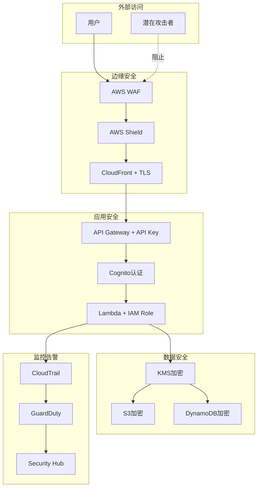

# AI PPT Assistant - 安全最佳实践

## 目录

1. [安全概述](#安全概述)
2. [IAM权限配置](#iam权限配置)
3. [数据加密策略](#数据加密策略)
4. [API安全](#api安全)
5. [密钥管理](#密钥管理)
6. [网络安全](#网络安全)
7. [合规性要求](#合规性要求)
8. [安全监控](#安全监控)
9. [事件响应](#事件响应)
10. [安全检查清单](#安全检查清单)

## 安全概述

### 安全原则

AI PPT Assistant遵循以下核心安全原则：

1. **最小权限原则（Principle of Least Privilege）**
   - 每个组件只获得完成任务所需的最小权限
   - 定期审查和调整权限

2. **纵深防御（Defense in Depth）**
   - 多层安全控制
   - 即使一层失败，其他层仍能提供保护

3. **零信任架构（Zero Trust）**
   - 永不信任，始终验证
   - 每个请求都需要认证和授权

4. **数据保护**
   - 传输中加密
   - 静态加密
   - 端到端加密

### 安全架构



## IAM权限配置

### Lambda执行角色

```json
{
  "Version": "2012-10-17",
  "Statement": [
    {
      "Sid": "BasicLambdaExecution",
      "Effect": "Allow",
      "Action": [
        "logs:CreateLogGroup",
        "logs:CreateLogStream",
        "logs:PutLogEvents"
      ],
      "Resource": "arn:aws:logs:*:*:log-group:/aws/lambda/ai-ppt-assistant-*"
    },
    {
      "Sid": "DynamoDBAccess",
      "Effect": "Allow",
      "Action": [
        "dynamodb:GetItem",
        "dynamodb:PutItem",
        "dynamodb:UpdateItem",
        "dynamodb:Query",
        "dynamodb:Scan"
      ],
      "Resource": "arn:aws:dynamodb:*:*:table/ai-ppt-presentations",
      "Condition": {
        "ForAllValues:StringEquals": {
          "dynamodb:LeadingKeys": ["${aws:userid}"]
        }
      }
    },
    {
      "Sid": "S3Access",
      "Effect": "Allow",
      "Action": [
        "s3:GetObject",
        "s3:PutObject",
        "s3:DeleteObject"
      ],
      "Resource": "arn:aws:s3:::ai-ppt-presentations-*/*",
      "Condition": {
        "StringLike": {
          "s3:prefix": ["users/${aws:userid}/*"]
        }
      }
    },
    {
      "Sid": "BedrockAccess",
      "Effect": "Allow",
      "Action": [
        "bedrock:InvokeModel",
        "bedrock:InvokeModelWithResponseStream"
      ],
      "Resource": "arn:aws:bedrock:*:*:model/anthropic.claude-3-*"
    },
    {
      "Sid": "KMSAccess",
      "Effect": "Allow",
      "Action": [
        "kms:Decrypt",
        "kms:GenerateDataKey"
      ],
      "Resource": "arn:aws:kms:*:*:key/*",
      "Condition": {
        "StringEquals": {
          "kms:ViaService": [
            "s3.*.amazonaws.com",
            "dynamodb.*.amazonaws.com"
          ]
        }
      }
    },
    {
      "Sid": "XRayAccess",
      "Effect": "Allow",
      "Action": [
        "xray:PutTraceSegments",
        "xray:PutTelemetryRecords"
      ],
      "Resource": "*"
    }
  ]
}
```

### 跨服务权限

```python
# iam_config.py

import boto3
import json

class IAMManager:
    """IAM权限管理器"""

    def __init__(self):
        self.iam = boto3.client('iam')

    def create_service_role(self, service_name, trusted_service):
        """创建服务角色"""

        # 信任策略
        trust_policy = {
            "Version": "2012-10-17",
            "Statement": [
                {
                    "Effect": "Allow",
                    "Principal": {
                        "Service": f"{trusted_service}.amazonaws.com"
                    },
                    "Action": "sts:AssumeRole"
                }
            ]
        }

        # 创建角色
        role_name = f"ai-ppt-assistant-{service_name}-role"

        try:
            response = self.iam.create_role(
                RoleName=role_name,
                AssumeRolePolicyDocument=json.dumps(trust_policy),
                Description=f"Role for {service_name} in AI PPT Assistant",
                MaxSessionDuration=3600,
                Tags=[
                    {'Key': 'Project', 'Value': 'ai-ppt-assistant'},
                    {'Key': 'Service', 'Value': service_name},
                    {'Key': 'ManagedBy', 'Value': 'Terraform'}
                ]
            )

            print(f"创建角色: {role_name}")
            return response['Role']['Arn']

        except self.iam.exceptions.EntityAlreadyExistsException:
            print(f"角色已存在: {role_name}")
            return self.iam.get_role(RoleName=role_name)['Role']['Arn']

    def attach_policy(self, role_name, policy_document):
        """附加策略到角色"""

        policy_name = f"{role_name}-policy"

        self.iam.put_role_policy(
            RoleName=role_name,
            PolicyName=policy_name,
            PolicyDocument=json.dumps(policy_document)
        )

        print(f"策略附加成功: {policy_name}")

    def create_resource_based_policy(self, resource_type, resource_name):
        """创建基于资源的策略"""

        if resource_type == 's3':
            return self._create_s3_bucket_policy(resource_name)
        elif resource_type == 'kms':
            return self._create_kms_key_policy(resource_name)
        elif resource_type == 'sqs':
            return self._create_sqs_queue_policy(resource_name)

    def _create_s3_bucket_policy(self, bucket_name):
        """S3存储桶策略"""

        return {
            "Version": "2012-10-17",
            "Statement": [
                {
                    "Sid": "DenyInsecureTransport",
                    "Effect": "Deny",
                    "Principal": "*",
                    "Action": "s3:*",
                    "Resource": [
                        f"arn:aws:s3:::{bucket_name}/*"
                    ],
                    "Condition": {
                        "Bool": {
                            "aws:SecureTransport": "false"
                        }
                    }
                },
                {
                    "Sid": "DenyUnencryptedObjectUploads",
                    "Effect": "Deny",
                    "Principal": "*",
                    "Action": "s3:PutObject",
                    "Resource": f"arn:aws:s3:::{bucket_name}/*",
                    "Condition": {
                        "StringNotEquals": {
                            "s3:x-amz-server-side-encryption": "AES256"
                        }
                    }
                }
            ]
        }

# 使用示例
iam_manager = IAMManager()

# 创建Lambda执行角色
lambda_role_arn = iam_manager.create_service_role('lambda', 'lambda')

# 附加DynamoDB访问策略
dynamodb_policy = {
    "Version": "2012-10-17",
    "Statement": [
        {
            "Effect": "Allow",
            "Action": [
                "dynamodb:GetItem",
                "dynamodb:PutItem",
                "dynamodb:UpdateItem"
            ],
            "Resource": "arn:aws:dynamodb:*:*:table/ai-ppt-presentations"
        }
    ]
}

iam_manager.attach_policy('ai-ppt-assistant-lambda-role', dynamodb_policy)
```

### 权限边界

```json
{
  "Version": "2012-10-17",
  "Statement": [
    {
      "Sid": "ServiceBoundaries",
      "Effect": "Allow",
      "Action": "*",
      "Resource": "*",
      "Condition": {
        "StringEquals": {
          "aws:RequestedRegion": ["us-east-1", "us-west-2"]
        }
      }
    },
    {
      "Sid": "DenyHighRiskActions",
      "Effect": "Deny",
      "Action": [
        "iam:DeleteRole",
        "iam:DeleteRolePolicy",
        "iam:DeleteUser",
        "iam:DeleteUserPolicy",
        "iam:DeleteGroup",
        "iam:DeleteGroupPolicy",
        "ec2:TerminateInstances",
        "ec2:DeleteVolume",
        "rds:DeleteDBInstance",
        "s3:DeleteBucket"
      ],
      "Resource": "*"
    }
  ]
}
```

## 数据加密策略

### 传输中加密

```python
# encryption.py

import boto3
from cryptography.fernet import Fernet
from cryptography.hazmat.primitives import hashes
from cryptography.hazmat.primitives.kdf.pbkdf2 import PBKDF2
import base64
import os

class EncryptionManager:
    """加密管理器"""

    def __init__(self):
        self.kms = boto3.client('kms')
        self.ssm = boto3.client('ssm')

    def create_data_key(self, key_id):
        """创建数据加密密钥"""

        response = self.kms.generate_data_key(
            KeyId=key_id,
            KeySpec='AES_256'
        )

        return {
            'plaintext': response['Plaintext'],
            'ciphertext': response['CiphertextBlob']
        }

    def encrypt_field(self, data, key_id):
        """字段级加密"""

        # 生成数据密钥
        data_key = self.create_data_key(key_id)

        # 使用数据密钥加密数据
        fernet = Fernet(base64.urlsafe_b64encode(data_key['plaintext'][:32]))
        encrypted_data = fernet.encrypt(data.encode())

        # 返回加密数据和加密的数据密钥
        return {
            'encrypted_data': encrypted_data,
            'encrypted_key': data_key['ciphertext']
        }

    def decrypt_field(self, encrypted_data, encrypted_key):
        """字段级解密"""

        # 解密数据密钥
        response = self.kms.decrypt(CiphertextBlob=encrypted_key)
        plaintext_key = response['Plaintext']

        # 使用数据密钥解密数据
        fernet = Fernet(base64.urlsafe_b64encode(plaintext_key[:32]))
        decrypted_data = fernet.decrypt(encrypted_data)

        return decrypted_data.decode()

    def encrypt_pii(self, pii_data):
        """个人身份信息加密"""

        # 获取PII加密密钥
        pii_key_id = self.ssm.get_parameter(
            Name='/ai-ppt-assistant/kms/pii-key-id',
            WithDecryption=True
        )['Parameter']['Value']

        encrypted_fields = {}

        for field, value in pii_data.items():
            if field in ['email', 'phone', 'ssn', 'credit_card']:
                encrypted_fields[field] = self.encrypt_field(value, pii_key_id)
            else:
                encrypted_fields[field] = value

        return encrypted_fields

# 使用示例
encryption_mgr = EncryptionManager()

# 加密敏感数据
sensitive_data = {
    'email': 'user@example.com',
    'phone': '+1234567890',
    'name': 'John Doe'  # 不加密
}

encrypted = encryption_mgr.encrypt_pii(sensitive_data)
```

### 静态加密

```yaml
# terraform/encryption.tf

# S3存储桶加密
resource "aws_s3_bucket_server_side_encryption_configuration" "presentations" {
  bucket = aws_s3_bucket.presentations.id

  rule {
    apply_server_side_encryption_by_default {
      sse_algorithm     = "aws:kms"
      kms_master_key_id = aws_kms_key.s3_key.arn
    }
    bucket_key_enabled = true
  }
}

# DynamoDB表加密
resource "aws_dynamodb_table" "presentations" {
  name = "ai-ppt-presentations"

  server_side_encryption {
    enabled     = true
    kms_key_arn = aws_kms_key.dynamodb_key.arn
  }

  point_in_time_recovery {
    enabled = true
  }
}

# EBS卷加密
resource "aws_ebs_encryption_by_default" "main" {
  enabled = true
}

# RDS数据库加密
resource "aws_db_instance" "main" {
  storage_encrypted = true
  kms_key_id       = aws_kms_key.rds_key.arn
}
```

### 密钥轮换

```python
# key_rotation.py

import boto3
from datetime import datetime, timedelta

class KeyRotationManager:
    """密钥轮换管理器"""

    def __init__(self):
        self.kms = boto3.client('kms')
        self.secrets = boto3.client('secretsmanager')

    def enable_key_rotation(self, key_id):
        """启用自动密钥轮换"""

        self.kms.enable_key_rotation(KeyId=key_id)

        # 获取轮换状态
        status = self.kms.get_key_rotation_status(KeyId=key_id)

        print(f"密钥轮换状态: {status['KeyRotationEnabled']}")

    def rotate_api_key(self, secret_name):
        """轮换API密钥"""

        # 生成新密钥
        new_api_key = self._generate_api_key()

        # 更新密钥
        self.secrets.update_secret(
            SecretId=secret_name,
            SecretString=json.dumps({
                'api_key': new_api_key,
                'created_at': datetime.utcnow().isoformat(),
                'expires_at': (datetime.utcnow() + timedelta(days=90)).isoformat()
            })
        )

        # 创建版本标签
        self.secrets.update_secret_version_stage(
            SecretId=secret_name,
            VersionStage='AWSCURRENT',
            MoveToVersionId=new_version_id,
            RemoveFromVersionId=old_version_id
        )

        return new_api_key

    def _generate_api_key(self):
        """生成安全的API密钥"""
        import secrets
        return secrets.token_urlsafe(32)

    def schedule_rotation(self, secret_name, lambda_arn):
        """计划自动轮换"""

        self.secrets.rotate_secret(
            SecretId=secret_name,
            RotationLambdaARN=lambda_arn,
            RotationRules={
                'AutomaticallyAfterDays': 30
            }
        )

# Lambda函数用于自动轮换
def rotation_handler(event, context):
    """密钥轮换Lambda处理器"""

    service_client = boto3.client('secretsmanager')
    token = event['Token']
    secret_id = event['SecretId']
    step = event['Step']

    if step == "createSecret":
        create_secret(service_client, secret_id, token)
    elif step == "setSecret":
        set_secret(service_client, secret_id, token)
    elif step == "testSecret":
        test_secret(service_client, secret_id, token)
    elif step == "finishSecret":
        finish_secret(service_client, secret_id, token)
```

## API安全

### API认证和授权

```python
# api_security.py

import jwt
import time
import hmac
import hashlib
from functools import wraps

class APISecurityManager:
    """API安全管理器"""

    def __init__(self, secret_key):
        self.secret_key = secret_key

    def generate_jwt_token(self, user_id, role, expires_in=3600):
        """生成JWT令牌"""

        payload = {
            'user_id': user_id,
            'role': role,
            'exp': int(time.time()) + expires_in,
            'iat': int(time.time()),
            'iss': 'ai-ppt-assistant'
        }

        token = jwt.encode(payload, self.secret_key, algorithm='HS256')
        return token

    def verify_jwt_token(self, token):
        """验证JWT令牌"""

        try:
            payload = jwt.decode(
                token,
                self.secret_key,
                algorithms=['HS256'],
                options={"verify_exp": True}
            )
            return payload
        except jwt.ExpiredSignatureError:
            raise AuthenticationError("Token expired")
        except jwt.InvalidTokenError:
            raise AuthenticationError("Invalid token")

    def generate_api_signature(self, method, path, body, timestamp):
        """生成API签名"""

        message = f"{method}\n{path}\n{body}\n{timestamp}"
        signature = hmac.new(
            self.secret_key.encode(),
            message.encode(),
            hashlib.sha256
        ).hexdigest()

        return signature

    def verify_api_signature(self, signature, method, path, body, timestamp):
        """验证API签名"""

        # 检查时间戳（防止重放攻击）
        current_time = int(time.time())
        if abs(current_time - int(timestamp)) > 300:  # 5分钟窗口
            raise SecurityError("Request expired")

        # 验证签名
        expected_signature = self.generate_api_signature(
            method, path, body, timestamp
        )

        if not hmac.compare_digest(signature, expected_signature):
            raise SecurityError("Invalid signature")

        return True

# 装饰器用于保护API端点
def require_auth(required_role=None):
    """认证装饰器"""

    def decorator(f):
        @wraps(f)
        def decorated_function(event, context):
            # 提取令牌
            token = event.get('headers', {}).get('Authorization', '').replace('Bearer ', '')

            if not token:
                return {
                    'statusCode': 401,
                    'body': json.dumps({'error': 'No token provided'})
                }

            try:
                # 验证令牌
                security_mgr = APISecurityManager(os.environ['JWT_SECRET'])
                payload = security_mgr.verify_jwt_token(token)

                # 检查角色
                if required_role and payload.get('role') != required_role:
                    return {
                        'statusCode': 403,
                        'body': json.dumps({'error': 'Insufficient permissions'})
                    }

                # 添加用户信息到事件
                event['user'] = payload

                return f(event, context)

            except AuthenticationError as e:
                return {
                    'statusCode': 401,
                    'body': json.dumps({'error': str(e)})
                }

        return decorated_function
    return decorator

# 使用示例
@require_auth(required_role='admin')
def admin_handler(event, context):
    """需要管理员权限的处理器"""
    user = event['user']
    # 处理请求...
```

### API限流和DDoS防护

```python
# rate_limiting.py

import boto3
import redis
from datetime import datetime, timedelta

class RateLimiter:
    """API限流器"""

    def __init__(self, redis_host, redis_port=6379):
        self.redis_client = redis.Redis(
            host=redis_host,
            port=redis_port,
            decode_responses=True
        )

    def check_rate_limit(self, client_id, limit=100, window=60):
        """检查速率限制"""

        key = f"rate_limit:{client_id}"
        current_time = datetime.utcnow()
        window_start = current_time - timedelta(seconds=window)

        # 使用滑动窗口算法
        pipe = self.redis_client.pipeline()

        # 移除过期的请求
        pipe.zremrangebyscore(key, 0, window_start.timestamp())

        # 计算当前窗口内的请求数
        pipe.zcard(key)

        # 添加当前请求
        pipe.zadd(key, {str(current_time.timestamp()): current_time.timestamp()})

        # 设置过期时间
        pipe.expire(key, window)

        results = pipe.execute()
        request_count = results[1]

        if request_count >= limit:
            return False, request_count, limit

        return True, request_count, limit

    def get_client_id(self, event):
        """获取客户端标识"""

        # 优先使用API密钥
        api_key = event.get('headers', {}).get('x-api-key')
        if api_key:
            return f"api_key:{api_key}"

        # 使用IP地址
        source_ip = event.get('requestContext', {}).get('identity', {}).get('sourceIp')
        if source_ip:
            return f"ip:{source_ip}"

        # 使用用户ID
        user_id = event.get('user', {}).get('user_id')
        if user_id:
            return f"user:{user_id}"

        return "anonymous"

# Lambda处理器中使用
def api_handler(event, context):
    """带限流的API处理器"""

    # 初始化限流器
    limiter = RateLimiter(os.environ['REDIS_HOST'])

    # 获取客户端ID
    client_id = limiter.get_client_id(event)

    # 检查限流
    allowed, current, limit = limiter.check_rate_limit(client_id)

    if not allowed:
        return {
            'statusCode': 429,
            'headers': {
                'X-RateLimit-Limit': str(limit),
                'X-RateLimit-Remaining': '0',
                'X-RateLimit-Reset': str(int(time.time()) + 60)
            },
            'body': json.dumps({
                'error': 'Rate limit exceeded',
                'retry_after': 60
            })
        }

    # 处理请求
    response = process_request(event)

    # 添加限流头
    response['headers'] = response.get('headers', {})
    response['headers'].update({
        'X-RateLimit-Limit': str(limit),
        'X-RateLimit-Remaining': str(limit - current - 1),
        'X-RateLimit-Reset': str(int(time.time()) + 60)
    })

    return response
```

### CORS配置

```python
# cors_config.py

def add_cors_headers(response, allowed_origins=None):
    """添加CORS头"""

    if allowed_origins is None:
        allowed_origins = ['https://app.ai-ppt-assistant.com']

    origin = event.get('headers', {}).get('origin')

    # 验证来源
    if origin in allowed_origins:
        cors_headers = {
            'Access-Control-Allow-Origin': origin,
            'Access-Control-Allow-Credentials': 'true'
        }
    else:
        cors_headers = {
            'Access-Control-Allow-Origin': allowed_origins[0]
        }

    # 添加其他CORS头
    cors_headers.update({
        'Access-Control-Allow-Methods': 'GET,POST,PUT,DELETE,OPTIONS',
        'Access-Control-Allow-Headers': 'Content-Type,Authorization,X-Api-Key',
        'Access-Control-Max-Age': '86400'
    })

    response['headers'] = response.get('headers', {})
    response['headers'].update(cors_headers)

    return response

# API Gateway CORS配置
cors_configuration = {
    "AllowOrigins": [
        "https://app.ai-ppt-assistant.com",
        "https://dev.ai-ppt-assistant.com"
    ],
    "AllowMethods": ["GET", "POST", "PUT", "DELETE", "OPTIONS"],
    "AllowHeaders": [
        "Content-Type",
        "Authorization",
        "X-Api-Key",
        "X-Request-Id"
    ],
    "ExposeHeaders": [
        "X-Request-Id",
        "X-RateLimit-Limit",
        "X-RateLimit-Remaining"
    ],
    "MaxAge": 86400,
    "AllowCredentials": True
}
```

## 密钥管理

### AWS Secrets Manager配置

```python
# secrets_manager.py

import boto3
import json
from botocore.exceptions import ClientError

class SecretsManager:
    """密钥管理器"""

    def __init__(self, region='us-east-1'):
        self.client = boto3.client('secretsmanager', region_name=region)
        self.cache = {}
        self.cache_ttl = 3600  # 1小时

    def get_secret(self, secret_name, version_id=None, version_stage='AWSCURRENT'):
        """获取密钥"""

        # 检查缓存
        cache_key = f"{secret_name}:{version_stage}"
        if cache_key in self.cache:
            cached_secret, cached_time = self.cache[cache_key]
            if time.time() - cached_time < self.cache_ttl:
                return cached_secret

        try:
            kwargs = {'SecretId': secret_name}

            if version_id:
                kwargs['VersionId'] = version_id
            else:
                kwargs['VersionStage'] = version_stage

            response = self.client.get_secret_value(**kwargs)

            # 解析密钥
            if 'SecretString' in response:
                secret = json.loads(response['SecretString'])
            else:
                secret = base64.b64decode(response['SecretBinary'])

            # 缓存密钥
            self.cache[cache_key] = (secret, time.time())

            return secret

        except ClientError as e:
            if e.response['Error']['Code'] == 'ResourceNotFoundException':
                raise SecretNotFoundError(f"Secret {secret_name} not found")
            elif e.response['Error']['Code'] == 'InvalidRequestException':
                raise SecretAccessError(f"Invalid request for secret {secret_name}")
            else:
                raise

    def create_secret(self, secret_name, secret_value, description=None):
        """创建密钥"""

        try:
            response = self.client.create_secret(
                Name=secret_name,
                Description=description or f"Secret for {secret_name}",
                SecretString=json.dumps(secret_value),
                Tags=[
                    {'Key': 'Project', 'Value': 'ai-ppt-assistant'},
                    {'Key': 'ManagedBy', 'Value': 'SecretsManager'}
                ]
            )

            return response['ARN']

        except ClientError as e:
            if e.response['Error']['Code'] == 'ResourceExistsException':
                # 更新现有密钥
                return self.update_secret(secret_name, secret_value)
            else:
                raise

    def update_secret(self, secret_name, secret_value):
        """更新密钥"""

        response = self.client.update_secret(
            SecretId=secret_name,
            SecretString=json.dumps(secret_value)
        )

        # 清除缓存
        for key in list(self.cache.keys()):
            if key.startswith(f"{secret_name}:"):
                del self.cache[key]

        return response['ARN']

    def rotate_secret(self, secret_name):
        """轮换密钥"""

        response = self.client.rotate_secret(
            SecretId=secret_name,
            RotationLambdaARN=os.environ['ROTATION_LAMBDA_ARN'],
            RotationRules={
                'AutomaticallyAfterDays': 30
            }
        )

        return response

# 使用示例
secrets_mgr = SecretsManager()

# 获取数据库凭证
db_creds = secrets_mgr.get_secret('ai-ppt-assistant/rds/credentials')
db_connection = create_connection(
    host=db_creds['host'],
    username=db_creds['username'],
    password=db_creds['password']
)

# 获取API密钥
api_keys = secrets_mgr.get_secret('ai-ppt-assistant/api/keys')
```

### 环境变量安全

```python
# env_security.py

import os
import boto3
from cryptography.fernet import Fernet

class SecureEnvironment:
    """安全环境变量管理"""

    def __init__(self):
        self.ssm = boto3.client('ssm')
        self.kms = boto3.client('kms')

    def get_parameter(self, name, decrypt=True):
        """从Parameter Store获取参数"""

        try:
            response = self.ssm.get_parameter(
                Name=name,
                WithDecryption=decrypt
            )
            return response['Parameter']['Value']

        except self.ssm.exceptions.ParameterNotFound:
            return os.environ.get(name.split('/')[-1])

    def get_parameters_by_path(self, path, decrypt=True):
        """批量获取参数"""

        parameters = {}
        paginator = self.ssm.get_paginator('get_parameters_by_path')

        for page in paginator.paginate(
            Path=path,
            Recursive=True,
            WithDecryption=decrypt
        ):
            for param in page['Parameters']:
                key = param['Name'].split('/')[-1]
                parameters[key] = param['Value']

        return parameters

    def set_parameter(self, name, value, key_id=None):
        """设置加密参数"""

        kwargs = {
            'Name': name,
            'Value': value,
            'Type': 'SecureString',
            'Overwrite': True,
            'Tags': [
                {'Key': 'Project', 'Value': 'ai-ppt-assistant'},
                {'Key': 'Environment', 'Value': os.environ.get('ENVIRONMENT', 'dev')}
            ]
        }

        if key_id:
            kwargs['KeyId'] = key_id

        response = self.ssm.put_parameter(**kwargs)
        return response['Version']

    def load_secure_environment(self):
        """加载安全环境变量"""

        # 获取环境路径
        env = os.environ.get('ENVIRONMENT', 'dev')
        param_path = f'/ai-ppt-assistant/{env}'

        # 加载所有参数
        parameters = self.get_parameters_by_path(param_path)

        # 设置环境变量
        for key, value in parameters.items():
            os.environ[key.upper()] = value

        return parameters

# Lambda处理器中使用
def handler(event, context):
    """Lambda处理器"""

    # 加载安全环境变量
    secure_env = SecureEnvironment()
    secure_env.load_secure_environment()

    # 现在可以安全地使用环境变量
    api_key = os.environ.get('API_KEY')
    db_password = os.environ.get('DB_PASSWORD')

    # 处理请求...
```

## 网络安全

### VPC配置

```yaml
# terraform/vpc_security.tf

# VPC配置
resource "aws_vpc" "main" {
  cidr_block           = "10.0.0.0/16"
  enable_dns_hostnames = true
  enable_dns_support   = true

  tags = {
    Name = "ai-ppt-assistant-vpc"
  }
}

# 私有子网（Lambda函数）
resource "aws_subnet" "private" {
  count             = 3
  vpc_id            = aws_vpc.main.id
  cidr_block        = "10.0.${count.index + 1}.0/24"
  availability_zone = data.aws_availability_zones.available.names[count.index]

  tags = {
    Name = "ai-ppt-assistant-private-${count.index + 1}"
    Type = "Private"
  }
}

# 安全组规则
resource "aws_security_group" "lambda" {
  name        = "ai-ppt-assistant-lambda-sg"
  description = "Security group for Lambda functions"
  vpc_id      = aws_vpc.main.id

  # 只允许出站HTTPS流量
  egress {
    from_port   = 443
    to_port     = 443
    protocol    = "tcp"
    cidr_blocks = ["0.0.0.0/0"]
  }

  # 允许到RDS的流量
  egress {
    from_port       = 3306
    to_port         = 3306
    protocol        = "tcp"
    security_groups = [aws_security_group.rds.id]
  }

  tags = {
    Name = "ai-ppt-assistant-lambda-sg"
  }
}

# 网络ACL
resource "aws_network_acl_rule" "private_ingress" {
  network_acl_id = aws_network_acl.private.id
  rule_number    = 100
  protocol       = "tcp"
  rule_action    = "allow"
  cidr_block     = "10.0.0.0/16"
  from_port      = 443
  to_port        = 443
}

# VPC端点（避免互联网流量）
resource "aws_vpc_endpoint" "s3" {
  vpc_id       = aws_vpc.main.id
  service_name = "com.amazonaws.${var.region}.s3"
  route_table_ids = aws_route_table.private[*].id
}

resource "aws_vpc_endpoint" "dynamodb" {
  vpc_id       = aws_vpc.main.id
  service_name = "com.amazonaws.${var.region}.dynamodb"
  route_table_ids = aws_route_table.private[*].id
}
```

### WAF规则配置

```python
# waf_config.py

import boto3
import json

class WAFManager:
    """WAF管理器"""

    def __init__(self):
        self.waf = boto3.client('wafv2')

    def create_web_acl(self, name, scope='REGIONAL'):
        """创建Web ACL"""

        response = self.waf.create_web_acl(
            Name=name,
            Scope=scope,
            DefaultAction={'Allow': {}},
            Rules=[
                {
                    'Name': 'RateLimitRule',
                    'Priority': 1,
                    'Statement': {
                        'RateBasedStatement': {
                            'Limit': 2000,
                            'AggregateKeyType': 'IP'
                        }
                    },
                    'Action': {'Block': {}},
                    'VisibilityConfig': {
                        'SampledRequestsEnabled': True,
                        'CloudWatchMetricsEnabled': True,
                        'MetricName': 'RateLimitRule'
                    }
                },
                {
                    'Name': 'SQLInjectionRule',
                    'Priority': 2,
                    'Statement': {
                        'SqliMatchStatement': {
                            'FieldToMatch': {'AllQueryArguments': {}},
                            'TextTransformations': [
                                {'Priority': 0, 'Type': 'URL_DECODE'},
                                {'Priority': 1, 'Type': 'HTML_ENTITY_DECODE'}
                            ]
                        }
                    },
                    'Action': {'Block': {}},
                    'VisibilityConfig': {
                        'SampledRequestsEnabled': True,
                        'CloudWatchMetricsEnabled': True,
                        'MetricName': 'SQLInjectionRule'
                    }
                },
                {
                    'Name': 'XSSRule',
                    'Priority': 3,
                    'Statement': {
                        'XssMatchStatement': {
                            'FieldToMatch': {'Body': {}},
                            'TextTransformations': [
                                {'Priority': 0, 'Type': 'NONE'}
                            ]
                        }
                    },
                    'Action': {'Block': {}},
                    'VisibilityConfig': {
                        'SampledRequestsEnabled': True,
                        'CloudWatchMetricsEnabled': True,
                        'MetricName': 'XSSRule'
                    }
                },
                {
                    'Name': 'GeoBlockRule',
                    'Priority': 4,
                    'Statement': {
                        'GeoMatchStatement': {
                            'CountryCodes': ['CN', 'RU', 'KP']  # 根据需要调整
                        }
                    },
                    'Action': {'Block': {}},
                    'VisibilityConfig': {
                        'SampledRequestsEnabled': True,
                        'CloudWatchMetricsEnabled': True,
                        'MetricName': 'GeoBlockRule'
                    }
                }
            ],
            'VisibilityConfig': {
                'SampledRequestsEnabled': True,
                'CloudWatchMetricsEnabled': True,
                'MetricName': f'{name}-metric'
            },
            'Tags': [
                {'Key': 'Project', 'Value': 'ai-ppt-assistant'},
                {'Key': 'Environment', 'Value': 'production'}
            ]
        )

        return response['Summary']['ARN']

    def associate_with_api_gateway(self, web_acl_arn, api_gateway_arn):
        """关联WAF到API Gateway"""

        self.waf.associate_web_acl(
            WebACLArn=web_acl_arn,
            ResourceArn=api_gateway_arn
        )

# 使用示例
waf_mgr = WAFManager()
web_acl_arn = waf_mgr.create_web_acl('ai-ppt-assistant-waf')
waf_mgr.associate_with_api_gateway(web_acl_arn, api_gateway_arn)
```

## 合规性要求

### GDPR合规

```python
# gdpr_compliance.py

class GDPRCompliance:
    """GDPR合规管理"""

    def __init__(self):
        self.dynamodb = boto3.resource('dynamodb')
        self.s3 = boto3.client('s3')

    def anonymize_user_data(self, user_id):
        """匿名化用户数据"""

        # 更新DynamoDB中的用户数据
        table = self.dynamodb.Table('users')

        table.update_item(
            Key={'user_id': user_id},
            UpdateExpression="""
                SET email = :anonymous_email,
                    name = :anonymous_name,
                    phone = :anonymous_phone,
                    anonymized = :true,
                    anonymized_at = :timestamp
            """,
            ExpressionAttributeValues={
                ':anonymous_email': f'anonymized_{user_id}@deleted.com',
                ':anonymous_name': 'DELETED',
                ':anonymous_phone': 'DELETED',
                ':true': True,
                ':timestamp': datetime.utcnow().isoformat()
            }
        )

    def export_user_data(self, user_id):
        """导出用户数据（GDPR数据可携带权）"""

        user_data = {}

        # 从DynamoDB获取用户信息
        table = self.dynamodb.Table('users')
        response = table.get_item(Key={'user_id': user_id})
        user_data['profile'] = response.get('Item', {})

        # 获取用户的所有演示文稿
        presentations_table = self.dynamodb.Table('presentations')
        response = presentations_table.query(
            IndexName='user-index',
            KeyConditionExpression='user_id = :user_id',
            ExpressionAttributeValues={':user_id': user_id}
        )
        user_data['presentations'] = response.get('Items', [])

        # 打包数据
        export_key = f'gdpr-exports/{user_id}/{datetime.utcnow().isoformat()}.json'

        self.s3.put_object(
            Bucket='ai-ppt-gdpr-exports',
            Key=export_key,
            Body=json.dumps(user_data, indent=2),
            ServerSideEncryption='AES256',
            Metadata={
                'user_id': user_id,
                'export_date': datetime.utcnow().isoformat()
            }
        )

        # 生成下载链接（24小时有效）
        download_url = self.s3.generate_presigned_url(
            'get_object',
            Params={'Bucket': 'ai-ppt-gdpr-exports', 'Key': export_key},
            ExpiresIn=86400
        )

        return download_url

    def delete_user_data(self, user_id):
        """删除用户数据（GDPR被遗忘权）"""

        # 记录删除请求
        audit_log = {
            'action': 'DELETE_USER_DATA',
            'user_id': user_id,
            'timestamp': datetime.utcnow().isoformat(),
            'reason': 'GDPR Right to be forgotten'
        }

        # 删除S3中的文件
        s3_objects = self.s3.list_objects_v2(
            Bucket='ai-ppt-presentations',
            Prefix=f'users/{user_id}/'
        )

        if 'Contents' in s3_objects:
            objects_to_delete = [
                {'Key': obj['Key']} for obj in s3_objects['Contents']
            ]

            self.s3.delete_objects(
                Bucket='ai-ppt-presentations',
                Delete={'Objects': objects_to_delete}
            )

        # 删除DynamoDB记录
        tables = ['users', 'presentations', 'sessions']

        for table_name in tables:
            table = self.dynamodb.Table(table_name)

            # 查询并删除
            if table_name == 'users':
                table.delete_item(Key={'user_id': user_id})
            else:
                # 查询用户相关记录
                response = table.query(
                    IndexName='user-index',
                    KeyConditionExpression='user_id = :user_id',
                    ExpressionAttributeValues={':user_id': user_id}
                )

                # 批量删除
                with table.batch_writer() as batch:
                    for item in response.get('Items', []):
                        batch.delete_item(Key={'id': item['id']})

        # 记录审计日志
        self.log_audit_event(audit_log)

        return True
```

### SOC 2合规

```yaml
# SOC 2 Type II控制措施

controls:
  # CC1: 控制环境
  control_environment:
    - 行为准则和道德政策
    - 组织结构和职责分配
    - 人力资源政策

  # CC2: 信息和沟通
  information_communication:
    - 内部沟通渠道
    - 外部沟通程序
    - 信息质量标准

  # CC3: 风险评估
  risk_assessment:
    - 年度风险评估
    - 威胁建模
    - 漏洞管理

  # CC4: 监控活动
  monitoring:
    - 持续监控
    - 定期审计
    - 性能指标

  # CC5: 控制活动
  control_activities:
    - 访问控制
    - 变更管理
    - 系统操作

  # CC6: 逻辑和物理访问控制
  access_controls:
    - 身份管理
    - 认证机制
    - 授权流程

  # CC7: 系统操作
  system_operations:
    - 事件管理
    - 问题管理
    - 备份和恢复

  # CC8: 变更管理
  change_management:
    - 变更请求流程
    - 测试程序
    - 部署控制

  # CC9: 风险缓解
  risk_mitigation:
    - 业务连续性计划
    - 灾难恢复程序
    - 保险覆盖
```

## 安全监控

### CloudTrail配置

```python
# cloudtrail_config.py

def setup_cloudtrail():
    """配置CloudTrail审计日志"""

    cloudtrail = boto3.client('cloudtrail')

    # 创建跟踪
    response = cloudtrail.create_trail(
        Name='ai-ppt-assistant-trail',
        S3BucketName='ai-ppt-audit-logs',
        IncludeGlobalServiceEvents=True,
        IsMultiRegionTrail=True,
        EnableLogFileValidation=True,
        EventSelectors=[
            {
                'ReadWriteType': 'All',
                'IncludeManagementEvents': True,
                'DataResources': [
                    {
                        'Type': 'AWS::S3::Object',
                        'Values': ['arn:aws:s3:::ai-ppt-*/*']
                    },
                    {
                        'Type': 'AWS::Lambda::Function',
                        'Values': ['arn:aws:lambda:*:*:function/ai-ppt-*']
                    }
                ]
            }
        ],
        InsightSelectors=[
            {
                'InsightType': 'ApiCallRateInsight'
            }
        ]
    )

    # 启动日志记录
    cloudtrail.start_logging(
        Name='ai-ppt-assistant-trail'
    )

    return response['TrailARN']
```

### GuardDuty威胁检测

```python
# guardduty_config.py

def setup_guardduty():
    """配置GuardDuty威胁检测"""

    guardduty = boto3.client('guardduty')

    # 创建检测器
    response = guardduty.create_detector(
        Enable=True,
        FindingPublishingFrequency='FIFTEEN_MINUTES',
        DataSources={
            'S3Logs': {'Enable': True},
            'Kubernetes': {'AuditLogs': {'Enable': True}}
        }
    )

    detector_id = response['DetectorId']

    # 创建威胁情报集
    guardduty.create_threat_intel_set(
        DetectorId=detector_id,
        Name='custom-threat-intel',
        Format='TXT',
        Location='s3://ai-ppt-security/threat-intel.txt',
        Activate=True
    )

    # 创建IP白名单
    guardduty.create_ip_set(
        DetectorId=detector_id,
        Name='trusted-ips',
        Format='TXT',
        Location='s3://ai-ppt-security/trusted-ips.txt',
        Activate=True
    )

    return detector_id
```

## 事件响应

### 安全事件响应流程

```python
# incident_response.py

class IncidentResponse:
    """安全事件响应"""

    def __init__(self):
        self.sns = boto3.client('sns')
        self.lambda_client = boto3.client('lambda')

    def handle_security_event(self, event):
        """处理安全事件"""

        severity = self.assess_severity(event)

        if severity == 'CRITICAL':
            self.immediate_response(event)
        elif severity == 'HIGH':
            self.automated_response(event)
        else:
            self.log_and_monitor(event)

    def immediate_response(self, event):
        """立即响应（关键事件）"""

        # 1. 隔离受影响资源
        if event['type'] == 'COMPROMISED_INSTANCE':
            self.isolate_instance(event['resource_id'])

        # 2. 撤销可疑凭证
        if event['type'] == 'COMPROMISED_CREDENTIALS':
            self.revoke_credentials(event['user_id'])

        # 3. 通知安全团队
        self.notify_security_team(event, 'CRITICAL')

        # 4. 创建事件工单
        self.create_incident_ticket(event)

    def isolate_instance(self, instance_id):
        """隔离受损实例"""

        ec2 = boto3.client('ec2')

        # 创建隔离安全组
        isolation_sg = ec2.create_security_group(
            GroupName=f'isolation-{instance_id}',
            Description='Isolation security group'
        )

        # 移除所有规则（只保留出站DNS）
        ec2.authorize_security_group_egress(
            GroupId=isolation_sg['GroupId'],
            IpPermissions=[
                {
                    'IpProtocol': 'udp',
                    'FromPort': 53,
                    'ToPort': 53,
                    'IpRanges': [{'CidrIp': '0.0.0.0/0'}]
                }
            ]
        )

        # 应用到实例
        ec2.modify_instance_attribute(
            InstanceId=instance_id,
            Groups=[isolation_sg['GroupId']]
        )

    def revoke_credentials(self, user_id):
        """撤销用户凭证"""

        iam = boto3.client('iam')

        # 禁用所有访问密钥
        response = iam.list_access_keys(UserName=user_id)

        for key in response['AccessKeyMetadata']:
            iam.update_access_key(
                UserName=user_id,
                AccessKeyId=key['AccessKeyId'],
                Status='Inactive'
            )

        # 强制MFA
        iam.put_user_policy(
            UserName=user_id,
            PolicyName='ForceMFA',
            PolicyDocument=json.dumps({
                "Version": "2012-10-17",
                "Statement": [{
                    "Effect": "Deny",
                    "Action": "*",
                    "Resource": "*",
                    "Condition": {
                        "BoolIfExists": {
                            "aws:MultiFactorAuthPresent": "false"
                        }
                    }
                }]
            })
        )

# Lambda处理器用于自动响应
def security_event_handler(event, context):
    """安全事件自动处理器"""

    incident_response = IncidentResponse()

    # 解析GuardDuty finding
    for record in event['Records']:
        finding = json.loads(record['Sns']['Message'])

        # 评估和响应
        incident_response.handle_security_event({
            'type': finding['type'],
            'severity': finding['severity'],
            'resource_id': finding['resource']['instanceDetails']['instanceId'],
            'description': finding['description']
        })
```

## 安全检查清单

### 部署前安全检查

- [ ] **IAM权限**
  - [ ] 所有角色遵循最小权限原则
  - [ ] 没有使用通配符权限
  - [ ] 启用MFA for 生产环境访问
  - [ ] 定期轮换访问密钥

- [ ] **数据加密**
  - [ ] S3启用默认加密
  - [ ] DynamoDB启用加密
  - [ ] 使用KMS管理密钥
  - [ ] 传输层使用TLS 1.2+

- [ ] **网络安全**
  - [ ] VPC正确配置
  - [ ] 安全组规则最小化
  - [ ] 启用VPC Flow Logs
  - [ ] 使用私有子网for敏感资源

- [ ] **API安全**
  - [ ] API密钥管理
  - [ ] 启用限流
  - [ ] CORS正确配置
  - [ ] 输入验证完善

- [ ] **监控告警**
  - [ ] CloudTrail启用
  - [ ] GuardDuty激活
  - [ ] 安全告警配置
  - [ ] 日志聚合设置

### 定期安全审计

```python
# security_audit.py

def run_security_audit():
    """运行安全审计"""

    audit_results = {
        'timestamp': datetime.utcnow().isoformat(),
        'findings': []
    }

    # 检查IAM
    iam_findings = audit_iam_policies()
    audit_results['findings'].extend(iam_findings)

    # 检查S3
    s3_findings = audit_s3_buckets()
    audit_results['findings'].extend(s3_findings)

    # 检查安全组
    sg_findings = audit_security_groups()
    audit_results['findings'].extend(sg_findings)

    # 生成报告
    generate_audit_report(audit_results)

    return audit_results
```

### 安全培训要求

1. **开发人员**
   - OWASP Top 10认知
   - 安全编码实践
   - 密钥管理最佳实践

2. **运维人员**
   - AWS安全最佳实践
   - 事件响应流程
   - 日志分析技能

3. **所有人员**
   - 安全意识培训
   - 钓鱼邮件识别
   - 密码管理政策

---

*最后更新: 2024-01-14*
*版本: 1.0.0*
*安全团队: security@ai-ppt.com*