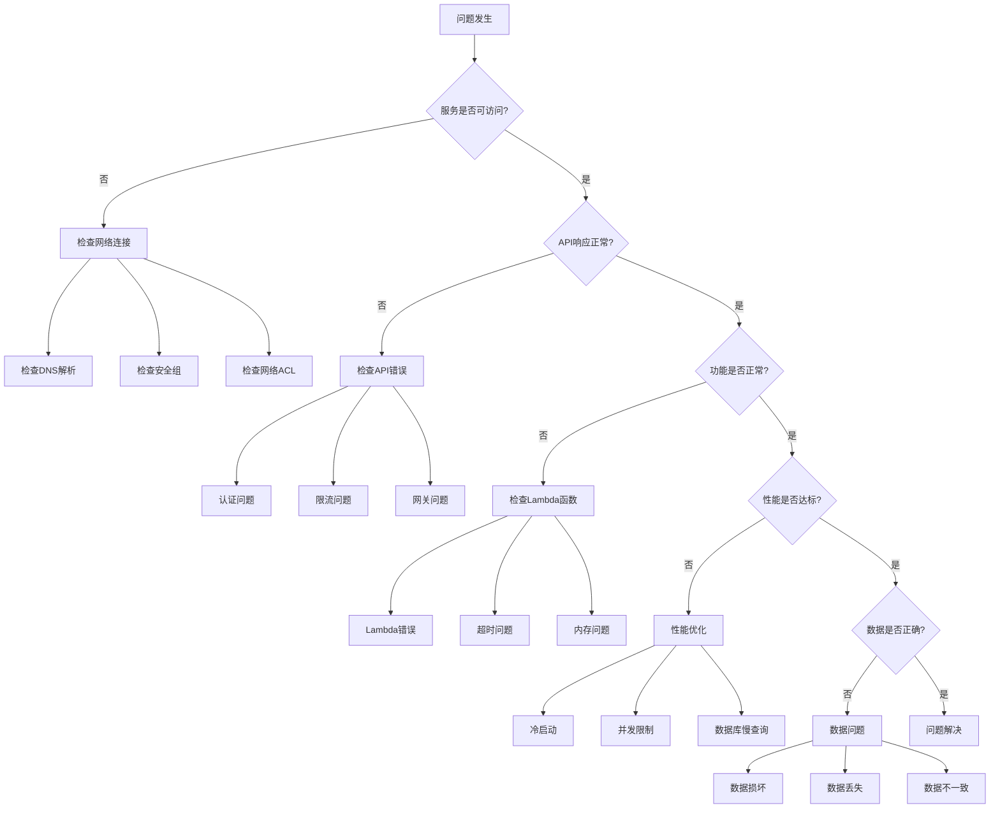

# AI PPT Assistant - 故障排除指南

## 目录

1. [快速诊断流程](#快速诊断流程)
2. [常见问题及解决方案](#常见问题及解决方案)
3. [错误代码参考](#错误代码参考)
4. [性能问题诊断](#性能问题诊断)
5. [日志分析技巧](#日志分析技巧)
6. [调试工具使用](#调试工具使用)
7. [紧急修复流程](#紧急修复流程)
8. [问题上报模板](#问题上报模板)

## 快速诊断流程

### 诊断决策树



### 快速检查命令

```bash
#!/bin/bash
# quick_diagnosis.sh - 快速诊断脚本

echo "=== AI PPT Assistant 快速诊断 ==="

# 1. 检查API Gateway
echo "1. 检查API Gateway状态..."
API_ID=$(aws apigatewayv2 get-apis --query "Items[?Name=='ai-ppt-assistant-api'].ApiId" --output text)
if [ -z "$API_ID" ]; then
    echo "  ❌ API Gateway未找到"
else
    echo "  ✅ API Gateway ID: $API_ID"
    API_ENDPOINT=$(aws apigatewayv2 get-api --api-id $API_ID --query "ApiEndpoint" --output text)
    echo "  📍 Endpoint: $API_ENDPOINT"

    # 测试连接
    HTTP_CODE=$(curl -s -o /dev/null -w "%{http_code}" $API_ENDPOINT/health)
    if [ "$HTTP_CODE" = "200" ]; then
        echo "  ✅ API健康检查通过"
    else
        echo "  ❌ API健康检查失败 (HTTP $HTTP_CODE)"
    fi
fi

# 2. 检查Lambda函数
echo -e "\n2. 检查Lambda函数状态..."
FUNCTIONS=("generate_ppt" "compile_ppt" "status_check" "image_generator")
for func in "${FUNCTIONS[@]}"; do
    FULL_NAME="ai-ppt-assistant-${func}"
    STATE=$(aws lambda get-function --function-name $FULL_NAME --query "Configuration.State" --output text 2>/dev/null)
    if [ "$STATE" = "Active" ]; then
        echo "  ✅ $func: Active"

        # 检查最近错误
        ERROR_COUNT=$(aws cloudwatch get-metric-statistics \
            --namespace AWS/Lambda \
            --metric-name Errors \
            --dimensions Name=FunctionName,Value=$FULL_NAME \
            --start-time $(date -u -d '1 hour ago' +%Y-%m-%dT%H:%M:%S) \
            --end-time $(date -u +%Y-%m-%dT%H:%M:%S) \
            --period 3600 \
            --statistics Sum \
            --query "Datapoints[0].Sum" \
            --output text)

        if [ "$ERROR_COUNT" != "None" ] && [ "$ERROR_COUNT" -gt "0" ]; then
            echo "     ⚠️  最近1小时错误: $ERROR_COUNT"
        fi
    else
        echo "  ❌ $func: $STATE"
    fi
done

# 3. 检查DynamoDB
echo -e "\n3. 检查DynamoDB状态..."
TABLE_STATUS=$(aws dynamodb describe-table --table-name ai-ppt-presentations --query "Table.TableStatus" --output text 2>/dev/null)
if [ "$TABLE_STATUS" = "ACTIVE" ]; then
    echo "  ✅ DynamoDB表: ACTIVE"

    # 检查限流
    THROTTLES=$(aws cloudwatch get-metric-statistics \
        --namespace AWS/DynamoDB \
        --metric-name UserErrors \
        --dimensions Name=TableName,Value=ai-ppt-presentations \
        --start-time $(date -u -d '1 hour ago' +%Y-%m-%dT%H:%M:%S) \
        --end-time $(date -u +%Y-%m-%dT%H:%M:%S) \
        --period 3600 \
        --statistics Sum \
        --query "Datapoints[0].Sum" \
        --output text)

    if [ "$THROTTLES" != "None" ] && [ "$THROTTLES" -gt "0" ]; then
        echo "     ⚠️  最近1小时限流: $THROTTLES"
    fi
else
    echo "  ❌ DynamoDB表: $TABLE_STATUS"
fi

# 4. 检查S3
echo -e "\n4. 检查S3存储桶..."
BUCKET_NAME="ai-ppt-presentations-prod"
if aws s3api head-bucket --bucket $BUCKET_NAME 2>/dev/null; then
    echo "  ✅ S3存储桶可访问"

    # 检查存储桶大小
    SIZE=$(aws s3 ls s3://$BUCKET_NAME --recursive --summarize | grep "Total Size" | cut -d: -f2)
    echo "     📊 总大小: $SIZE bytes"
else
    echo "  ❌ S3存储桶不可访问"
fi

# 5. 检查CloudWatch告警
echo -e "\n5. 检查活跃告警..."
ALARMS=$(aws cloudwatch describe-alarms --state-value ALARM --query "MetricAlarms[?starts_with(AlarmName, 'ai-ppt')].[AlarmName,StateReason]" --output text)
if [ -z "$ALARMS" ]; then
    echo "  ✅ 没有活跃告警"
else
    echo "  ⚠️  活跃告警:"
    echo "$ALARMS" | while read name reason; do
        echo "     - $name: $reason"
    done
fi

echo -e "\n=== 诊断完成 ==="
```

## 常见问题及解决方案

### 1. API Gateway问题

#### 问题：403 Forbidden错误

**症状**：
- API调用返回403错误
- 错误信息："User is not authorized to access this resource"

**原因**：
1. API密钥无效或过期
2. IAM权限不足
3. CORS配置错误

**解决方案**：

```python
# 检查API密钥
import boto3

api_gateway = boto3.client('apigatewayv2')

# 获取API密钥信息
def check_api_keys(api_id):
    """检查API密钥状态"""
    response = api_gateway.get_api_keys(
        apiId=api_id,
        includeValues=False
    )

    for key in response['Items']:
        print(f"Key ID: {key['Id']}")
        print(f"Enabled: {key['Enabled']}")
        print(f"Created: {key['CreatedDate']}")

        # 检查使用计划
        usage_plans = api_gateway.get_usage_plan_keys(
            usagePlanId=key.get('StageKeys', [{}])[0].get('RestApiId')
        )
        print(f"Usage Plans: {usage_plans}")

# 修复CORS配置
def fix_cors(api_id, route_id):
    """修复CORS配置"""
    api_gateway.update_route(
        ApiId=api_id,
        RouteId=route_id,
        RouteResponseSelectionExpression='$default',
        AuthorizationType='NONE',  # 或 'JWT'
        CorsConfiguration={
            'AllowOrigins': ['*'],
            'AllowMethods': ['GET', 'POST', 'PUT', 'DELETE', 'OPTIONS'],
            'AllowHeaders': ['*'],
            'ExposeHeaders': ['*'],
            'MaxAge': 86400
        }
    )
```

#### 问题：429 Too Many Requests

**症状**：
- API返回429错误
- 错误信息："Rate limit exceeded"

**解决方案**：

```bash
# 临时增加限流配置
aws apigatewayv2 update-stage \
    --api-id $API_ID \
    --stage-name prod \
    --throttle-settings '{
        "RateLimit": 10000,
        "BurstLimit": 20000
    }'

# 为特定路由设置限流
aws apigatewayv2 update-route \
    --api-id $API_ID \
    --route-id $ROUTE_ID \
    --throttle-settings '{
        "RateLimit": 1000,
        "BurstLimit": 2000
    }'
```

### 2. Lambda函数问题

#### 问题：Lambda超时

**症状**：
- 函数执行超过配置的超时时间
- CloudWatch日志显示："Task timed out after X seconds"

**诊断脚本**：

```python
# diagnose_lambda_timeout.py

import boto3
import json
from datetime import datetime, timedelta

def analyze_lambda_timeouts(function_name, hours=24):
    """分析Lambda超时问题"""

    logs = boto3.client('logs')
    lambda_client = boto3.client('lambda')

    # 获取函数配置
    config = lambda_client.get_function_configuration(
        FunctionName=function_name
    )
    print(f"当前超时设置: {config['Timeout']}秒")
    print(f"内存配置: {config['MemorySize']}MB")

    # 查询超时日志
    log_group = f'/aws/lambda/{function_name}'
    end_time = datetime.utcnow()
    start_time = end_time - timedelta(hours=hours)

    query = """
    fields @timestamp, @duration, @message
    | filter @message like /Task timed out/
    | stats count() as timeout_count, avg(@duration) as avg_duration, max(@duration) as max_duration
    """

    response = logs.start_query(
        logGroupName=log_group,
        startTime=int(start_time.timestamp()),
        endTime=int(end_time.timestamp()),
        queryString=query
    )

    # 等待查询完成
    query_id = response['queryId']
    status = 'Running'

    while status == 'Running':
        response = logs.get_query_results(queryId=query_id)
        status = response['status']
        time.sleep(1)

    # 分析结果
    if response['results']:
        stats = response['results'][0]
        print(f"\n过去{hours}小时超时统计:")
        for stat in stats:
            print(f"  {stat['field']}: {stat['value']}")

        # 建议
        max_duration = float(stats[2]['value']) if len(stats) > 2 else config['Timeout']
        recommended_timeout = int(max_duration * 1.5)
        print(f"\n建议:")
        print(f"  - 将超时时间增加到: {recommended_timeout}秒")

        if config['MemorySize'] < 1024:
            print(f"  - 考虑增加内存到: 1024MB (可能提高CPU性能)")

# 使用示例
analyze_lambda_timeouts('ai-ppt-assistant-generate_ppt')
```

**解决方案**：

```bash
# 增加超时时间
aws lambda update-function-configuration \
    --function-name ai-ppt-assistant-generate_ppt \
    --timeout 300

# 增加内存（同时增加CPU）
aws lambda update-function-configuration \
    --function-name ai-ppt-assistant-generate_ppt \
    --memory-size 3008
```

#### 问题：Lambda内存不足

**症状**：
- CloudWatch日志："Runtime.ExitError"
- 日志显示："Runtime exited with error: signal: killed"

**诊断和解决**：

```python
# memory_analysis.py

def analyze_memory_usage(function_name):
    """分析Lambda内存使用情况"""

    cloudwatch = boto3.client('cloudwatch')

    # 获取内存使用统计
    response = cloudwatch.get_metric_statistics(
        Namespace='AWS/Lambda',
        MetricName='Duration',
        Dimensions=[
            {'Name': 'FunctionName', 'Value': function_name}
        ],
        StartTime=datetime.utcnow() - timedelta(hours=1),
        EndTime=datetime.utcnow(),
        Period=300,
        Statistics=['Average', 'Maximum']
    )

    # 查询实际内存使用
    logs = boto3.client('logs')
    log_group = f'/aws/lambda/{function_name}'

    query = """
    fields @timestamp, @memorySize, @maxMemoryUsed
    | filter @type = "REPORT"
    | stats avg(@maxMemoryUsed) as avg_memory, max(@maxMemoryUsed) as max_memory, @memorySize as allocated
    """

    # 执行查询...

    print(f"内存使用分析:")
    print(f"  分配内存: {allocated}MB")
    print(f"  平均使用: {avg_memory}MB")
    print(f"  最大使用: {max_memory}MB")
    print(f"  使用率: {(max_memory/allocated)*100:.1f}%")

    if max_memory > allocated * 0.9:
        print("⚠️ 内存使用接近上限，建议增加内存配置")
```

### 3. DynamoDB问题

#### 问题：DynamoDB限流

**症状**：
- ProvisionedThroughputExceededException错误
- 请求被限流

**解决方案**：

```python
# fix_dynamodb_throttling.py

def fix_throttling(table_name):
    """修复DynamoDB限流问题"""

    dynamodb = boto3.client('dynamodb')

    # 检查当前容量
    table = dynamodb.describe_table(TableName=table_name)
    billing_mode = table['Table'].get('BillingModeSummary', {}).get('BillingMode')

    if billing_mode == 'PROVISIONED':
        # 增加预置容量
        dynamodb.update_table(
            TableName=table_name,
            ProvisionedThroughput={
                'ReadCapacityUnits': 100,
                'WriteCapacityUnits': 100
            }
        )
        print("已增加预置容量")
    else:
        # 切换到按需模式
        dynamodb.update_table(
            TableName=table_name,
            BillingMode='PAY_PER_REQUEST'
        )
        print("已切换到按需计费模式")

    # 配置自动扩展
    autoscaling = boto3.client('application-autoscaling')

    autoscaling.register_scalable_target(
        ServiceNamespace='dynamodb',
        ResourceId=f'table/{table_name}',
        ScalableDimension='dynamodb:table:ReadCapacityUnits',
        MinCapacity=5,
        MaxCapacity=40000
    )

    autoscaling.put_scaling_policy(
        PolicyName=f'{table_name}-read-scaling',
        ServiceNamespace='dynamodb',
        ResourceId=f'table/{table_name}',
        ScalableDimension='dynamodb:table:ReadCapacityUnits',
        PolicyType='TargetTrackingScaling',
        TargetTrackingScalingPolicyConfiguration={
            'TargetValue': 70.0,
            'PredefinedMetricSpecification': {
                'PredefinedMetricType': 'DynamoDBReadCapacityUtilization'
            }
        }
    )
```

### 4. Bedrock相关问题

#### 问题：Bedrock模型调用失败

**症状**：
- "ModelNotReadyException"错误
- "ThrottlingException"错误

**诊断脚本**：

```python
# diagnose_bedrock.py

import boto3
import time

def test_bedrock_model(model_id='anthropic.claude-3-sonnet-20240229-v1:0'):
    """测试Bedrock模型可用性"""

    bedrock = boto3.client('bedrock-runtime')

    test_prompt = {
        "anthropic_version": "bedrock-2023-05-31",
        "max_tokens": 100,
        "messages": [
            {
                "role": "user",
                "content": "Hello, please respond with 'OK' if you're working."
            }
        ]
    }

    try:
        # 测试模型调用
        start_time = time.time()
        response = bedrock.invoke_model(
            modelId=model_id,
            contentType='application/json',
            accept='application/json',
            body=json.dumps(test_prompt)
        )
        elapsed = time.time() - start_time

        result = json.loads(response['body'].read())
        print(f"✅ 模型响应正常")
        print(f"   响应时间: {elapsed:.2f}秒")
        print(f"   Token使用: {result.get('usage', {})}")

    except Exception as e:
        print(f"❌ 模型调用失败: {e}")

        if 'ThrottlingException' in str(e):
            print("   建议: 实施重试逻辑和请求限流")
        elif 'ModelNotReadyException' in str(e):
            print("   建议: 等待模型准备就绪或切换到其他区域")

# 测试所有可用模型
def test_all_models():
    """测试所有可用的Bedrock模型"""

    bedrock = boto3.client('bedrock')

    models = bedrock.list_foundation_models()
    for model in models['modelSummaries']:
        if model['modelLifecycle']['status'] == 'ACTIVE':
            print(f"\n测试模型: {model['modelId']}")
            test_bedrock_model(model['modelId'])
            time.sleep(1)  # 避免限流
```

## 错误代码参考

### HTTP状态码

| 状态码 | 含义 | 常见原因 | 解决方法 |
|--------|------|----------|----------|
| **400** | Bad Request | 请求参数错误 | 检查请求格式和参数 |
| **401** | Unauthorized | 认证失败 | 检查API密钥或Token |
| **403** | Forbidden | 权限不足 | 检查IAM权限 |
| **404** | Not Found | 资源不存在 | 验证资源ID和路径 |
| **429** | Too Many Requests | 限流 | 实施重试逻辑 |
| **500** | Internal Server Error | 服务器错误 | 检查Lambda日志 |
| **502** | Bad Gateway | 网关错误 | 检查Lambda函数状态 |
| **503** | Service Unavailable | 服务不可用 | 检查服务健康状态 |
| **504** | Gateway Timeout | 网关超时 | 增加超时配置 |

### 自定义错误代码

```python
# error_codes.py

class ErrorCodes:
    """自定义错误代码定义"""

    # 1000-1999: 输入验证错误
    INVALID_TOPIC = 1001       # 主题无效
    INVALID_PAGE_COUNT = 1002  # 页数无效
    INVALID_TEMPLATE = 1003    # 模板无效

    # 2000-2999: 业务逻辑错误
    PPT_GENERATION_FAILED = 2001  # PPT生成失败
    IMAGE_GENERATION_FAILED = 2002 # 图像生成失败
    CONTENT_TOO_LONG = 2003        # 内容过长

    # 3000-3999: 系统错误
    DATABASE_ERROR = 3001      # 数据库错误
    S3_UPLOAD_FAILED = 3002    # S3上传失败
    BEDROCK_ERROR = 3003       # Bedrock调用失败

    # 4000-4999: 外部服务错误
    EXTERNAL_API_ERROR = 4001  # 外部API错误
    NETWORK_ERROR = 4002       # 网络错误

    @staticmethod
    def get_message(code):
        """获取错误消息"""
        messages = {
            1001: "提供的主题无效或包含不支持的字符",
            1002: "页数必须在1-50之间",
            1003: "指定的模板不存在",
            2001: "PPT生成过程失败，请重试",
            2002: "图像生成失败，将使用默认图像",
            2003: "生成的内容超过最大长度限制",
            3001: "数据库操作失败",
            3002: "文件上传到S3失败",
            3003: "Bedrock服务调用失败",
            4001: "外部API服务不可用",
            4002: "网络连接错误"
        }
        return messages.get(code, "未知错误")
```

## 性能问题诊断

### Lambda冷启动优化

```python
# cold_start_analysis.py

def analyze_cold_starts(function_name, hours=24):
    """分析Lambda冷启动情况"""

    logs = boto3.client('logs')
    log_group = f'/aws/lambda/{function_name}'

    # CloudWatch Insights查询
    query = """
    fields @timestamp, @duration, @initDuration
    | filter @type = "REPORT"
    | filter @initDuration > 0
    | stats count() as cold_starts,
            avg(@initDuration) as avg_init_time,
            max(@initDuration) as max_init_time,
            avg(@duration) as avg_total_duration
    """

    # 执行查询...

    print(f"冷启动分析 ({hours}小时):")
    print(f"  冷启动次数: {cold_starts}")
    print(f"  平均初始化时间: {avg_init_time:.0f}ms")
    print(f"  最大初始化时间: {max_init_time:.0f}ms")

    # 优化建议
    if avg_init_time > 1000:
        print("\n优化建议:")
        print("  1. 启用预留并发")
        print("  2. 减少依赖包大小")
        print("  3. 使用Lambda层")
        print("  4. 优化初始化代码")

        # 自动配置预留并发
        lambda_client = boto3.client('lambda')
        lambda_client.put_provisioned_concurrency_config(
            FunctionName=function_name,
            ProvisionedConcurrentExecutions=5,
            Qualifier='$LATEST'
        )
        print("\n✅ 已配置5个预留并发实例")
```

### 数据库查询优化

```python
# db_performance_analysis.py

def analyze_db_performance(table_name):
    """分析DynamoDB性能"""

    cloudwatch = boto3.client('cloudwatch')

    metrics = [
        'ConsumedReadCapacityUnits',
        'ConsumedWriteCapacityUnits',
        'SuccessfulRequestLatency',
        'ThrottledRequests'
    ]

    for metric in metrics:
        response = cloudwatch.get_metric_statistics(
            Namespace='AWS/DynamoDB',
            MetricName=metric,
            Dimensions=[
                {'Name': 'TableName', 'Value': table_name}
            ],
            StartTime=datetime.utcnow() - timedelta(hours=1),
            EndTime=datetime.utcnow(),
            Period=300,
            Statistics=['Average', 'Maximum', 'Sum']
        )

        if response['Datapoints']:
            data = response['Datapoints'][0]
            print(f"\n{metric}:")
            for stat in ['Average', 'Maximum', 'Sum']:
                if stat in data:
                    print(f"  {stat}: {data[stat]:.2f}")

    # 查询模式分析
    print("\n常见查询模式优化建议:")
    print("  1. 使用批量操作减少请求次数")
    print("  2. 实施查询结果缓存")
    print("  3. 使用投影表达式减少数据传输")
    print("  4. 考虑使用全局二级索引")
```

## 日志分析技巧

### CloudWatch Insights查询示例

```sql
-- 查找最慢的请求
fields @timestamp, @duration, @message
| filter @type = "REPORT"
| sort @duration desc
| limit 20

-- 分析错误分布
fields @timestamp, @message
| filter @message like /ERROR/
| parse @message /ERROR.*: (?<error_message>.*)/
| stats count() by error_message

-- 追踪特定请求
fields @timestamp, @message, @requestId
| filter @requestId = "abc-123-def"
| sort @timestamp asc

-- 统计每小时请求量
fields @timestamp
| filter @type = "REPORT"
| stats count() by bin(1h)

-- 分析内存使用趋势
fields @timestamp, @maxMemoryUsed, @memorySize
| filter @type = "REPORT"
| stats avg(@maxMemoryUsed/@memorySize * 100) as memory_usage_percent by bin(5m)
```

### 日志聚合脚本

```python
# log_aggregator.py

import boto3
from collections import defaultdict

def aggregate_errors(log_group, hours=24):
    """聚合错误日志"""

    logs = boto3.client('logs')

    # 获取所有错误
    query = """
    fields @timestamp, @message, @logStream
    | filter @message like /ERROR|Exception|Failed/
    | limit 1000
    """

    # 执行查询并处理结果...

    # 分类错误
    error_categories = defaultdict(list)

    for log in results:
        message = log['@message']

        if 'TimeoutError' in message:
            error_categories['timeout'].append(log)
        elif 'MemoryError' in message:
            error_categories['memory'].append(log)
        elif 'ThrottlingException' in message:
            error_categories['throttling'].append(log)
        elif 'ValidationException' in message:
            error_categories['validation'].append(log)
        else:
            error_categories['other'].append(log)

    # 生成报告
    print("错误分类统计:")
    for category, logs in error_categories.items():
        print(f"  {category}: {len(logs)} 次")

        if logs:
            print(f"    最近示例: {logs[0]['@message'][:100]}...")

    return error_categories
```

## 调试工具使用

### AWS X-Ray追踪

```python
# xray_trace_analysis.py

import boto3

def analyze_traces(service_name, hours=1):
    """分析X-Ray追踪数据"""

    xray = boto3.client('xray')

    # 获取追踪摘要
    response = xray.get_trace_summaries(
        TimeRangeType='LastHours',
        TimeRange={'Hours': hours},
        FilterExpression=f'service("{service_name}")'
    )

    slow_traces = []
    error_traces = []

    for trace in response['TraceSummaries']:
        duration = trace.get('Duration', 0)

        if duration > 5:  # 超过5秒
            slow_traces.append(trace)

        if trace.get('HasError'):
            error_traces.append(trace)

    print(f"X-Ray追踪分析 (最近{hours}小时):")
    print(f"  总追踪数: {len(response['TraceSummaries'])}")
    print(f"  慢请求: {len(slow_traces)}")
    print(f"  错误请求: {len(error_traces)}")

    # 分析慢请求
    if slow_traces:
        print("\n最慢的5个请求:")
        for trace in sorted(slow_traces, key=lambda x: x['Duration'], reverse=True)[:5]:
            print(f"  - ID: {trace['Id']}")
            print(f"    Duration: {trace['Duration']:.2f}s")
            print(f"    URL: {trace.get('Http', {}).get('HttpURL', 'N/A')}")

    # 分析错误
    if error_traces:
        print("\n最近的错误:")
        for trace in error_traces[:5]:
            # 获取详细追踪
            detail = xray.get_trace_graph(TraceIds=[trace['Id']])
            for service in detail['Services']:
                if service.get('ErrorStatistics', {}).get('TotalCount', 0) > 0:
                    print(f"  - Service: {service['Name']}")
                    print(f"    Errors: {service['ErrorStatistics']}")
```

### 本地调试环境

```python
# local_debug.py

import os
import sys
import json
from unittest.mock import Mock, patch

class LocalDebugger:
    """本地调试工具"""

    def __init__(self):
        # 设置环境变量
        os.environ['AWS_REGION'] = 'us-east-1'
        os.environ['ENVIRONMENT'] = 'local'
        os.environ['DYNAMODB_TABLE'] = 'ai-ppt-presentations-local'
        os.environ['S3_BUCKET'] = 'ai-ppt-local'

    def mock_aws_services(self):
        """模拟AWS服务"""

        # 模拟DynamoDB
        mock_dynamodb = Mock()
        mock_dynamodb.put_item.return_value = {'ResponseMetadata': {'HTTPStatusCode': 200}}
        mock_dynamodb.get_item.return_value = {
            'Item': {
                'presentation_id': {'S': 'test-123'},
                'status': {'S': 'completed'}
            }
        }

        # 模拟S3
        mock_s3 = Mock()
        mock_s3.upload_fileobj.return_value = None
        mock_s3.generate_presigned_url.return_value = 'https://mock-url.com/file.pptx'

        # 模拟Bedrock
        mock_bedrock = Mock()
        mock_bedrock.invoke_model.return_value = {
            'body': json.dumps({
                'content': [{'text': 'Generated content'}]
            }).encode()
        }

        return {
            'dynamodb': mock_dynamodb,
            's3': mock_s3,
            'bedrock': mock_bedrock
        }

    def test_lambda_handler(self, handler, event):
        """测试Lambda处理器"""

        # 创建模拟context
        context = Mock()
        context.aws_request_id = 'test-request-id'
        context.invoked_function_arn = 'arn:aws:lambda:test'
        context.get_remaining_time_in_millis = Mock(return_value=300000)

        # 模拟AWS服务
        mocks = self.mock_aws_services()

        with patch('boto3.client') as mock_client:
            def client_side_effect(service):
                return mocks.get(service, Mock())

            mock_client.side_effect = client_side_effect

            # 执行处理器
            try:
                result = handler(event, context)
                print(f"✅ 执行成功:")
                print(json.dumps(result, indent=2))
                return result
            except Exception as e:
                print(f"❌ 执行失败: {e}")
                import traceback
                traceback.print_exc()
                raise

# 使用示例
if __name__ == "__main__":
    debugger = LocalDebugger()

    # 导入Lambda函数
    sys.path.insert(0, '../lambdas')
    from generate_ppt import handler

    # 创建测试事件
    test_event = {
        'body': json.dumps({
            'topic': 'AI Technology Trends',
            'pages': 5
        })
    }

    # 测试
    result = debugger.test_lambda_handler(handler, test_event)
```

## 紧急修复流程

### 紧急回滚脚本

```bash
#!/bin/bash
# emergency_rollback.sh

set -e

FUNCTION_NAME=$1
VERSION=$2

if [ -z "$FUNCTION_NAME" ] || [ -z "$VERSION" ]; then
    echo "Usage: ./emergency_rollback.sh <function_name> <version>"
    exit 1
fi

echo "🚨 执行紧急回滚..."

# 1. 更新Lambda别名
echo "回滚Lambda函数到版本 $VERSION..."
aws lambda update-alias \
    --function-name $FUNCTION_NAME \
    --name PROD \
    --function-version $VERSION

# 2. 验证回滚
echo "验证回滚..."
CURRENT_VERSION=$(aws lambda get-alias --function-name $FUNCTION_NAME --name PROD --query "FunctionVersion" --output text)

if [ "$CURRENT_VERSION" = "$VERSION" ]; then
    echo "✅ 回滚成功"
else
    echo "❌ 回滚失败"
    exit 1
fi

# 3. 测试功能
echo "测试功能..."
aws lambda invoke \
    --function-name $FUNCTION_NAME \
    --qualifier PROD \
    --payload '{"test": true}' \
    response.json

if [ $? -eq 0 ]; then
    echo "✅ 功能测试通过"
else
    echo "❌ 功能测试失败"
fi

# 4. 发送通知
aws sns publish \
    --topic-arn arn:aws:sns:us-east-1:123456789012:ops-alerts \
    --subject "紧急回滚完成" \
    --message "函数 $FUNCTION_NAME 已回滚到版本 $VERSION"

echo "🎉 紧急回滚完成"
```

### 热修复流程

```python
# hotfix.py

import boto3
import zipfile
import io

def apply_hotfix(function_name, fix_code):
    """应用热修复"""

    lambda_client = boto3.client('lambda')

    # 1. 下载当前代码
    response = lambda_client.get_function(
        FunctionName=function_name,
        Qualifier='$LATEST'
    )

    code_url = response['Code']['Location']

    # 2. 下载并解压代码
    import requests
    r = requests.get(code_url)
    zip_content = io.BytesIO(r.content)

    with zipfile.ZipFile(zip_content, 'r') as zip_ref:
        # 读取所有文件
        file_list = zip_ref.namelist()

    # 3. 创建新的zip包
    new_zip = io.BytesIO()

    with zipfile.ZipFile(new_zip, 'w', zipfile.ZIP_DEFLATED) as zipf:
        # 复制原有文件
        with zipfile.ZipFile(zip_content, 'r') as zip_ref:
            for file in file_list:
                if file != 'lambda_function.py':  # 跳过要修改的文件
                    zipf.writestr(file, zip_ref.read(file))

        # 添加修复代码
        zipf.writestr('lambda_function.py', fix_code)

    # 4. 更新Lambda函数
    new_zip.seek(0)

    response = lambda_client.update_function_code(
        FunctionName=function_name,
        ZipFile=new_zip.read(),
        Publish=True
    )

    new_version = response['Version']
    print(f"热修复已应用，新版本: {new_version}")

    # 5. 更新别名
    lambda_client.update_alias(
        FunctionName=function_name,
        Name='PROD',
        FunctionVersion=new_version
    )

    return new_version
```

## 问题上报模板

### 问题报告模板

```markdown
# 问题报告

## 基本信息
- **报告人**: [姓名]
- **日期时间**: [YYYY-MM-DD HH:MM:SS UTC]
- **严重级别**: [P0/P1/P2/P3/P4]
- **影响范围**: [受影响的用户数/功能]

## 问题描述
[详细描述问题现象]

## 重现步骤
1. [步骤1]
2. [步骤2]
3. [步骤3]

## 预期行为
[描述正常情况下的预期行为]

## 实际行为
[描述实际发生的行为]

## 错误信息
```
[粘贴错误日志或截图]
```

## 环境信息
- **环境**: [dev/staging/prod]
- **区域**: [us-east-1]
- **服务**: [具体的Lambda函数/API端点]
- **请求ID**: [如果有]
- **追踪ID**: [X-Ray追踪ID]

## 诊断步骤已执行
- [ ] 检查CloudWatch日志
- [ ] 查看X-Ray追踪
- [ ] 验证配置
- [ ] 测试其他环境

## 临时解决方案
[如果有临时解决方案，请描述]

## 根本原因分析
[如果已知，描述根本原因]

## 建议修复方案
[提出修复建议]

## 附件
- [日志文件]
- [截图]
- [配置文件]
```

### 自动化问题收集

```python
# issue_collector.py

import boto3
import json
from datetime import datetime

class IssueCollector:
    """自动收集问题信息"""

    def __init__(self, issue_id):
        self.issue_id = issue_id
        self.report = {
            'issue_id': issue_id,
            'timestamp': datetime.utcnow().isoformat(),
            'diagnostics': {}
        }

    def collect_logs(self, function_name, request_id=None):
        """收集相关日志"""

        logs = boto3.client('logs')
        log_group = f'/aws/lambda/{function_name}'

        filter_pattern = f'"{request_id}"' if request_id else "ERROR"

        response = logs.filter_log_events(
            logGroupName=log_group,
            filterPattern=filter_pattern,
            limit=100
        )

        self.report['diagnostics']['logs'] = response['events']

    def collect_metrics(self, function_name):
        """收集性能指标"""

        cloudwatch = boto3.client('cloudwatch')

        metrics = ['Errors', 'Duration', 'Throttles']
        self.report['diagnostics']['metrics'] = {}

        for metric in metrics:
            response = cloudwatch.get_metric_statistics(
                Namespace='AWS/Lambda',
                MetricName=metric,
                Dimensions=[
                    {'Name': 'FunctionName', 'Value': function_name}
                ],
                StartTime=datetime.utcnow() - timedelta(hours=1),
                EndTime=datetime.utcnow(),
                Period=300,
                Statistics=['Sum', 'Average', 'Maximum']
            )

            self.report['diagnostics']['metrics'][metric] = response['Datapoints']

    def collect_traces(self, trace_id):
        """收集X-Ray追踪"""

        xray = boto3.client('xray')

        response = xray.get_trace_graph(
            TraceIds=[trace_id]
        )

        self.report['diagnostics']['traces'] = response['Services']

    def generate_report(self):
        """生成问题报告"""

        # 保存到S3
        s3 = boto3.client('s3')
        report_key = f'issue-reports/{self.issue_id}.json'

        s3.put_object(
            Bucket='ai-ppt-diagnostics',
            Key=report_key,
            Body=json.dumps(self.report, indent=2),
            ContentType='application/json'
        )

        print(f"问题报告已生成: s3://ai-ppt-diagnostics/{report_key}")

        # 创建GitHub Issue
        self.create_github_issue()

        return self.report

    def create_github_issue(self):
        """创建GitHub Issue"""

        import requests

        issue_data = {
            'title': f'[AUTO] Issue {self.issue_id}',
            'body': self.format_issue_body(),
            'labels': ['bug', 'auto-generated']
        }

        headers = {
            'Authorization': f'token {os.environ["GITHUB_TOKEN"]}',
            'Accept': 'application/vnd.github.v3+json'
        }

        response = requests.post(
            'https://api.github.com/repos/org/repo/issues',
            json=issue_data,
            headers=headers
        )

        if response.status_code == 201:
            print(f"GitHub Issue创建成功: {response.json()['html_url']}")

# 使用示例
collector = IssueCollector('issue-2024-01-14-001')
collector.collect_logs('ai-ppt-assistant-generate_ppt')
collector.collect_metrics('ai-ppt-assistant-generate_ppt')
collector.generate_report()
```

## 故障排除检查清单

### 快速检查清单

- [ ] **服务可用性**
  - [ ] API Gateway响应正常
  - [ ] Lambda函数状态Active
  - [ ] DynamoDB表状态ACTIVE
  - [ ] S3存储桶可访问

- [ ] **性能指标**
  - [ ] API延迟 < 3秒
  - [ ] Lambda错误率 < 1%
  - [ ] DynamoDB无限流
  - [ ] 内存使用 < 90%

- [ ] **日志检查**
  - [ ] 无ERROR级别日志
  - [ ] 无异常堆栈跟踪
  - [ ] 无超时警告

- [ ] **监控告警**
  - [ ] CloudWatch无活跃告警
  - [ ] X-Ray无错误追踪
  - [ ] 成本在预算内

### 深度诊断清单

- [ ] **代码级检查**
  - [ ] 最近部署验证
  - [ ] 配置更改审查
  - [ ] 依赖版本检查

- [ ] **网络诊断**
  - [ ] VPC配置验证
  - [ ] 安全组规则检查
  - [ ] DNS解析测试

- [ ] **数据完整性**
  - [ ] 数据库一致性检查
  - [ ] S3对象验证
  - [ ] 缓存同步状态

- [ ] **外部依赖**
  - [ ] Bedrock服务状态
  - [ ] 第三方API可用性
  - [ ] CDN运行状态

---

*最后更新: 2024-01-14*
*版本: 1.0.0*
*技术支持: support@ai-ppt.com*