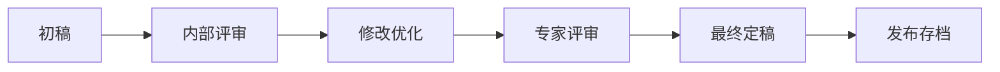

# AI PPT Assistant 最佳实践指南

## 目录

1. [提示词优化技巧](#提示词优化技巧)
2. [模板选择建议](#模板选择建议)
3. [性能优化建议](#性能优化建议)
4. [成本控制策略](#成本控制策略)
5. [内容质量提升](#内容质量提升)
6. [设计原则](#设计原则)
7. [协作效率](#协作效率)
8. [安全最佳实践](#安全最佳实践)

## 提示词优化技巧

### 基础原则

#### 1. 明确具体

❌ **不好的示例：**
```
"做一个关于AI的PPT"
```

✅ **优秀的示例：**
```
"创建一个20页的PPT，主题是'人工智能在金融风控中的应用'，
包含以下章节：
1. AI技术概述（3页）
2. 金融风控现状（3页）
3. AI风控解决方案（5页）
4. 实际案例分析（4页）
5. 实施路线图（3页）
6. 总结与展望（2页）
目标受众是银行高管，风格要专业严谨。"
```

#### 2. 结构化表达

使用清晰的结构描述需求：

```markdown
# PPT基本信息
- 主题：2024年度营销策略
- 页数：15-18页
- 受众：公司管理层
- 用途：年度规划会议

# 内容大纲
## 第一部分：2023回顾（4页）
- 业绩总结
- 市场表现
- 竞争分析
- 经验教训

## 第二部分：2024规划（6页）
- 市场机会
- 目标设定
- 策略制定
- 行动计划

## 第三部分：资源需求（3页）
- 预算规划
- 团队建设
- 技术支持

# 设计要求
- 配色：公司VI色系
- 风格：现代、专业
- 图表：数据可视化为主
```

### 高级技巧

#### 1. 分步迭代

**第一步：生成框架**
```
"先帮我生成一个产品发布会PPT的大纲，
产品是智能家居系统，
需要包含产品介绍、技术优势、市场定位、价格策略"
```

**第二步：完善内容**
```
"基于这个大纲，请详细展开技术优势部分，
加入与竞品的对比分析，
强调我们的AI语音识别准确率达到99%"
```

**第三步：优化表达**
```
"将技术术语转换为通俗易懂的表达，
目标受众是普通消费者，不是技术人员"
```

#### 2. 情境设定

```
角色设定：
"你是一位经验丰富的咨询顾问，
正在为一家传统制造企业准备数字化转型方案。
企业规模500人，年营收10亿，
管理层平均年龄50岁，对数字化了解有限。"

任务要求：
"创建一个循序渐进的PPT，
从他们熟悉的概念开始，
逐步引入数字化概念，
使用大量实际案例，
避免技术术语。"
```

#### 3. 参考样本

```
"参考苹果公司的产品发布会风格，
创建一个极简主义的PPT，
每页不超过3个要点，
大量留白，
使用高质量图片，
文字精炼有力。"
```

### 提示词模板库

#### 商业演示模板

```
[公司名称] [年份] [业务类型]演示PPT

# 基本信息
- 演讲时长：[X]分钟
- 目标受众：[投资人/客户/合作伙伴]
- 核心目的：[融资/销售/合作]

# 必须包含
1. 公司简介与团队
2. 市场机会与痛点
3. 产品/解决方案
4. 商业模式
5. 竞争优势
6. 财务预测/业绩
7. 发展规划
8. 投资需求/合作方案

# 风格要求
- 视觉风格：[专业/创新/技术感]
- 数据呈现：[图表/信息图/动画]
- 品牌元素：[Logo位置/品牌色]
```

#### 教学课件模板

```
课程名称：[XXX]
第[X]章：[章节标题]

# 教学目标
- 知识目标：[学生应该知道什么]
- 能力目标：[学生应该会做什么]
- 素质目标：[学生应该具备什么态度]

# 内容结构
1. 导入（2页）
   - 案例/问题引入
   - 学习目标展示

2. 新知讲解（8页）
   - 概念定义
   - 原理解释
   - 步骤演示
   - 例题分析

3. 练习巩固（3页）
   - 课堂练习
   - 小组讨论
   - 实践操作

4. 总结提升（2页）
   - 知识要点
   - 思维导图
   - 课后作业

# 教学特色
- 互动元素：[问答/投票/游戏]
- 多媒体：[视频/动画/音频]
- 案例来源：[行业/生活/历史]
```

## 模板选择建议

### 场景匹配矩阵

| 使用场景 | 推荐模板 | 关键特征 | 避免选择 |
|---------|---------|---------|---------|
| 董事会汇报 | 商务蓝、极简灰 | 数据驱动、逻辑清晰 | 创意类、花哨模板 |
| 产品发布 | 科技感、渐变色 | 视觉冲击、创新感 | 传统、保守模板 |
| 学术报告 | 学术白、经典蓝 | 严谨、引用规范 | 娱乐化模板 |
| 培训课程 | 教育绿、友好橙 | 互动性、易读性 | 信息密集模板 |
| 创意提案 | 艺术感、大胆配色 | 个性化、差异化 | 标准化模板 |
| 销售演示 | 品牌定制、活力型 | 说服力、行动导向 | 纯文本模板 |

### 模板定制策略

#### 1. 品牌一致性

```yaml
品牌模板要素：
  Logo位置:
    - 标题页: 中心大号
    - 内容页: 右上角小号
    - 结尾页: 中心配合联系方式

  配色方案:
    - 主色: 品牌主色 (60%)
    - 辅助色: 品牌辅色 (30%)
    - 强调色: 对比色 (10%)

  字体选择:
    - 标题: 品牌指定字体
    - 正文: 易读性字体
    - 数据: 等宽字体
```

#### 2. 受众适配

**专业人士：**
- 信息密度高
- 专业术语
- 详细数据
- 复杂图表

**普通受众：**
- 视觉化呈现
- 简单类比
- 故事化叙述
- 互动元素

**国际受众：**
- 文化中性设计
- 避免特定文化符号
- 国际化图标
- 多语言支持

### 模板组合使用

```
项目完整展示 =
  开场模板（吸引注意）
  + 内容模板（信息传递）
  + 数据模板（论证支撑）
  + 案例模板（实证说明）
  + 结尾模板（行动召唤）
```

## 性能优化建议

### 生成速度优化

#### 1. 内容优化

**批量处理：**
```javascript
// 推荐：一次性提交完整需求
{
  "slides": [
    {"title": "第1页", "content": "..."},
    {"title": "第2页", "content": "..."},
    {"title": "第3页", "content": "..."}
  ]
}

// 避免：逐页生成
generateSlide(1);
generateSlide(2);
generateSlide(3);
```

#### 2. 资源优化

**图片处理：**
- 使用WebP格式（体积小40%）
- 按需加载（懒加载）
- 合理压缩（质量85%）
- CDN加速

**最佳尺寸：**
```
全屏背景: 1920×1080 (150KB以内)
内容配图: 800×600 (80KB以内)
图标素材: 200×200 (20KB以内)
Logo标识: 300×100 (10KB以内)
```

#### 3. 缓存策略

```
缓存级别：
1. 浏览器缓存：静态资源
2. 本地存储：用户偏好、模板
3. 会话缓存：临时编辑数据
4. 云端缓存：常用素材库
```

### 编辑流畅度

#### 1. 分页加载

```
可见区域优先：
- 当前页：完整加载
- 前后1页：预加载
- 其他页：按需加载
```

#### 2. 异步操作

```javascript
// 非阻塞保存
autoSave({
  interval: 30, // 秒
  background: true,
  notification: "minimal"
});
```

#### 3. 性能监控

监控指标：
- 页面加载时间 < 3秒
- 操作响应时间 < 100ms
- 自动保存时间 < 500ms
- 导出时间 < 30秒

## 成本控制策略

### AI使用成本

#### 1. 智能调用

**分级策略：**
```
简单任务 → 轻量模型（低成本）
  - 格式调整
  - 简单翻译
  - 模板填充

复杂任务 → 高级模型（按需）
  - 创意生成
  - 深度分析
  - 专业内容
```

#### 2. 缓存复用

```
可复用内容：
- 行业通用内容
- 标准化模板
- 常用图表样式
- 公共素材库
```

#### 3. 批量优化

```
批量折扣：
- 单次生成：标准价格
- 5-10个：9折
- 10-50个：8折
- 50个以上：协商价格
```

### 存储成本

#### 1. 智能压缩

```python
压缩策略：
if file_type == "image":
    if usage == "background":
        compress_quality = 70
    elif usage == "content":
        compress_quality = 85
    else:  # icon, logo
        compress_quality = 95
```

#### 2. 生命周期管理

```
存储策略：
- 活跃文件：高速存储
- 7天未访问：标准存储
- 30天未访问：归档存储
- 90天未访问：冷存储
- 180天后：压缩存储
```

#### 3. 版本控制

```
版本保留策略：
- 最近5个版本：完整保存
- 5-10个版本：差异保存
- 更早版本：关键版本保存
```

### 流量优化

#### 1. CDN策略

```
CDN配置：
- 静态资源：全球CDN
- 用户文件：区域CDN
- API请求：就近节点
- 实时数据：直连
```

#### 2. 压缩传输

```
传输优化：
- Gzip压缩：文本类内容
- Brotli压缩：静态资源
- 图片优化：自适应质量
- 视频流：自适应码率
```

## 内容质量提升

### 信息架构

#### 1. 金字塔原理

```
结论先行
    ↓
论点支撑
    ↓
数据论证
    ↓
案例说明
```

#### 2. SCQA框架

- **S**ituation（情境）：当前状况
- **C**omplication（冲突）：面临问题
- **Q**uestion（问题）：如何解决
- **A**nswer（答案）：解决方案

#### 3. STAR法则

- **S**ituation（背景）
- **T**ask（任务）
- **A**ction（行动）
- **R**esult（结果）

### 视觉层次

#### 1. 信息密度控制

```
7±2原则：
- 每页要点：3-5个
- 每点文字：不超过2行
- 关键数据：突出显示
- 次要信息：弱化处理
```

#### 2. 视觉引导

```
Z字型阅读路径：
┌──────→────────┐
│               ↓
│   重要信息    │
│               │
├──────→────────┤
│               ↓
│   支撑内容    │
│               │
└──────→────────┘
```

#### 3. 色彩心理学

| 颜色 | 心理联想 | 适用场景 |
|------|---------|---------|
| 蓝色 | 信任、专业 | 企业、金融 |
| 绿色 | 成长、健康 | 环保、医疗 |
| 红色 | 激情、紧急 | 促销、警示 |
| 橙色 | 活力、创新 | 创意、年轻 |
| 灰色 | 稳重、高端 | 奢侈品、科技 |

### 数据可视化

#### 1. 图表选择

```python
def choose_chart(data_type, purpose):
    if purpose == "比较":
        if data_type == "分类":
            return "柱状图"
        elif data_type == "时间":
            return "折线图"
    elif purpose == "占比":
        return "饼图"
    elif purpose == "关系":
        return "散点图"
    elif purpose == "分布":
        return "直方图"
```

#### 2. 数据故事化

```
数据叙述三步：
1. 背景设定："去年同期..."
2. 核心发现："增长了45%..."
3. 意义解读："这意味着..."
```

## 设计原则

### 一致性原则

#### 1. 视觉一致性

```css
/* 统一的设计语言 */
.slide-title {
  font-size: 36px;
  font-weight: bold;
  color: #333;
  margin-bottom: 20px;
}

.slide-content {
  font-size: 24px;
  line-height: 1.5;
  color: #666;
}

.emphasis {
  color: brand-color;
  font-weight: 600;
}
```

#### 2. 交互一致性

- 点击行为一致
- 动画效果统一
- 过渡时间相同
- 操作反馈一致

### 简约原则

#### 1. 内容精简

```
精简公式：
原始内容
  → 删除冗余
  → 合并相似
  → 提炼核心
  → 精华内容
```

#### 2. 设计克制

```
少即是多：
- 字体种类 ≤ 2种
- 颜色数量 ≤ 3种主色
- 动画效果 ≤ 2种
- 装饰元素 = 最少必要
```

### 可访问性

#### 1. 对比度要求

```
WCAG 2.1标准：
- 正文文本：4.5:1
- 大号文本：3:1
- 图形元素：3:1
```

#### 2. 字体可读性

```
最小字号：
- 投影展示：24pt
- 屏幕阅读：18pt
- 打印输出：12pt
```

## 协作效率

### 团队协作流程

#### 1. 角色分工

```yaml
项目角色：
  内容负责人:
    - 确定大纲
    - 审核内容
    - 质量把关

  设计负责人:
    - 视觉设计
    - 模板制作
    - 品牌规范

  数据分析师:
    - 数据整理
    - 图表制作
    - 分析报告

  项目协调员:
    - 进度管理
    - 资源协调
    - 版本控制
```

#### 2. 协作规范

```
命名规范：
项目名_版本号_日期_负责人
例：2024营销方案_v2.1_20240315_张三

评论规范：
[类型] 位置：具体意见
例：[内容] P5：数据需要更新为最新季度

版本说明：
v1.0：初稿完成
v1.1：修正错误
v2.0：重大改版
v2.1：细节优化
```

#### 3. 评审流程



### 沟通技巧

#### 1. 需求确认

```
确认清单：
□ 使用场景明确
□ 目标受众清晰
□ 核心信息确定
□ 时间节点明确
□ 预算范围确认
□ 交付标准一致
```

#### 2. 反馈处理

```
STAR反馈法：
S - Specific（具体）："第5页的图表"
T - Timely（及时）：24小时内反馈
A - Actionable（可执行）："改为饼图"
R - Respectful（尊重）：建设性意见
```

## 安全最佳实践

### 数据安全

#### 1. 敏感信息处理

```python
# 敏感信息识别
sensitive_patterns = [
    r'\d{3}-\d{2}-\d{4}',  # SSN
    r'\d{16}',              # 信用卡
    r'[a-zA-Z0-9._%+-]+@[a-zA-Z0-9.-]+\.[a-zA-Z]{2,}',  # Email
    r'\d{11}',              # 手机号
]

# 自动脱敏
def mask_sensitive_data(text):
    for pattern in sensitive_patterns:
        text = re.sub(pattern, '[已脱敏]', text)
    return text
```

#### 2. 访问控制

```yaml
权限级别：
  公开:
    - 查看: 所有人
    - 编辑: 禁止
    - 下载: 禁止

  内部:
    - 查看: 组织成员
    - 编辑: 授权成员
    - 下载: 需审批

  机密:
    - 查看: 指定人员
    - 编辑: 特定角色
    - 下载: 记录审计
    - 水印: 强制添加
```

### 版权保护

#### 1. 素材使用

```
合规检查：
✓ 使用授权素材库
✓ 标注图片来源
✓ 遵守CC协议
✓ 购买商业授权
✗ 未经授权使用
✗ 修改版权标识
```

#### 2. 输出保护

```javascript
// 水印添加
watermark_config = {
  text: "机密文件-请勿外传",
  opacity: 0.1,
  angle: -45,
  repeat: true,
  user_info: true  // 包含查看者信息
}

// 防截屏
document.addEventListener('keyup', (e) => {
  if (e.key === 'PrintScreen') {
    alert('截屏功能已被禁用');
    return false;
  }
});
```

### 备份恢复

#### 1. 自动备份

```
备份策略：
- 实时保存：每次修改
- 定时备份：每5分钟
- 版本备份：重大修改
- 异地备份：每日一次
```

#### 2. 灾难恢复

```
恢复优先级：
P0：正在编辑的文件 - 立即恢复
P1：24小时内文件 - 1小时内恢复
P2：7天内文件 - 4小时内恢复
P3：历史归档 - 24小时内恢复
```

## 实战案例

### 案例1：大型发布会

**背景：**
- 1000人规模产品发布会
- 需要中英双语
- 现场直播

**最佳实践：**
```
准备阶段：
1. 提前2周开始制作
2. 建立专门项目组
3. 制定详细时间表

制作要点：
- 采用16:9宽屏格式
- 字号不小于32pt
- 高对比度配色
- 预留翻译空间

技术保障：
- 准备3个备份版本
- 离线版本应急
- 测试所有设备兼容性
```

### 案例2：在线教育

**背景：**
- 500人在线课程
- 90分钟时长
- 需要互动环节

**最佳实践：**
```
内容设计：
- 每15分钟一个互动点
- 使用问答、投票功能
- 预留讨论时间

技术优化：
- 压缩文件大小
- 使用流式加载
- 降低动画复杂度

互动设计：
- 设置思考题
- 准备练习材料
- 及时反馈机制
```

## 持续改进

### 数据分析

```python
# 使用分析
analytics = {
    "view_time": "每页停留时间",
    "completion_rate": "完成率",
    "interaction_rate": "互动率",
    "share_count": "分享次数",
    "feedback_score": "满意度评分"
}

# 改进建议
if view_time['page_5'] < 10:  # 秒
    suggest("第5页内容可能过于简单或不吸引人")

if completion_rate < 0.7:
    suggest("考虑缩短总长度或增加互动元素")
```

### 用户反馈

```
反馈收集：
1. 演示后问卷
2. 实时弹幕
3. 评分系统
4. 改进建议箱

改进循环：
收集 → 分析 → 优化 → 验证 → 标准化
```

## 工具和资源

### 推荐工具

| 类别 | 工具名称 | 用途 | 特点 |
|------|---------|------|------|
| 配色 | Coolors | 配色方案生成 | AI推荐 |
| 图标 | Flaticon | 图标素材 | 种类丰富 |
| 图片 | Unsplash | 高质量图片 | 免费商用 |
| 字体 | Google Fonts | 字体库 | 网络字体 |
| 图表 | Chart.js | 数据可视化 | 交互性强 |

### 学习资源

```
在线课程：
- PPT设计基础（2小时）
- 商务演示技巧（3小时）
- 数据可视化（4小时）
- 演讲表达力（2小时）

推荐书籍：
- 《演说之禅》
- 《用图表说话》
- 《金字塔原理》
- 《设计心理学》

社区论坛：
- PPT设计交流群
- 模板分享社区
- 专家问答板块
```

## 总结

### 核心要点回顾

1. **内容为王**：再好的设计也无法弥补内容的不足
2. **了解受众**：始终以受众需求为导向
3. **简约至上**：少即是多的设计哲学
4. **持续优化**：基于反馈不断改进
5. **工具辅助**：善用AI但不依赖AI

### 行动清单

```markdown
□ 建立个人模板库
□ 制定设计规范
□ 优化工作流程
□ 定期回顾总结
□ 持续学习提升
```

---

*愿这份最佳实践指南帮助您创作出更优秀的演示作品！*