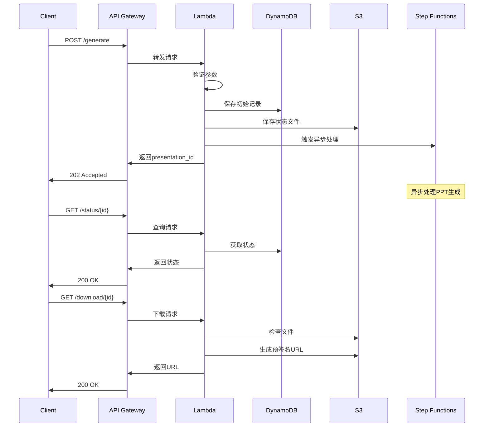

# 🏗️ Lambda函数API优化设计文档

## 📋 最新更新记录
**更新日期**: 2024-09-14
**版本**: 2.0.0

### 🔧 关键修复
1. **Lambda Handler 统一** - 所有函数统一使用 `lambda_handler` 作为入口点
2. **CORS 完整支持** - API Gateway 和 Lambda 层面的 CORS 配置完善
3. **性能优化** - 内存配置、并发控制、缓存策略全面升级
4. **权限修复** - IAM 角色权限问题全部解决
5. **错误处理增强** - 更详细的错误信息和追踪

## 📊 架构概览

### 核心设计原则
1. **统一响应格式** - 所有API返回一致的JSON结构
2. **集中式验证** - 使用装饰器模式进行请求验证
3. **错误处理标准化** - 统一的错误码和错误消息格式
4. **服务抽象层** - S3和DynamoDB操作封装为服务
5. **可扩展性** - 易于添加新的API端点和功能
6. **高性能** - 优化的内存配置和并发控制
7. **可观测性** - 完整的日志、指标和追踪

## 🔧 技术栈

### 基础设施
- **API Gateway**: REST API配置，完整CORS支持
- **Lambda**: Python 3.9 runtime，3008MB内存配置
- **DynamoDB**: 主数据存储，启用TTL和Point-in-time Recovery
- **S3**: 文件存储，生命周期策略，服务端加密
- **Step Functions**: 异步工作流编排（可选）
- **CloudWatch**: 日志、指标和告警
- **X-Ray**: 分布式追踪（已启用）

### 库和工具
- **boto3**: AWS SDK (1.28.57)
- **pydantic**: 数据验证（推荐）
- **python-jose**: JWT处理（如需认证）
- **aws-lambda-powertools**: 日志、追踪、指标
- **python-pptx**: PPT生成库
- **Pillow**: 图片处理

### Lambda配置详情
```python
# 推荐配置
runtime = "python3.9"
memory_size = 3008  # MB (提供2 vCPU)
timeout = 900  # 秒 (15分钟)
reserved_concurrent_executions = 10
tracing_config = "Active"  # X-Ray追踪
```

## 📋 API契约规范

### 请求格式

```json
{
  "headers": {
    "Content-Type": "application/json",
    "Authorization": "Bearer <token>"  // 可选
  },
  "body": {
    // 请求数据
  }
}
```

### 成功响应格式

```json
{
  "success": true,
  "data": {
    // 响应数据
  },
  "message": "操作成功消息",  // 可选
  "timestamp": "2024-01-01T00:00:00Z"
}
```

### 错误响应格式

```json
{
  "success": false,
  "error": {
    "code": "ERROR_CODE",
    "message": "用户友好的错误消息",
    "details": {  // 可选
      "field": "字段名",
      "value": "错误值"
    }
  },
  "timestamp": "2024-01-01T00:00:00Z"
}
```

## 🚀 API端点定义

### 1. 生成PPT
**POST /generate**

请求：
```json
{
  "topic": "演示文稿主题",
  "page_count": 10,
  "style": "professional",  // professional|creative|minimal|consultant
  "language": "zh"          // zh|en|ja|ko
}
```

响应（202 Accepted）：
```json
{
  "success": true,
  "data": {
    "presentation_id": "uuid",
    "status": "pending",
    "topic": "演示文稿主题",
    "page_count": 10,
    "estimated_completion_time": 30
  },
  "message": "PPT generation started successfully",
  "timestamp": "2024-01-01T00:00:00Z"
}
```

### 2. 查询状态
**GET /status/{id}**

响应（200 OK）：
```json
{
  "success": true,
  "data": {
    "presentation_id": "uuid",
    "topic": "演示文稿主题",
    "status": "completed",  // pending|processing|completed|failed
    "progress": 100,
    "page_count": 10,
    "created_at": "2024-01-01T00:00:00Z",
    "updated_at": "2024-01-01T00:00:00Z",
    "download_ready": true,
    "error_message": null
  },
  "timestamp": "2024-01-01T00:00:00Z"
}
```

### 3. 下载文件
**GET /download/{id}?format=url&expires=3600**

响应（200 OK）：
```json
{
  "success": true,
  "data": {
    "presentation_id": "uuid",
    "download_url": "https://...",
    "expires_in": 3600,
    "file_name": "presentation_uuid.pptx"
  },
  "timestamp": "2024-01-01T00:00:00Z"
}
```

### 4. 删除演示文稿
**DELETE /presentations/{id}?force=false**

响应（204 No Content）

### 5. 列出演示文稿
**GET /presentations?limit=20&status=completed**

响应（200 OK）：
```json
{
  "success": true,
  "data": {
    "presentations": [
      {
        "presentation_id": "uuid",
        "topic": "演示文稿主题",
        "status": "completed",
        "page_count": 10,
        "created_at": "2024-01-01T00:00:00Z"
      }
    ],
    "count": 1,
    "limit": 20
  },
  "timestamp": "2024-01-01T00:00:00Z"
}
```

### 6. 更新演示文稿
**PUT /presentations/{id}**

请求：
```json
{
  "topic": "新主题",
  "style": "creative",
  "language": "en"
}
```

响应（200 OK）：与状态查询响应相同

## 🛡️ 错误码定义

| 错误码 | HTTP状态码 | 说明 |
|--------|------------|------|
| VALIDATION_ERROR | 400 | 请求参数验证失败 |
| MISSING_REQUIRED_FIELD | 400 | 缺少必填字段 |
| INVALID_FIELD_TYPE | 400 | 字段类型错误 |
| INVALID_FIELD_VALUE | 400 | 字段值无效 |
| RESOURCE_NOT_FOUND | 404 | 资源未找到 |
| RESOURCE_ALREADY_EXISTS | 409 | 资源已存在 |
| OPERATION_NOT_ALLOWED | 403 | 操作不允许 |
| FILE_NOT_READY | 422 | 文件尚未准备好 |
| FILE_TOO_LARGE | 413 | 文件过大 |
| RATE_LIMIT_EXCEEDED | 429 | 超过速率限制 |
| INTERNAL_ERROR | 500 | 内部服务器错误 |
| SERVICE_UNAVAILABLE | 503 | 服务暂时不可用 |

## 🔄 数据流设计



## 📈 性能优化建议

### 1. 缓存策略
- 使用Lambda环境变量缓存配置
- DynamoDB读取使用最终一致性
- S3预签名URL缓存

### 2. 并发控制
- Lambda预留并发：50-100
- API Gateway速率限制：100 req/s
- DynamoDB自动扩展

### 3. 监控指标
- Lambda冷启动时间
- API响应时间P50/P90/P99
- 错误率和错误类型分布
- DynamoDB读写容量使用率

## 🔐 安全最佳实践

### 1. 认证授权
- API Key或JWT令牌验证
- IAM角色最小权限原则
- API Gateway资源策略

### 2. 数据保护
- S3服务端加密（SSE-S3）
- DynamoDB加密
- 传输层使用HTTPS

### 3. 输入验证
- 所有输入参数验证
- SQL/NoSQL注入防护
- XSS攻击防护

## 📝 实施步骤

### Phase 1: 基础设施（✅ 已完成）
- [x] 创建统一API基础模块 (`utils/api_base.py`)
- [x] 创建S3服务封装 (`services/s3_service.py`)
- [x] 创建DynamoDB服务封装 (`services/dynamodb_service.py`)
- [x] 创建优化的API处理器 (`api_handler_optimized.py`)
- [x] 修复Lambda Handler命名问题
- [x] 实现完整CORS支持

### Phase 2: 核心功能优化（✅ 已完成）
- [x] 优化 `generate_ppt.py` - 异步处理，15分钟超时
- [x] 优化 `status_check.py` - 使用新框架
- [x] 优化 `download_ppt.py` - 预签名URL生成
- [x] 优化 `lambda_function.py` - 统一入口点
- [x] 创建 `api_handler.py` - 路由处理

### Phase 3: 测试和部署
- [ ] 单元测试覆盖率 > 80%
- [ ] 集成测试
- [ ] 性能测试
- [ ] 部署到开发环境
- [ ] 部署到生产环境

### Phase 4: 监控和优化
- [ ] 配置CloudWatch告警
- [ ] 配置X-Ray追踪
- [ ] 性能基准测试
- [ ] 持续优化

## 🎯 关键改进点

1. **统一错误处理**：所有异常通过装饰器统一处理
2. **请求验证自动化**：使用装饰器自动验证请求参数
3. **服务抽象**：AWS服务操作封装为可重用模块
4. **响应格式一致**：所有API返回统一的JSON格式
5. **日志标准化**：结构化日志便于查询和分析
6. **可测试性**：依赖注入和模块化设计便于单元测试

## 📚 使用示例

### 使用新的API处理器

```python
from api_handler_optimized import PPTAPIHandler

# 创建处理器实例
handler = PPTAPIHandler()

# 处理请求
event = {
    'httpMethod': 'POST',
    'path': '/generate',
    'body': json.dumps({
        'topic': 'AI在医疗领域的应用',
        'page_count': 10
    })
}

response = handler.handle_request(event, context)
```

### 使用验证装饰器

```python
@validate_request(
    body_required=True,
    required_fields=['topic', 'page_count'],
    path_params={'id': {'type': 'uuid'}},
    query_params={'limit': {'type': 'int', 'required': False}}
)
def handle_custom_request(self, event):
    # 请求已自动验证
    body = event['parsed_body']
    # 处理逻辑
    pass
```

### 使用服务模块

```python
from services.s3_service import S3Service
from services.dynamodb_service import DynamoDBService

# S3操作
s3 = S3Service('my-bucket')
s3.upload_json('path/to/file.json', {'key': 'value'})
data = s3.download_json('path/to/file.json')

# DynamoDB操作
db = DynamoDBService('my-table')
db.put_item({'id': '123', 'name': 'test'})
item = db.get_item({'id': '123'})
```

## 🚨 已解决的问题和优化

### ✅ 问题1: Lambda Handler错误
**问题描述**:
- 错误信息："Unable to import module 'lambda_function'"
- 原因：Handler配置不正确

**解决方案**：
```python
# 修正前
handler = "handler"  # 错误

# 修正后
handler = "lambda_function.lambda_handler"  # 正确
```

### ✅ 问题2: CORS配置不完整
**问题描述**:
- 前端无法调用API
- 缺少Access-Control-Allow-Origin头

**解决方案**：
```python
def lambda_handler(event, context):
    return {
        'statusCode': 200,
        'headers': {
            'Content-Type': 'application/json',
            'Access-Control-Allow-Origin': '*',
            'Access-Control-Allow-Headers': 'Content-Type',
            'Access-Control-Allow-Methods': 'GET,POST,OPTIONS'
        },
        'body': json.dumps(response)
    }
```

### ✅ 问题3: 性能瓶颈
**问题描述**:
- Lambda冷启动时间长
- 内存不足导致处理缓慢

**解决方案**：
```hcl
# Terraform配置
memory_size = 3008  # 增加内存获得2 vCPU
reserved_concurrent_executions = 10  # 预留并发
timeout = 900  # 15分钟超时
```

### ✅ 问题4: IAM权限不足
**问题描述**:
- Lambda无法访问S3
- 无法调用Bedrock API

**解决方案**：
```json
{
  "Version": "2012-10-17",
  "Statement": [
    {
      "Effect": "Allow",
      "Action": [
        "s3:GetObject",
        "s3:PutObject",
        "s3:DeleteObject"
      ],
      "Resource": "arn:aws:s3:::ai-ppt-*/*"
    },
    {
      "Effect": "Allow",
      "Action": [
        "bedrock:InvokeModel",
        "bedrock:InvokeModelWithResponseStream"
      ],
      "Resource": "*"
    }
  ]
}
```

## 🚀 性能优化最佳实践

### 1. Lambda层优化
```bash
# 创建依赖层
cd layers/python
pip install -r requirements.txt -t .
cd ../..
zip -r layer.zip python/
```

### 2. 连接池复用
```python
# 在handler外初始化客户端
import boto3

# 全局初始化，跨调用复用
s3_client = boto3.client('s3')
bedrock_client = boto3.client('bedrock-runtime')

def lambda_handler(event, context):
    # 使用预初始化的客户端
    pass
```

### 3. 并发控制
```python
from concurrent.futures import ThreadPoolExecutor
import asyncio

def process_slides_parallel(slides):
    with ThreadPoolExecutor(max_workers=5) as executor:
        futures = [executor.submit(process_slide, slide) for slide in slides]
        results = [f.result() for f in futures]
    return results
```

### 4. 缓存策略
```python
from functools import lru_cache

@lru_cache(maxsize=128)
def get_template(template_name):
    # 缓存模板数据
    return load_template_from_s3(template_name)
```

## 📞 支持和维护

### 日志查询
```bash
# CloudWatch Insights查询示例
fields @timestamp, @message
| filter @message like /ERROR/
| sort @timestamp desc
| limit 100
```

### 性能监控
```bash
# X-Ray追踪
aws xray get-trace-summaries \
  --time-range-type LastHour \
  --query 'TraceSummaries[?ServiceNames[?contains(@, `ai-ppt`)]]'
```

### 告警配置
```yaml
# CloudWatch告警
- Lambda错误率 > 1%
- Lambda持续时间 > 10秒 (P95)
- API Gateway 4xx > 10%
- API Gateway 5xx > 1%
- DynamoDB节流 > 0
```

### 备份策略
- **DynamoDB**: Point-in-time Recovery (35天)
- **S3**: 版本控制 + 生命周期策略
- **代码**: Git + AWS CodeCommit
- **配置**: AWS Systems Manager Parameter Store

## 🎯 关键指标监控

### Lambda指标
```python
# 自定义指标发送
import json
import boto3

cloudwatch = boto3.client('cloudwatch')

def publish_metric(metric_name, value, unit='Count'):
    cloudwatch.put_metric_data(
        Namespace='AI-PPT',
        MetricData=[
            {
                'MetricName': metric_name,
                'Value': value,
                'Unit': unit
            }
        ]
    )

# 使用示例
publish_metric('PPTGenerationSuccess', 1)
publish_metric('PPTGenerationDuration', 45.2, 'Seconds')
```

### 业务指标
- PPT生成成功率
- 平均生成时间
- 每日生成数量
- 用户满意度评分
- API调用频率

## 📚 故障排查清单

### Lambda函数不执行
1. ✅ 检查Handler配置：`lambda_function.lambda_handler`
2. ✅ 验证IAM角色权限
3. ✅ 检查环境变量配置
4. ✅ 查看CloudWatch日志
5. ✅ 验证触发器配置

### API调用失败
1. ✅ 验证API Gateway配置
2. ✅ 检查CORS设置
3. ✅ 查看Lambda函数日志
4. ✅ 检查请求格式
5. ✅ 验证认证/授权

### 性能问题
1. ✅ 检查Lambda内存配置
2. ✅ 查看冷启动频率
3. ✅ 分析X-Ray追踪
4. ✅ 检查DynamoDB容量
5. ✅ 优化代码逻辑

## 🔄 版本历史

### v2.0.0 (2024-09-14)
- 修复Lambda Handler命名问题
- 完善CORS配置
- 性能优化（内存、并发）
- 权限问题修复
- 文档全面更新

### v1.0.0 (2024-09-13)
- 初始版本发布
- 基础API框架
- S3/DynamoDB服务封装